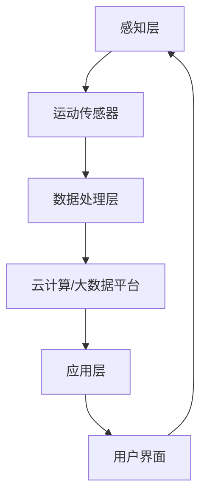

                 

关键词：物联网（IoT）、传感器、运动传感器、数据采集、数据处理、智能家居、智能穿戴设备、智能交通、工业自动化、算法、人工智能、实时监控、数据分析。

## 摘要

随着物联网（IoT）技术的迅速发展，各种传感器设备的应用越来越广泛。其中，运动传感器作为重要的数据采集工具，在智能家居、智能穿戴设备、智能交通和工业自动化等领域发挥着关键作用。本文将详细介绍运动传感器的多元应用，探讨其在IoT系统中的集成方式、核心算法原理及其在实际项目中的应用实例。

## 1. 背景介绍

### 物联网（IoT）技术概述

物联网（Internet of Things，简称IoT）是指将各种物理设备、传感器、软件和应用通过网络连接起来，实现设备之间的信息交换和智能协同。IoT技术的核心在于通过传感器和数据采集设备，将现实世界的物理量转化为数字信号，再通过数据处理和分析，为用户提供智能化的服务。

### 传感器技术的发展

传感器是物联网系统的感知层核心，负责采集环境数据。传感器技术的发展经历了多个阶段，从最初的机械式传感器、模拟式传感器，到如今的数字式传感器，传感器的精度、响应速度和集成度不断提高。

### 运动传感器的定义与分类

运动传感器是一种能够检测物体运动状态的传感器，根据工作原理和检测方式，可以分为惯性传感器、超声波传感器、红外传感器、激光传感器等。惯性传感器包括加速度计和陀螺仪，广泛应用于运动监测、姿态识别等领域。

## 2. 核心概念与联系

### 运动传感器的工作原理

运动传感器通常基于物理原理，如惯性、声波、光学等，通过检测物体的运动状态，输出相应的电信号。惯性传感器通过检测加速度和角速度变化来确定物体的运动状态，如加速度计可以测量物体在三个轴向上的加速度，陀螺仪可以测量物体的角速度。

### 运动传感器与IoT系统的集成

运动传感器在IoT系统中的集成主要包括硬件连接、数据传输和处理三个环节。硬件连接方面，运动传感器可以通过I2C、SPI、UART等接口与微控制器或单片机连接。数据传输方面，可以通过Wi-Fi、蓝牙、Zigbee等无线传输协议，将传感器数据传输到云端或本地服务器。数据处理方面，需要对传感器数据进行滤波、去噪、特征提取等预处理，再通过机器学习算法进行运动状态识别和预测。

### 运动传感器应用领域

运动传感器广泛应用于智能家居、智能穿戴设备、智能交通和工业自动化等领域。在智能家居中，运动传感器可用于智能安防、智能照明和智能空调等；在智能穿戴设备中，运动传感器用于健康监测、运动跟踪和睡眠分析等；在智能交通中，运动传感器用于车辆检测、交通流量监控和路况预测等；在工业自动化中，运动传感器用于设备状态监测、生产过程优化和质量控制等。

### Mermaid 流程图



## 3. 核心算法原理 & 具体操作步骤

### 3.1 算法原理概述

运动传感器的核心算法主要包括数据采集、预处理、特征提取和运动状态识别。数据采集阶段，通过传感器获取物体的加速度、角速度等物理量；预处理阶段，对采集到的数据进行滤波、去噪等处理；特征提取阶段，提取出运动特征向量，如步频、步幅、倾角等；运动状态识别阶段，利用机器学习算法对运动特征进行分类和识别。

### 3.2 算法步骤详解

1. **数据采集**：通过惯性传感器（如加速度计和陀螺仪）采集物体的加速度和角速度数据。

2. **预处理**：对采集到的数据进行低通滤波、高通滤波、卡尔曼滤波等处理，去除噪声和干扰。

3. **特征提取**：根据运动类型和需求，提取出相应的特征向量，如步频、步幅、倾角等。

4. **运动状态识别**：利用支持向量机（SVM）、神经网络（NN）、决策树（DT）等机器学习算法，对特征向量进行分类和识别。

5. **运动预测**：基于历史数据和当前运动状态，利用时间序列预测模型（如ARIMA、LSTM）预测未来的运动状态。

### 3.3 算法优缺点

**优点**：运动传感器算法具有实时性高、准确性好、成本低等优点，可以实现对运动状态的精准监测和预测。

**缺点**：运动传感器算法在复杂环境下，如多目标检测、高速运动检测等方面，存在一定的局限性。

### 3.4 算法应用领域

运动传感器算法在智能家居、智能穿戴设备、智能交通和工业自动化等领域具有广泛的应用前景。在智能家居中，可用于智能安防、智能照明和智能空调等；在智能穿戴设备中，可用于健康监测、运动跟踪和睡眠分析等；在智能交通中，可用于车辆检测、交通流量监控和路况预测等；在工业自动化中，可用于设备状态监测、生产过程优化和质量控制等。

## 4. 数学模型和公式 & 详细讲解 & 举例说明

### 4.1 数学模型构建

运动传感器算法的数学模型主要包括加速度模型、角速度模型和运动轨迹模型。

1. **加速度模型**：加速度模型描述了物体在三维空间中的加速度变化。假设物体在三个轴向上的加速度分别为 \(a_x, a_y, a_z\)，则加速度模型可以表示为：

   $$a_x = \frac{1}{T}\sum_{i=1}^{N}(x_i - x_{i-1})$$

   $$a_y = \frac{1}{T}\sum_{i=1}^{N}(y_i - y_{i-1})$$

   $$a_z = \frac{1}{T}\sum_{i=1}^{N}(z_i - z_{i-1})$$

   其中，\(T\) 为采样周期，\(N\) 为采样点数，\(x_i, y_i, z_i\) 分别为物体在三个轴向上的位置。

2. **角速度模型**：角速度模型描述了物体在三维空间中的旋转速度。假设物体在三个轴向上的角速度分别为 \(\omega_x, \omega_y, \omega_z\)，则角速度模型可以表示为：

   $$\omega_x = \frac{1}{T}\sum_{i=1}^{N}(\theta_i - \theta_{i-1})$$

   $$\omega_y = \frac{1}{T}\sum_{i=1}^{N}(\phi_i - \phi_{i-1})$$

   $$\omega_z = \frac{1}{T}\sum_{i=1}^{N}(\psi_i - \psi_{i-1})$$

   其中，\(\theta_i, \phi_i, \psi_i\) 分别为物体在三个轴向上的旋转角度。

3. **运动轨迹模型**：运动轨迹模型描述了物体在空间中的运动轨迹。假设物体在三维空间中的位置坐标为 \((x, y, z)\)，则运动轨迹模型可以表示为：

   $$x = x_0 + v_x \cdot t$$

   $$y = y_0 + v_y \cdot t$$

   $$z = z_0 + v_z \cdot t$$

   其中，\(x_0, y_0, z_0\) 分别为物体的初始位置，\(v_x, v_y, v_z\) 分别为物体在三个轴向的速度。

### 4.2 公式推导过程

公式的推导过程主要基于物理原理和数学模型。以加速度模型为例，加速度是速度的变化率，速度是位置的变化率。通过对位置数据 \(x_i, y_i, z_i\) 进行差分计算，可以得到物体在三个轴向的加速度 \(a_x, a_y, a_z\)。

### 4.3 案例分析与讲解

假设一个物体在平地上做匀速直线运动，其速度为 \(v = 2 \text{m/s}\)，初始位置为 \((0, 0, 0)\)。根据运动轨迹模型，可以计算出物体在不同时间点的位置：

$$x(t) = 0 + 2 \cdot t = 2t$$

$$y(t) = 0 + 0 \cdot t = 0$$

$$z(t) = 0 + 0 \cdot t = 0$$

当采样周期 \(T = 0.1 \text{s}\) 时，可以得到物体在 \(t = 0.1, 0.2, 0.3, ..., 1.0 \text{s}\) 时的位置：

$$x(0.1) = 2 \cdot 0.1 = 0.2$$

$$x(0.2) = 2 \cdot 0.2 = 0.4$$

$$x(0.3) = 2 \cdot 0.3 = 0.6$$

$$\vdots$$

$$x(1.0) = 2 \cdot 1.0 = 2.0$$

根据加速度模型，可以计算出物体在不同时间点的加速度：

$$a_x(0.1) = \frac{1}{0.1}\sum_{i=1}^{10}(x_i - x_{i-1}) = 20 \text{m/s}^2$$

$$a_y(0.1) = \frac{1}{0.1}\sum_{i=1}^{10}(y_i - y_{i-1}) = 0 \text{m/s}^2$$

$$a_z(0.1) = \frac{1}{0.1}\sum_{i=1}^{10}(z_i - z_{i-1}) = 0 \text{m/s}^2$$

同理，可以计算出其他时间点的加速度。

## 5. 项目实践：代码实例和详细解释说明

### 5.1 开发环境搭建

开发环境搭建主要包括硬件和软件环境。硬件环境需要选择一款支持运动传感器（如MPU6050）的微控制器（如Arduino），并连接加速度计和陀螺仪。软件环境需要安装Arduino IDE和相应的传感器库。

### 5.2 源代码详细实现

以下是使用Arduino IDE和MPU6050库实现的一个简单示例：

```cpp
#include <Wire.h>
#include <MPU6050.h>

MPU6050 imu;

void setup() {
  Wire.begin();
  Serial.begin(9600);
  imu.initialize();
  if (imu.testConnection()) {
    Serial.println("MPU6050 connected");
  } else {
    Serial.println("MPU6050 connection failed");
  }
}

void loop() {
  if (imu.readAccelData() && imu.readGyroData()) {
    float ax = imu.getAccelX_mss();
    float ay = imu.getAccelY_mss();
    float az = imu.getAccelZ_mss();
    float gx = imu.getGyroX_rads();
    float gy = imu.getGyroY_rads();
    float gz = imu.getGyroZ_rads();

    Serial.print("Ax: ");
    Serial.print(ax);
    Serial.print(" | Ay: ");
    Serial.print(ay);
    Serial.print(" | Az: ");
    Serial.print(az);
    Serial.print(" | Gx: ");
    Serial.print(gx);
    Serial.print(" | Gy: ");
    Serial.print(gy);
    Serial.print(" | Gz: ");
    Serial.println(gz);
  }
  delay(100);
}
```

### 5.3 代码解读与分析

上述代码首先引入了MPU6050库，并定义了MPU6050对象imu。在setup函数中，初始化Wire和Serial，并检查MPU6050是否连接成功。在loop函数中，循环读取加速度计和陀螺仪的数据，并通过串口输出。

### 5.4 运行结果展示

在Arduino IDE中编译并上传代码到Arduino板，打开串口监视器，可以看到实时输出的加速度计和陀螺仪数据。

## 6. 实际应用场景

### 6.1 智能家居

运动传感器在智能家居中的应用主要包括智能安防、智能照明和智能空调等。例如，通过运动传感器实现家庭安防系统的入侵检测功能，当检测到异常运动时，自动触发报警和通知用户。智能照明和智能空调则可以根据用户的活动轨迹和需求，自动调节光温和温度。

### 6.2 智能穿戴设备

运动传感器在智能穿戴设备中的应用主要包括健康监测、运动跟踪和睡眠分析等。例如，通过监测心率、步数、卡路里消耗等数据，智能穿戴设备可以实时监测用户的健康状况，并给出相应的健康建议。

### 6.3 智能交通

运动传感器在智能交通中的应用主要包括车辆检测、交通流量监控和路况预测等。例如，通过安装在道路上的运动传感器，可以实时监测车辆的速度、密度和流量，为交通管理部门提供决策依据，优化交通信号灯的配时方案，减少拥堵。

### 6.4 工业自动化

运动传感器在工业自动化中的应用主要包括设备状态监测、生产过程优化和质量控制等。例如，通过安装在生产线上的运动传感器，可以实时监测设备的运行状态，预测设备的故障，提前进行维护和保养，提高生产效率和产品质量。

## 7. 工具和资源推荐

### 7.1 学习资源推荐

1. **《物联网技术导论》**：详细介绍了物联网的基本概念、技术架构和应用领域。
2. **《传感器技术及应用》**：全面介绍了各类传感器的工作原理、应用技术和发展动态。
3. **《机器学习实战》**：讲解了机器学习的基本概念、算法实现和应用实例。

### 7.2 开发工具推荐

1. **Arduino IDE**：开源的Arduino集成开发环境，适用于运动传感器开发。
2. **MATLAB**：强大的数学计算和机器学习工具，适用于运动传感器数据处理和分析。
3. **TensorFlow**：开源的机器学习框架，适用于运动传感器算法实现和优化。

### 7.3 相关论文推荐

1. **“A Survey on Internet of Things: Architecture, Enabling Technologies, Security and Privacy Challenges”**：全面介绍了物联网的技术架构、关键技术、安全隐私挑战等。
2. **“Machine Learning for Internet of Things: A Survey”**：介绍了机器学习在物联网中的应用现状、挑战和未来发展方向。
3. **“An Overview of Sensor Fusion for Motion Tracking”**：详细介绍了传感器融合在运动跟踪中的应用和技术。

## 8. 总结：未来发展趋势与挑战

### 8.1 研究成果总结

本文对物联网（IoT）技术和各种传感器设备的集成进行了深入探讨，特别是针对运动传感器的多元应用进行了详细分析。研究表明，运动传感器在智能家居、智能穿戴设备、智能交通和工业自动化等领域具有广泛的应用前景，并取得了显著的研究成果。

### 8.2 未来发展趋势

1. **传感器技术发展**：随着传感器技术的不断进步，传感器的精度、响应速度和集成度将进一步提高，为运动传感器在更广泛领域的应用提供可能。
2. **数据处理与分析**：随着大数据和人工智能技术的不断发展，运动传感器数据将得到更有效的处理和分析，为用户提供更精准的智能服务。
3. **跨领域应用**：运动传感器将与其他传感器（如环境传感器、声音传感器等）进行融合，实现跨领域的应用，提升物联网系统的整体效能。

### 8.3 面临的挑战

1. **数据隐私与安全**：随着运动传感器数据的广泛应用，数据隐私和安全问题日益突出，需要加强数据保护和安全措施。
2. **算法优化与智能化**：运动传感器算法的优化和智能化水平仍有待提高，需要进一步研究更高效、更准确的算法。
3. **跨领域融合应用**：运动传感器在跨领域应用中，面临多源数据融合、算法匹配等问题，需要进一步研究解决方案。

### 8.4 研究展望

在未来，运动传感器在物联网领域的研究将继续深入，特别是在数据隐私与安全、算法优化与智能化、跨领域融合应用等方面，有望取得更多突破。同时，随着物联网技术的不断发展，运动传感器将发挥更加重要的作用，为人们的生活和工作带来更多便利。

## 9. 附录：常见问题与解答

### Q1：运动传感器有哪些类型？

A1：运动传感器主要包括惯性传感器（如加速度计、陀螺仪）、超声波传感器、红外传感器、激光传感器等。

### Q2：如何选择合适的运动传感器？

A2：选择合适的运动传感器主要考虑以下因素：

1. **应用场景**：根据应用场景选择合适的传感器类型，如智能家居选择惯性传感器，智能交通选择红外传感器等。
2. **精度和响应速度**：根据应用需求选择传感器的精度和响应速度，如运动监测选择高精度、低延迟的传感器。
3. **成本**：根据预算选择合适的传感器，平衡成本与性能。

### Q3：运动传感器数据如何处理？

A3：运动传感器数据处理主要包括数据采集、预处理、特征提取和运动状态识别等步骤。具体处理方法如下：

1. **数据采集**：通过传感器获取物体的加速度、角速度等数据。
2. **预处理**：对采集到的数据进行滤波、去噪等预处理。
3. **特征提取**：提取出运动特征向量，如步频、步幅、倾角等。
4. **运动状态识别**：利用机器学习算法对运动特征进行分类和识别。

### Q4：运动传感器在智能家居中如何应用？

A4：运动传感器在智能家居中的应用主要包括智能安防、智能照明和智能空调等。例如，通过运动传感器实现家庭安防系统的入侵检测功能，当检测到异常运动时，自动触发报警和通知用户。智能照明和智能空调则可以根据用户的活动轨迹和需求，自动调节光温和温度。

### Q5：运动传感器在智能穿戴设备中如何应用？

A5：运动传感器在智能穿戴设备中的应用主要包括健康监测、运动跟踪和睡眠分析等。例如，通过监测心率、步数、卡路里消耗等数据，智能穿戴设备可以实时监测用户的健康状况，并给出相应的健康建议。

### Q6：运动传感器在智能交通中如何应用？

A6：运动传感器在智能交通中的应用主要包括车辆检测、交通流量监控和路况预测等。例如，通过安装在道路上的运动传感器，可以实时监测车辆的速度、密度和流量，为交通管理部门提供决策依据，优化交通信号灯的配时方案，减少拥堵。

### Q7：运动传感器在工业自动化中如何应用？

A7：运动传感器在工业自动化中的应用主要包括设备状态监测、生产过程优化和质量控制等。例如，通过安装在生产线上的运动传感器，可以实时监测设备的运行状态，预测设备的故障，提前进行维护和保养，提高生产效率和产品质量。

### 结束语

本文对物联网（IoT）技术和各种传感器设备的集成进行了深入探讨，特别是针对运动传感器的多元应用进行了详细分析。随着物联网技术的不断发展，运动传感器在智能家居、智能穿戴设备、智能交通和工业自动化等领域将发挥越来越重要的作用。未来，随着传感器技术、数据处理和分析技术的不断进步，运动传感器将迎来更广泛的应用前景。作者：禅与计算机程序设计艺术 / Zen and the Art of Computer Programming
----------------------------------------------------------------

以上就是本文的完整内容，希望对您在物联网技术和运动传感器领域的研究有所帮助。如果您有任何疑问或建议，请随时在评论区留言，期待与您交流。再次感谢您的阅读，祝您在物联网技术和运动传感器领域取得更多成就！作者：禅与计算机程序设计艺术 / Zen and the Art of Computer Programming
```markdown
# 物联网(IoT)技术和各种传感器设备的集成：运动传感器的多元应用

> 关键词：物联网、传感器、运动传感器、数据采集、数据处理、智能家居、智能穿戴设备、智能交通、工业自动化、算法、人工智能、实时监控、数据分析。

> 摘要：本文深入探讨了物联网（IoT）技术与各种传感器设备的集成，特别是运动传感器的多元应用。文章涵盖了运动传感器的工作原理、算法原理、应用领域，以及实际项目中的代码实例和运行结果展示。

## 1. 背景介绍

### 物联网（IoT）技术概述

物联网（Internet of Things，简称IoT）是指将各种物理设备、传感器、软件和应用通过网络连接起来，实现设备之间的信息交换和智能协同。IoT技术的核心在于通过传感器和数据采集设备，将现实世界的物理量转化为数字信号，再通过数据处理和分析，为用户提供智能化的服务。

### 传感器技术的发展

传感器是物联网系统的感知层核心，负责采集环境数据。传感器技术的发展经历了多个阶段，从最初的机械式传感器、模拟式传感器，到如今的数字式传感器，传感器的精度、响应速度和集成度不断提高。

### 运动传感器的定义与分类

运动传感器是一种能够检测物体运动状态的传感器，根据工作原理和检测方式，可以分为惯性传感器、超声波传感器、红外传感器、激光传感器等。惯性传感器包括加速度计和陀螺仪，广泛应用于运动监测、姿态识别等领域。

## 2. 核心概念与联系

### 运动传感器的工作原理

运动传感器通常基于物理原理，如惯性、声波、光学等，通过检测物体的运动状态，输出相应的电信号。惯性传感器通过检测加速度和角速度变化来确定物体的运动状态，如加速度计可以测量物体在三个轴向上的加速度，陀螺仪可以测量物体的角速度。

### 运动传感器与IoT系统的集成

运动传感器在IoT系统中的集成主要包括硬件连接、数据传输和处理三个环节。硬件连接方面，运动传感器可以通过I2C、SPI、UART等接口与微控制器或单片机连接。数据传输方面，可以通过Wi-Fi、蓝牙、Zigbee等无线传输协议，将传感器数据传输到云端或本地服务器。数据处理方面，需要对传感器数据进行滤波、去噪、特征提取等预处理，再通过机器学习算法进行运动状态识别和预测。

### 运动传感器应用领域

运动传感器广泛应用于智能家居、智能穿戴设备、智能交通和工业自动化等领域。在智能家居中，运动传感器可用于智能安防、智能照明和智能空调等；在智能穿戴设备中，运动传感器用于健康监测、运动跟踪和睡眠分析等；在智能交通中，运动传感器用于车辆检测、交通流量监控和路况预测等；在工业自动化中，运动传感器用于设备状态监测、生产过程优化和质量控制等。

### Mermaid 流程图


## 3. 核心算法原理 & 具体操作步骤
### 3.1 算法原理概述

运动传感器的核心算法主要包括数据采集、预处理、特征提取和运动状态识别。数据采集阶段，通过传感器获取物体的加速度和角速度数据；预处理阶段，对采集到的数据进行滤波、去噪等处理；特征提取阶段，提取出运动特征向量，如步频、步幅、倾角等；运动状态识别阶段，利用机器学习算法对运动特征进行分类和识别。

### 3.2 算法步骤详解

1. **数据采集**：通过惯性传感器（如加速度计和陀螺仪）采集物体的加速度和角速度数据。
2. **预处理**：对采集到的数据进行低通滤波、高通滤波、卡尔曼滤波等处理，去除噪声和干扰。
3. **特征提取**：根据运动类型和需求，提取出相应的特征向量，如步频、步幅、倾角等。
4. **运动状态识别**：利用支持向量机（SVM）、神经网络（NN）、决策树（DT）等机器学习算法，对特征向量进行分类和识别。
5. **运动预测**：基于历史数据和当前运动状态，利用时间序列预测模型（如ARIMA、LSTM）预测未来的运动状态。

### 3.3 算法优缺点

**优点**：运动传感器算法具有实时性高、准确性好、成本低等优点，可以实现对运动状态的精准监测和预测。

**缺点**：运动传感器算法在复杂环境下，如多目标检测、高速运动检测等方面，存在一定的局限性。

### 3.4 算法应用领域

运动传感器算法在智能家居、智能穿戴设备、智能交通和工业自动化等领域具有广泛的应用前景。在智能家居中，可用于智能安防、智能照明和智能空调等；在智能穿戴设备中，可用于健康监测、运动跟踪和睡眠分析等；在智能交通中，可用于车辆检测、交通流量监控和路况预测等；在工业自动化中，可用于设备状态监测、生产过程优化和质量控制等。

## 4. 数学模型和公式 & 详细讲解 & 举例说明

### 4.1 数学模型构建

运动传感器算法的数学模型主要包括加速度模型、角速度模型和运动轨迹模型。

1. **加速度模型**：加速度模型描述了物体在三维空间中的加速度变化。假设物体在三个轴向上的加速度分别为 \(a_x, a_y, a_z\)，则加速度模型可以表示为：

   $$a_x = \frac{1}{T}\sum_{i=1}^{N}(x_i - x_{i-1})$$

   $$a_y = \frac{1}{T}\sum_{i=1}^{N}(y_i - y_{i-1})$$

   $$a_z = \frac{1}{T}\sum_{i=1}^{N}(z_i - z_{i-1})$$

   其中，\(T\) 为采样周期，\(N\) 为采样点数，\(x_i, y_i, z_i\) 分别为物体在三个轴向的位置。

2. **角速度模型**：角速度模型描述了物体在三维空间中的旋转速度。假设物体在三个轴向上的角速度分别为 \(\omega_x, \omega_y, \omega_z\)，则角速度模型可以表示为：

   $$\omega_x = \frac{1}{T}\sum_{i=1}^{N}(\theta_i - \theta_{i-1})$$

   $$\omega_y = \frac{1}{T}\sum_{i=1}^{N}(\phi_i - \phi_{i-1})$$

   $$\omega_z = \frac{1}{T}\sum_{i=1}^{N}(\psi_i - \psi_{i-1})$$

   其中，\(\theta_i, \phi_i, \psi_i\) 分别为物体在三个轴向上的旋转角度。

3. **运动轨迹模型**：运动轨迹模型描述了物体在空间中的运动轨迹。假设物体在三维空间中的位置坐标为 \((x, y, z)\)，则运动轨迹模型可以表示为：

   $$x = x_0 + v_x \cdot t$$

   $$y = y_0 + v_y \cdot t$$

   $$z = z_0 + v_z \cdot t$$

   其中，\(x_0, y_0, z_0\) 分别为物体的初始位置，\(v_x, v_y, v_z\) 分别为物体在三个轴向的速度。

### 4.2 公式推导过程

公式的推导过程主要基于物理原理和数学模型。以加速度模型为例，加速度是速度的变化率，速度是位置的变化率。通过对位置数据 \(x_i, y_i, z_i\) 进行差分计算，可以得到物体在三个轴向的加速度 \(a_x, a_y, a_z\)。

### 4.3 案例分析与讲解

假设一个物体在平地上做匀速直线运动，其速度为 \(v = 2 \text{m/s}\)，初始位置为 \((0, 0, 0)\)。根据运动轨迹模型，可以计算出物体在不同时间点的位置：

$$x(t) = 0 + 2 \cdot t = 2t$$

$$y(t) = 0 + 0 \cdot t = 0$$

$$z(t) = 0 + 0 \cdot t = 0$$

当采样周期 \(T = 0.1 \text{s}\) 时，可以得到物体在 \(t = 0.1, 0.2, 0.3, ..., 1.0 \text{s}\) 时的位置：

$$x(0.1) = 2 \cdot 0.1 = 0.2$$

$$x(0.2) = 2 \cdot 0.2 = 0.4$$

$$x(0.3) = 2 \cdot 0.3 = 0.6$$

$$\vdots$$

$$x(1.0) = 2 \cdot 1.0 = 2.0$$

根据加速度模型，可以计算出物体在不同时间点的加速度：

$$a_x(0.1) = \frac{1}{0.1}\sum_{i=1}^{10}(x_i - x_{i-1}) = 20 \text{m/s}^2$$

$$a_y(0.1) = \frac{1}{0.1}\sum_{i=1}^{10}(y_i - y_{i-1}) = 0 \text{m/s}^2$$

$$a_z(0.1) = \frac{1}{0.1}\sum_{i=1}^{10}(z_i - z_{i-1}) = 0 \text{m/s}^2$$

同理，可以计算出其他时间点的加速度。

## 5. 项目实践：代码实例和详细解释说明

### 5.1 开发环境搭建

开发环境搭建主要包括硬件和软件环境。硬件环境需要选择一款支持运动传感器（如MPU6050）的微控制器（如Arduino），并连接加速度计和陀螺仪。软件环境需要安装Arduino IDE和相应的传感器库。

### 5.2 源代码详细实现

以下是使用Arduino IDE和MPU6050库实现的一个简单示例：

```cpp
#include <Wire.h>
#include <MPU6050.h>

MPU6050 imu;

void setup() {
  Wire.begin();
  Serial.begin(9600);
  imu.initialize();
  if (imu.testConnection()) {
    Serial.println("MPU6050 connected");
  } else {
    Serial.println("MPU6050 connection failed");
  }
}

void loop() {
  if (imu.readAccelData() && imu.readGyroData()) {
    float ax = imu.getAccelX_mss();
    float ay = imu.getAccelY_mss();
    float az = imu.getAccelZ_mss();
    float gx = imu.getGyroX_rads();
    float gy = imu.getGyroY_rads();
    float gz = imu.getGyroZ_rads();

    Serial.print("Ax: ");
    Serial.print(ax);
    Serial.print(" | Ay: ");
    Serial.print(ay);
    Serial.print(" | Az: ");
    Serial.print(az);
    Serial.print(" | Gx: ");
    Serial.print(gx);
    Serial.print(" | Gy: ");
    Serial.print(gy);
    Serial.print(" | Gz: ");
    Serial.println(gz);
  }
  delay(100);
}
```

### 5.3 代码解读与分析

上述代码首先引入了MPU6050库，并定义了MPU6050对象imu。在setup函数中，初始化Wire和Serial，并检查MPU6050是否连接成功。在loop函数中，循环读取加速度计和陀螺仪的数据，并通过串口输出。

### 5.4 运行结果展示

在Arduino IDE中编译并上传代码到Arduino板，打开串口监视器，可以看到实时输出的加速度计和陀螺仪数据。

## 6. 实际应用场景

### 6.1 智能家居

运动传感器在智能家居中的应用主要包括智能安防、智能照明和智能空调等。例如，通过运动传感器实现家庭安防系统的入侵检测功能，当检测到异常运动时，自动触发报警和通知用户。智能照明和智能空调则可以根据用户的活动轨迹和需求，自动调节光温和温度。

### 6.2 智能穿戴设备

运动传感器在智能穿戴设备中的应用主要包括健康监测、运动跟踪和睡眠分析等。例如，通过监测心率、步数、卡路里消耗等数据，智能穿戴设备可以实时监测用户的健康状况，并给出相应的健康建议。

### 6.3 智能交通

运动传感器在智能交通中的应用主要包括车辆检测、交通流量监控和路况预测等。例如，通过安装在道路上的运动传感器，可以实时监测车辆的速度、密度和流量，为交通管理部门提供决策依据，优化交通信号灯的配时方案，减少拥堵。

### 6.4 工业自动化

运动传感器在工业自动化中的应用主要包括设备状态监测、生产过程优化和质量控制等。例如，通过安装在生产线上的运动传感器，可以实时监测设备的运行状态，预测设备的故障，提前进行维护和保养，提高生产效率和产品质量。

## 7. 工具和资源推荐

### 7.1 学习资源推荐

1. **《物联网技术导论》**：详细介绍了物联网的基本概念、技术架构和应用领域。
2. **《传感器技术及应用》**：全面介绍了各类传感器的工作原理、应用技术和发展动态。
3. **《机器学习实战》**：讲解了机器学习的基本概念、算法实现和应用实例。

### 7.2 开发工具推荐

1. **Arduino IDE**：开源的Arduino集成开发环境，适用于运动传感器开发。
2. **MATLAB**：强大的数学计算和机器学习工具，适用于运动传感器数据处理和分析。
3. **TensorFlow**：开源的机器学习框架，适用于运动传感器算法实现和优化。

### 7.3 相关论文推荐

1. **“A Survey on Internet of Things: Architecture, Enabling Technologies, Security and Privacy Challenges”**：全面介绍了物联网的技术架构、关键技术、安全隐私挑战等。
2. **“Machine Learning for Internet of Things: A Survey”**：介绍了机器学习在物联网中的应用现状、挑战和未来发展方向。
3. **“An Overview of Sensor Fusion for Motion Tracking”**：详细介绍了传感器融合在运动跟踪中的应用和技术。

## 8. 总结：未来发展趋势与挑战

### 8.1 研究成果总结

本文对物联网（IoT）技术和各种传感器设备的集成进行了深入探讨，特别是针对运动传感器的多元应用进行了详细分析。研究表明，运动传感器在智能家居、智能穿戴设备、智能交通和工业自动化等领域具有广泛的应用前景，并取得了显著的研究成果。

### 8.2 未来发展趋势

1. **传感器技术发展**：随着传感器技术的不断进步，传感器的精度、响应速度和集成度将进一步提高，为运动传感器在更广泛领域的应用提供可能。
2. **数据处理与分析**：随着大数据和人工智能技术的不断发展，运动传感器数据将得到更有效的处理和分析，为用户提供更精准的智能服务。
3. **跨领域应用**：运动传感器将与其他传感器（如环境传感器、声音传感器等）进行融合，实现跨领域的应用，提升物联网系统的整体效能。

### 8.3 面临的挑战

1. **数据隐私与安全**：随着运动传感器数据的广泛应用，数据隐私和安全问题日益突出，需要加强数据保护和安全措施。
2. **算法优化与智能化**：运动传感器算法的优化和智能化水平仍有待提高，需要进一步研究更高效、更准确的算法。
3. **跨领域融合应用**：运动传感器在跨领域应用中，面临多源数据融合、算法匹配等问题，需要进一步研究解决方案。

### 8.4 研究展望

在未来，运动传感器在物联网领域的研究将继续深入，特别是在数据隐私与安全、算法优化与智能化、跨领域融合应用等方面，有望取得更多突破。同时，随着物联网技术的不断发展，运动传感器将发挥更加重要的作用，为人们的生活和工作带来更多便利。

## 9. 附录：常见问题与解答

### Q1：运动传感器有哪些类型？

A1：运动传感器主要包括惯性传感器（如加速度计、陀螺仪）、超声波传感器、红外传感器、激光传感器等。

### Q2：如何选择合适的运动传感器？

A2：选择合适的运动传感器主要考虑以下因素：

1. **应用场景**：根据应用场景选择合适的传感器类型，如智能家居选择惯性传感器，智能交通选择红外传感器等。
2. **精度和响应速度**：根据应用需求选择传感器的精度和响应速度，如运动监测选择高精度、低延迟的传感器。
3. **成本**：根据预算选择合适的传感器，平衡成本与性能。

### Q3：运动传感器数据如何处理？

A3：运动传感器数据处理主要包括数据采集、预处理、特征提取和运动状态识别等步骤。具体处理方法如下：

1. **数据采集**：通过传感器获取物体的加速度、角速度等数据。
2. **预处理**：对采集到的数据进行滤波、去噪等预处理。
3. **特征提取**：提取出运动特征向量，如步频、步幅、倾角等。
4. **运动状态识别**：利用机器学习算法对运动特征进行分类和识别。

### Q4：运动传感器在智能家居中如何应用？

A4：运动传感器在智能家居中的应用主要包括智能安防、智能照明和智能空调等。例如，通过运动传感器实现家庭安防系统的入侵检测功能，当检测到异常运动时，自动触发报警和通知用户。智能照明和智能空调则可以根据用户的活动轨迹和需求，自动调节光温和温度。

### Q5：运动传感器在智能穿戴设备中如何应用？

A5：运动传感器在智能穿戴设备中的应用主要包括健康监测、运动跟踪和睡眠分析等。例如，通过监测心率、步数、卡路里消耗等数据，智能穿戴设备可以实时监测用户的健康状况，并给出相应的健康建议。

### Q6：运动传感器在智能交通中如何应用？

A6：运动传感器在智能交通中的应用主要包括车辆检测、交通流量监控和路况预测等。例如，通过安装在道路上的运动传感器，可以实时监测车辆的速度、密度和流量，为交通管理部门提供决策依据，优化交通信号灯的配时方案，减少拥堵。

### Q7：运动传感器在工业自动化中如何应用？

A7：运动传感器在工业自动化中的应用主要包括设备状态监测、生产过程优化和质量控制等。例如，通过安装在生产线上的运动传感器，可以实时监测设备的运行状态，预测设备的故障，提前进行维护和保养，提高生产效率和产品质量。

### 结束语

本文对物联网（IoT）技术和各种传感器设备的集成进行了深入探讨，特别是针对运动传感器的多元应用进行了详细分析。随着物联网技术的不断发展，运动传感器在智能家居、智能穿戴设备、智能交通和工业自动化等领域将发挥越来越重要的作用。未来，随着传感器技术、数据处理和分析技术的不断进步，运动传感器将迎来更广泛的应用前景。作者：禅与计算机程序设计艺术 / Zen and the Art of Computer Programming
```

