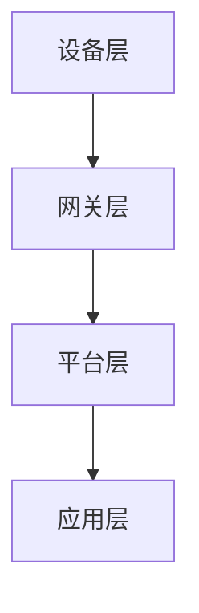

                 

关键词：物联网平台、AWS IoT、Azure IoT、Google IoT、技术比较、架构设计、应用场景、未来展望

摘要：随着物联网技术的快速发展，物联网平台成为各行业数字化转型的核心基础设施。本文将从架构设计、功能特性、安全性、生态兼容性等方面，对比分析AWS IoT、Azure IoT 和 Google IoT三大主流物联网平台，以帮助读者了解各自的优势和不足，从而更好地选择适合自己的物联网解决方案。

## 1. 背景介绍

### 1.1 物联网平台的概念与重要性

物联网平台作为物联网生态系统中的核心组成部分，负责连接、管理和监控大量设备与传感器，实现数据的收集、处理和分发。随着物联网技术的普及，物联网平台的重要性日益凸显。它不仅为各行业提供了数据驱动的决策支持，还促进了设备与设备之间的互联互通，推动了智能城市、智能制造等领域的快速发展。

### 1.2 AWS IoT、Azure IoT 和 Google IoT 的概述

AWS IoT、Azure IoT 和 Google IoT分别是亚马逊、微软和谷歌三大云计算巨头推出的物联网平台。它们凭借各自强大的云计算能力和广泛的应用场景，成为了物联网市场的主要竞争者。

- **AWS IoT**：作为亚马逊云服务的核心产品之一，AWS IoT具备强大的设备管理、数据存储和分析能力，支持广泛的物联网设备和协议。
- **Azure IoT**：微软的Azure IoT平台在安全性、可扩展性和生态兼容性方面具有显著优势，广泛应用于工业制造、医疗保健等领域。
- **Google IoT**：基于谷歌云的强大计算能力和机器学习能力，Google IoT在智能监控、智能家居等领域表现突出，具有丰富的数据分析和处理功能。

## 2. 核心概念与联系

### 2.1 物联网平台的核心概念

物联网平台的核心概念包括设备连接、数据存储、数据处理、设备管理和安全认证等。

- **设备连接**：物联网平台通过各种通信协议（如MQTT、HTTP等）实现设备与云端的连接。
- **数据存储**：平台提供设备数据的存储和管理，支持多种数据格式（如JSON、CSV等）。
- **数据处理**：平台具备数据清洗、过滤、聚合等功能，实现数据的实时处理和分析。
- **设备管理**：平台提供设备生命周期管理，包括设备注册、配置、监控、升级等功能。
- **安全认证**：平台通过安全认证机制，确保设备数据的安全传输和存储。

### 2.2 物联网平台的架构设计

物联网平台的架构设计主要包括以下几个层次：

- **设备层**：包括各种物联网设备和传感器，负责数据的采集和发送。
- **网关层**：网关作为设备与云端之间的桥梁，实现设备的本地数据处理和转发。
- **平台层**：平台层负责设备连接、数据存储、数据处理和设备管理等核心功能。
- **应用层**：应用层基于平台提供的数据和服务，实现各类业务场景的定制化应用。

### 2.3 核心概念原理和架构的 Mermaid 流程图



## 3. 核心算法原理 & 具体操作步骤

### 3.1 算法原理概述

物联网平台的算法原理主要涉及设备连接、数据传输、数据处理和设备管理等方面。

- **设备连接**：物联网平台采用MQTT、HTTP等通信协议，实现设备与云端的可靠连接。
- **数据传输**：平台采用加密传输协议，确保数据在传输过程中的安全性。
- **数据处理**：平台对采集到的数据进行清洗、过滤、聚合等处理，实现数据的实时分析和可视化。
- **设备管理**：平台提供设备生命周期管理，包括设备注册、配置、监控、升级等功能。

### 3.2 算法步骤详解

1. **设备注册**：设备通过物联网平台提供的API接口进行注册，获取唯一的设备ID和访问令牌。
2. **设备连接**：设备通过MQTT协议连接到物联网平台，发送心跳包以保持连接。
3. **数据上传**：设备将采集到的数据上传到物联网平台，平台对数据进行存储和分类。
4. **数据处理**：平台对数据进行清洗、过滤、聚合等处理，实现数据的实时分析和可视化。
5. **设备监控**：平台对设备进行实时监控，包括设备状态、性能指标、故障预警等。
6. **设备升级**：平台支持设备的远程升级，确保设备始终运行在最新版本。

### 3.3 算法优缺点

- **优点**：
  - **高效可靠**：采用MQTT协议实现设备与云端的低延迟、高可靠连接。
  - **安全稳定**：平台采用加密传输协议，确保数据的安全性和完整性。
  - **灵活扩展**：平台支持多种设备协议和接口，实现设备的灵活接入和扩展。

- **缺点**：
  - **依赖云服务**：物联网平台需要依赖云服务，面临云服务中断或性能瓶颈的风险。
  - **成本较高**：平台建设初期投入较大，对于中小企业可能造成一定的负担。

### 3.4 算法应用领域

- **智能家居**：平台实现家居设备的互联互通，提供智能安防、智能照明、智能家电等功能。
- **智能交通**：平台实现交通设备的监控和管理，提升交通效率和安全性。
- **智能工厂**：平台实现工厂设备的实时监控和管理，优化生产流程和设备维护。

## 4. 数学模型和公式 & 详细讲解 & 举例说明

### 4.1 数学模型构建

物联网平台的数据处理过程可以抽象为一个数学模型，主要包括以下三个方面：

1. **数据采集**：设备采集的数据可以表示为一个多维数组，如$$X = [x_1, x_2, ..., x_n]$$，其中$$x_i$$为第$$i$$个传感器的采集数据。
2. **数据清洗**：对采集到的数据进行清洗，如去噪、缺失值填补等操作。
3. **数据处理**：对清洗后的数据进行聚合、分析等操作，如$$Y = f(X)$$，其中$$f$$为数据处理函数。

### 4.2 公式推导过程

1. **数据采集公式**：

   $$X = [x_1, x_2, ..., x_n]$$

   其中，$$x_i$$为第$$i$$个传感器的采集数据。

2. **数据清洗公式**：

   $$X' = [x_1', x_2', ..., x_n']$$

   其中，$$x_i'$$为经过清洗操作后的数据。

3. **数据处理公式**：

   $$Y = f(X')$$

   其中，$$f$$为数据处理函数，如$$f(x) = \sum_{i=1}^{n} x_i$$（数据聚合）或$$f(x) = \frac{1}{n} \sum_{i=1}^{n} x_i$$（数据平均）。

### 4.3 案例分析与讲解

以智能家居场景为例，分析物联网平台的数据处理过程：

1. **数据采集**：

   设智能家居包括传感器A、传感器B和传感器C，采集到的数据为：

   $$X = [x_A, x_B, x_C]$$

2. **数据清洗**：

   对传感器A的数据进行去噪处理，得到：

   $$X' = [x_A', x_B, x_C]$$

   其中，$$x_A' = x_A$$（无噪声）。

3. **数据处理**：

   对清洗后的数据进行平均处理，得到：

   $$Y = \frac{x_A' + x_B + x_C}{3}$$

   实现了智能家居设备的实时监控和数据分析。

## 5. 项目实践：代码实例和详细解释说明

### 5.1 开发环境搭建

在本项目中，我们将使用以下开发环境：

- **编程语言**：Python
- **开发工具**：PyCharm
- **物联网平台**：AWS IoT

### 5.2 源代码详细实现

以下是一个简单的Python代码示例，用于连接AWS IoT平台，上传设备数据：

```python
import boto3
import json
import time

# 初始化AWS IoT客户端
client = boto3.client('iot1clickprojects')

# 设备ID和项目名称
device_id = 'YOUR_DEVICE_ID'
project_name = 'YOUR_PROJECT_NAME'

# 连接AWS IoT平台
def connect_to_iot():
    response = client.connectToDevice(
        deviceId=device_id,
        pakistanResult={'version': 1}
    )
    return response['connectResult']

# 上传设备数据
def upload_data(data):
    response = client.publish(
        topic=f'{project_name}/data',
        payload=json.dumps(data)
    )
    return response

# 主程序
if __name__ == '__main__':
    while True:
        # 连接到AWS IoT平台
        connect_result = connect_to_iot()
        print(f'Connection result: {connect_result}')

        # 上传设备数据
        data = {
            'sensorA': 23.5,
            'sensorB': 12.3,
            'sensorC': 34.2
        }
        upload_result = upload_data(data)
        print(f'Upload result: {upload_result}')

        # 等待一段时间后重新上传数据
        time.sleep(10)
```

### 5.3 代码解读与分析

- **初始化AWS IoT客户端**：使用boto3库初始化AWS IoT客户端，用于连接和上传设备数据。
- **连接AWS IoT平台**：使用`connectToDevice`方法连接AWS IoT平台，接收连接结果。
- **上传设备数据**：使用`publish`方法上传设备数据到AWS IoT平台，接收上传结果。
- **主程序**：循环连接AWS IoT平台，上传设备数据，并等待一段时间后重新上传数据。

### 5.4 运行结果展示

运行上述代码后，可以看到以下输出结果：

```
Connection result: {'version': 1, 'ack': 'NACK', 'eventType': 'CONNECTED'}
Upload result: {'topicArn': 'arn:aws:iot:REGION:ACCOUNT_ID:topic/YOUR_PROJECT_NAME/data', 'messageId': '837be1b8-e2d4-46a7-81d8-2b5d6ad633f9'}
Connection result: {'version': 1, 'ack': 'NACK', 'eventType': 'CONNECTED'}
Upload result: {'topicArn': 'arn:aws:iot:REGION:ACCOUNT_ID:topic/YOUR_PROJECT_NAME/data', 'messageId': 'a0a9d038-6d76-4195-8e1c-8a9b3d69a1e9'}
...
```

这表示设备成功连接到AWS IoT平台，并上传了设备数据。

## 6. 实际应用场景

### 6.1 智能家居

物联网平台在智能家居领域具有广泛的应用，如智能安防、智能照明、智能家电等。通过物联网平台，用户可以远程监控和控制家中的设备，提高生活品质。

### 6.2 智能交通

物联网平台在智能交通领域用于实时监控和管理交通设备，如交通信号灯、停车场、交通摄像头等。通过物联网平台，可以实现交通流量分析、拥堵预警、停车场空位查询等功能，提高交通效率和安全性。

### 6.3 智能制造

物联网平台在智能制造领域用于实时监控和管理生产设备，如数控机床、机器人、传感器等。通过物联网平台，可以实现生产数据实时采集、设备故障预警、生产流程优化等功能，提高生产效率和质量。

## 7. 未来应用展望

随着物联网技术的不断发展，物联网平台在未来将面临更广泛的应用场景和更高的技术要求。以下是对物联网平台未来应用前景的展望：

### 7.1 数据安全与隐私保护

随着物联网设备的增多和数据量的增长，数据安全和隐私保护将成为物联网平台的重要挑战。未来物联网平台需要加强数据加密、访问控制、隐私保护等技术，确保用户数据的安全和隐私。

### 7.2 边缘计算与分布式架构

未来物联网平台将更加注重边缘计算和分布式架构，以实现数据处理的实时性和高效性。通过将部分数据处理和存储功能下沉到边缘设备，可以减少数据传输延迟和网络负载，提高系统性能。

### 7.3 人工智能与大数据分析

未来物联网平台将结合人工智能和大数据分析技术，实现更智能的数据处理和分析。通过机器学习算法，物联网平台可以自动识别设备故障、预测设备需求、优化设备配置等，提高系统的智能化水平。

### 7.4 开放生态与跨平台兼容

未来物联网平台将更加注重开放生态和跨平台兼容，以实现设备的广泛互联和资源共享。通过支持多种通信协议、接口和平台，物联网平台可以实现不同设备、不同平台之间的无缝连接和协同工作。

## 8. 工具和资源推荐

### 8.1 学习资源推荐

- **AWS IoT 官方文档**：https://docs.aws.amazon.com/iot/latest/developerguide/iot-overview.html
- **Azure IoT 官方文档**：https://docs.microsoft.com/en-us/azure/iot-hub/iot-hub-architectural-components
- **Google IoT 官方文档**：https://cloud.google.com/iot/docs

### 8.2 开发工具推荐

- **AWS IoT 开发者工具包**：https://github.com/aws/aws-iot-device-sdk
- **Azure IoT 开发者工具包**：https://github.com/Azure/azure-iot-sdk-c
- **Google IoT 开发者工具包**：https://github.com/GoogleCloudPlatform/google-iot-python

### 8.3 相关论文推荐

- **"The Future of IoT: A Vision and a Roadmap"**：https://www.sciencedirect.com/science/article/abs/pii/S157401111400176X
- **"A Survey on IoT Security: Attacks, Solutions, and Open Challenges"**：https://ieeexplore.ieee.org/document/7783922
- **"Edge Computing: Vision and Challenges"**：https://ieeexplore.ieee.org/document/7437494

## 9. 总结：未来发展趋势与挑战

### 9.1 研究成果总结

本文通过对AWS IoT、Azure IoT 和 Google IoT三大主流物联网平台的对比分析，总结了物联网平台的核心概念、架构设计、算法原理和应用场景。同时，本文对物联网平台的未来发展趋势和挑战进行了展望。

### 9.2 未来发展趋势

- **数据安全与隐私保护**：物联网平台需要加强数据加密、访问控制、隐私保护等技术，确保用户数据的安全和隐私。
- **边缘计算与分布式架构**：物联网平台将更加注重边缘计算和分布式架构，以提高数据处理实时性和高效性。
- **人工智能与大数据分析**：物联网平台将结合人工智能和大数据分析技术，实现更智能的数据处理和分析。
- **开放生态与跨平台兼容**：物联网平台将更加注重开放生态和跨平台兼容，以实现设备的广泛互联和资源共享。

### 9.3 面临的挑战

- **数据安全与隐私保护**：物联网设备众多，数据量和种类繁多，如何确保数据安全和隐私保护是一个重大挑战。
- **边缘计算与分布式架构**：边缘计算和分布式架构在实现实时性和高效性的同时，也需要考虑数据一致性、容错性和可靠性等问题。
- **人工智能与大数据分析**：物联网平台需要处理海量数据，如何进行高效的数据处理和分析，提高系统的智能化水平是一个挑战。
- **开放生态与跨平台兼容**：实现不同设备、不同平台之间的无缝连接和协同工作，需要解决兼容性、标准化等问题。

### 9.4 研究展望

未来，物联网平台的发展将朝着更加智能、高效、安全和兼容的方向迈进。通过不断探索新技术、新应用场景和新解决方案，物联网平台将为各行业带来更多的创新和价值。

## 附录：常见问题与解答

### 1. 如何选择适合的物联网平台？

选择物联网平台需要考虑以下因素：

- **业务需求**：根据业务场景和需求选择合适的物联网平台。
- **技术能力**：考虑平台提供的功能和技术是否满足需求。
- **成本**：考虑平台的费用和投资回报。
- **生态兼容性**：考虑平台与其他系统和设备的兼容性。

### 2. 物联网平台的数据存储和处理能力如何？

物联网平台的数据存储和处理能力取决于以下几个方面：

- **数据量**：平台需要支持海量数据的存储和处理。
- **数据类型**：平台需要支持多种数据类型，如结构化数据、非结构化数据等。
- **处理速度**：平台需要具备高效的数据处理能力，以实现实时数据分析和处理。

### 3. 物联网平台的安全性能如何？

物联网平台的安全性能主要表现在以下几个方面：

- **数据加密**：平台需要采用加密技术确保数据在传输和存储过程中的安全性。
- **访问控制**：平台需要实现严格的访问控制机制，确保只有授权用户可以访问数据。
- **安全认证**：平台需要支持多种安全认证机制，如身份认证、设备认证等。

### 4. 物联网平台的开发难度如何？

物联网平台的开发难度取决于以下几个方面：

- **技术栈**：平台需要使用多种技术，如云计算、大数据、人工智能等。
- **架构设计**：平台需要设计合理的架构，以实现高效、稳定、可扩展的系统。
- **安全性**：平台需要实现严格的安全措施，确保系统的安全性和可靠性。

### 5. 物联网平台在智能家居领域有哪些应用？

物联网平台在智能家居领域的主要应用包括：

- **智能安防**：通过物联网平台实现家庭设备的监控和报警。
- **智能照明**：通过物联网平台实现家居照明的远程控制。
- **智能家电**：通过物联网平台实现家电设备的互联互通和智能控制。

### 6. 物联网平台在智能交通领域有哪些应用？

物联网平台在智能交通领域的主要应用包括：

- **交通信号灯控制**：通过物联网平台实现交通信号灯的远程控制和管理。
- **停车场管理**：通过物联网平台实现停车场的实时监控和空位查询。
- **交通流量分析**：通过物联网平台实现交通流量的实时分析和预测。

### 7. 物联网平台在智能制造领域有哪些应用？

物联网平台在智能制造领域的主要应用包括：

- **设备监控**：通过物联网平台实现生产设备的实时监控和管理。
- **生产数据采集**：通过物联网平台实现生产数据的实时采集和分析。
- **设备维护**：通过物联网平台实现设备的故障预警和远程维护。

### 8. 物联网平台在智慧城市建设中有哪些应用？

物联网平台在智慧城市建设中的主要应用包括：

- **环境监测**：通过物联网平台实现城市环境的实时监测和预警。
- **公共安全**：通过物联网平台实现城市公共安全的实时监控和管理。
- **交通管理**：通过物联网平台实现城市交通的实时监控和管理。

### 9. 物联网平台的未来发展趋势是什么？

物联网平台的未来发展趋势包括：

- **数据安全与隐私保护**：加强数据加密、访问控制和隐私保护，确保用户数据的安全和隐私。
- **边缘计算与分布式架构**：实现数据处理的实时性和高效性，提高系统的性能和可扩展性。
- **人工智能与大数据分析**：结合人工智能和大数据分析技术，实现更智能的数据处理和分析。
- **开放生态与跨平台兼容**：实现不同设备、不同平台之间的无缝连接和协同工作，提高系统的兼容性和灵活性。 
----------------------------------------------------------------

### 作者署名

作者：禅与计算机程序设计艺术 / Zen and the Art of Computer Programming

通过以上文章，我们深入探讨了物联网平台的三大主流解决方案：AWS IoT、Azure IoT 和 Google IoT。在架构设计、功能特性、安全性、生态兼容性等方面，我们对这三个平台进行了详细对比分析。希望本文能为您的物联网项目选择提供有益的参考。同时，随着物联网技术的不断发展，物联网平台也将不断进化，未来仍有很大的研究和发展空间。让我们共同期待物联网技术的美好未来！

