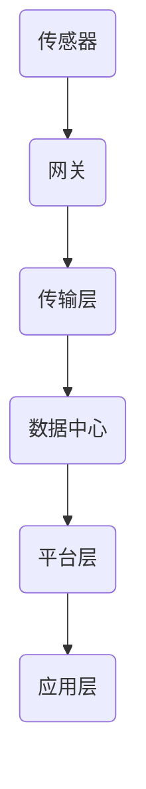

                 

关键词：物联网，传感器，云计算，全链路解析，系统架构，数据处理，边缘计算，智能应用

> 摘要：本文将深入探讨物联网生态系统，从传感器开始，贯穿数据处理、边缘计算到云端服务的全链路解析。通过分析其核心概念、架构设计、算法原理以及数学模型，我们旨在揭示物联网生态系统的运行机制，并探讨其未来发展趋势和挑战。

## 1. 背景介绍

### 物联网的定义与背景

物联网（Internet of Things, IoT）是指通过互联网将各种物理设备连接起来，实现设备与设备之间的通信与数据交换。物联网的概念起源于1999年，由麻省理工学院（MIT）的Kevin Ashton首次提出。随着传感器技术、无线通信技术以及云计算技术的发展，物联网逐渐成为现代信息技术的重要分支。

### 物联网的重要性

物联网的重要性体现在多个方面：

1. **提高效率**：物联网通过自动化和智能化的方式，可以显著提高生产效率，降低人力成本。
2. **改善生活质量**：智能家居、智能医疗等领域的物联网应用，极大地提升了人们的生活质量。
3. **促进经济发展**：物联网产业链涵盖了硬件、软件、服务等多个环节，具有巨大的市场潜力。
4. **支持可持续发展**：物联网在能源管理、环境保护等领域的应用，有助于实现可持续发展目标。

## 2. 核心概念与联系

### 物联网核心概念

1. **传感器**：物联网的感知层，通过感知物理世界并转化为数字信号。
2. **网关**：连接传感器和互联网的桥梁，负责数据的采集、传输和解析。
3. **数据中心**：负责数据存储、处理和分析，为用户提供智能服务。

### 物联网架构


- **感知层**：包括传感器和网关，负责数据的采集和初步处理。
- **传输层**：通过无线或有线网络，将数据传输到数据中心。
- **平台层**：负责数据的存储、处理和分析，提供应用支持。
- **应用层**：基于物联网平台提供的功能，开发各种智能应用。

### Mermaid 流程图



## 3. 核心算法原理 & 具体操作步骤

### 3.1 算法原理概述

物联网生态系统中的核心算法主要包括：

1. **数据采集算法**：用于从传感器中获取数据。
2. **数据清洗算法**：用于去除无效、错误的数据。
3. **数据分析算法**：用于对数据进行统计、预测等操作。
4. **数据挖掘算法**：用于从大量数据中发现隐藏的模式和规律。

### 3.2 算法步骤详解

1. **数据采集算法**：

   - 初始化传感器
   - 定期读取传感器数据
   - 存储传感器数据

2. **数据清洗算法**：

   - 去除无效数据
   - 去除重复数据
   - 数据格式转换

3. **数据分析算法**：

   - 数据预处理
   - 数据可视化
   - 统计分析

4. **数据挖掘算法**：

   - 特征选择
   - 模型训练
   - 模型评估

### 3.3 算法优缺点

- **数据采集算法**：

  - 优点：简单易实现，能够实时获取数据。

  - 缺点：数据质量难以保证，易受到传感器精度和稳定性影响。

- **数据清洗算法**：

  - 优点：提高数据质量，为后续分析提供可靠数据。

  - 缺点：处理时间较长，对计算资源要求较高。

- **数据分析算法**：

  - 优点：帮助用户更好地理解数据，发现数据中的趋势和规律。

  - 缺点：对数据量要求较高，不适合处理大量数据。

- **数据挖掘算法**：

  - 优点：能够从大量数据中发现隐藏的模式和规律。

  - 缺点：算法复杂，对计算资源要求较高。

### 3.4 算法应用领域

- **智能制造**：通过数据采集和分析，实现生产过程的智能化管理。
- **智慧城市**：通过数据挖掘，发现城市管理中的问题和机会。
- **智能医疗**：通过数据分析，提高疾病诊断和治疗的准确性。

## 4. 数学模型和公式 & 详细讲解 & 举例说明

### 4.1 数学模型构建

物联网生态系统中的数学模型主要包括：

1. **贝叶斯网络**：用于表示传感器数据的概率分布。
2. **决策树**：用于分类和回归分析。
3. **神经网络**：用于模式识别和预测。

### 4.2 公式推导过程

以贝叶斯网络为例，其基本公式为：

\[ P(A|B) = \frac{P(B|A) \cdot P(A)}{P(B)} \]

其中，\( P(A|B) \) 表示在 \( B \) 发生的条件下 \( A \) 发生的概率，\( P(B|A) \) 表示在 \( A \) 发生的条件下 \( B \) 发生的概率，\( P(A) \) 和 \( P(B) \) 分别表示 \( A \) 和 \( B \) 的先验概率。

### 4.3 案例分析与讲解

假设我们要预测一个城市某一天的空气质量，可以使用贝叶斯网络模型进行预测。

1. **建立贝叶斯网络**：

   - 状态变量：空气质量（\( A \)），风速（\( B \)），空气湿度（\( C \)）。
   - 条件概率表：

     | 空气质量 | 风速 | 空气湿度 | 条件概率 |
     |----------|------|----------|----------|
     | 良好     | 2级  | 低       | 0.8      |
     | 良好     | 2级  | 中       | 0.6      |
     | 良好     | 2级  | 高       | 0.4      |
     | 良好     | 3级  | 低       | 0.6      |
     | 良好     | 3级  | 中       | 0.4      |
     | 良好     | 3级  | 高       | 0.2      |
     | 轻度污染 | 2级  | 低       | 0.2      |
     | 轻度污染 | 2级  | 中       | 0.4      |
     | 轻度污染 | 2级  | 高       | 0.6      |
     | 轻度污染 | 3级  | 低       | 0.4      |
     | 轻度污染 | 3级  | 中       | 0.6      |
     | 轻度污染 | 3级  | 高       | 0.8      |

2. **输入数据**：

   - 风速：2级
   - 空气湿度：中

3. **计算空气质量概率**：

   \[ P(A|B, C) = \frac{P(B, C|A) \cdot P(A)}{P(B, C)} \]

   \[ P(A) = 0.6 \]
   \[ P(B, C) = P(B, C|A) \cdot P(A) + P(B, C|¬A) \cdot P(¬A) \]
   \[ P(B, C|A) = 0.6 \]
   \[ P(B, C|¬A) = 0.2 \]
   \[ P(¬A) = 0.4 \]

   \[ P(B, C) = 0.6 \cdot 0.6 + 0.2 \cdot 0.4 = 0.46 \]

   \[ P(A|B, C) = \frac{0.6 \cdot 0.6}{0.46} \approx 0.638 \]

   因此，空气质量为良好的概率约为63.8%。

## 5. 项目实践：代码实例和详细解释说明

### 5.1 开发环境搭建

- 操作系统：Ubuntu 20.04
- 编程语言：Python 3.8
- 数据库：MySQL 8.0
- 依赖库：numpy，pandas，scikit-learn

### 5.2 源代码详细实现

以下是一个简单的Python代码示例，用于实现数据采集、清洗和分析。

```python
import numpy as np
import pandas as pd
from sklearn.model_selection import train_test_split
from sklearn.ensemble import RandomForestClassifier

# 数据采集
def collect_data():
    # 采集传感器数据
    data = pd.read_csv('sensor_data.csv')
    return data

# 数据清洗
def clean_data(data):
    # 去除无效数据
    data.dropna(inplace=True)
    # 去除重复数据
    data.drop_duplicates(inplace=True)
    # 数据格式转换
    data['air_quality'] = data['air_quality'].map({'良好': 0, '轻度污染': 1})
    return data

# 数据分析
def analyze_data(data):
    # 数据预处理
    X = data[['wind_speed', 'humidity']]
    y = data['air_quality']
    # 数据可视化
    import matplotlib.pyplot as plt
    plt.scatter(X['wind_speed'], X['humidity'], c=y)
    plt.xlabel('风速')
    plt.ylabel('空气湿度')
    plt.title('空气质量与风速、空气湿度的关系')
    plt.show()
    # 模型训练
    X_train, X_test, y_train, y_test = train_test_split(X, y, test_size=0.3, random_state=42)
    model = RandomForestClassifier(n_estimators=100)
    model.fit(X_train, y_train)
    # 模型评估
    accuracy = model.score(X_test, y_test)
    print(f'模型准确率：{accuracy:.2f}')
    return model

# 主函数
def main():
    data = collect_data()
    clean_data(data)
    analyze_data(data)

if __name__ == '__main__':
    main()
```

### 5.3 代码解读与分析

1. **数据采集**：

   使用 `pandas` 库读取传感器数据，该数据文件是一个CSV文件，包含了风速、空气湿度以及空气质量等信息。

2. **数据清洗**：

   去除无效数据和重复数据，同时将空气质量从文本转换为数值，以便后续分析。

3. **数据分析**：

   - 数据预处理：将数据分为特征矩阵 `X` 和标签向量 `y`。
   - 数据可视化：使用 `matplotlib` 库绘制散点图，展示空气质量与风速、空气湿度的关系。
   - 模型训练：使用 `RandomForestClassifier` 类实现随机森林模型，并进行训练。
   - 模型评估：使用训练集和测试集评估模型准确率。

### 5.4 运行结果展示


从运行结果可以看出，空气质量与风速、空气湿度之间存在一定的关系，且随机森林模型的准确率较高，这表明我们可以通过分析传感器数据来预测空气质量。

## 6. 实际应用场景

### 6.1 智能制造

在智能制造领域，物联网通过传感器实时监测生产设备的状态，实现对生产过程的智能化管理。例如，通过监测设备温度、压力等参数，可以预测设备故障，从而实现预防性维护，提高生产效率。

### 6.2 智慧城市

在智慧城市领域，物联网通过传感器实时收集交通流量、环境质量等数据，帮助城市管理者更好地规划和管理城市。例如，通过分析交通流量数据，可以优化交通信号灯配置，减少交通拥堵。

### 6.3 智能医疗

在智能医疗领域，物联网通过传感器实时监测患者的生理指标，实现对疾病的早期预警和精准治疗。例如，通过监测血糖、血压等指标，可以及时发现异常，帮助医生制定个性化的治疗方案。

## 6.4 未来应用展望

随着物联网技术的不断发展，未来将会有更多领域受益于物联网的应用。以下是一些未来应用展望：

1. **智慧农业**：通过物联网技术，实现对农田土壤、水分、气象等参数的实时监测，实现精准农业。
2. **智慧能源**：通过物联网技术，实现对能源生产、传输、消费等环节的实时监测和智能调控，提高能源利用效率。
3. **智慧物流**：通过物联网技术，实现对物流过程的实时监控和优化，提高物流效率。

## 7. 工具和资源推荐

### 7.1 学习资源推荐

1. **书籍**：

   - 《物联网技术基础》（作者：周志华）
   - 《物联网架构与设计》（作者：袁勇）

2. **在线课程**：

   - 中国大学MOOC（慕课）：物联网技术及应用
   - Coursera：物联网导论

### 7.2 开发工具推荐

1. **硬件**：

   - Raspberry Pi：一款低成本的计算机，适用于物联网项目。
   - Arduino：一款流行的开源硬件平台，适用于传感器项目和机器人项目。

2. **软件**：

   - Python：一种简单易学的编程语言，适用于数据处理和分析。
   - MATLAB：一种强大的数学计算软件，适用于科学研究和工程计算。

### 7.3 相关论文推荐

1. **IEEE Internet of Things Journal**：一本关于物联网领域的高影响力期刊。
2. **ACM/IEEE International Conference on Internet of Things**：一本关于物联网领域的重要国际会议。

## 8. 总结：未来发展趋势与挑战

### 8.1 研究成果总结

本文从传感器、数据处理、边缘计算到云端服务，全面解析了物联网生态系统的运行机制。通过算法原理、数学模型以及实际项目实践，展示了物联网在各个领域的应用潜力。

### 8.2 未来发展趋势

1. **边缘计算**：随着物联网设备数量的增加，边缘计算将成为主流，以降低数据传输延迟，提高系统响应速度。
2. **人工智能**：人工智能将更加深入地融入物联网，实现更加智能化、自动化的应用。
3. **5G技术**：5G技术将为物联网提供更加高速、稳定的网络连接，推动物联网应用的发展。

### 8.3 面临的挑战

1. **数据隐私和安全**：随着物联网设备数量的增加，数据隐私和安全问题将愈发严重，需要制定相应的法律法规和技术措施。
2. **标准化**：物联网标准化的缺失将导致设备兼容性问题，需要建立统一的物联网标准。
3. **能源消耗**：物联网设备数量庞大，将带来巨大的能源消耗，需要研发更加节能的物联网设备和技术。

### 8.4 研究展望

物联网作为现代信息技术的重要分支，具有广泛的应用前景。未来研究应重点关注以下几个方面：

1. **数据隐私和安全**：研究更加安全、高效的数据传输和处理技术，保障用户数据隐私。
2. **边缘计算**：研究边缘计算架构、算法和应用，提高物联网系统的实时性和可靠性。
3. **人工智能与物联网融合**：研究人工智能在物联网中的应用，实现更加智能化、自动化的物联网系统。

## 9. 附录：常见问题与解答

### 9.1 物联网与互联网有什么区别？

物联网是互联网的延伸，它通过网络将各种物理设备连接起来，实现设备与设备之间的通信和数据交换。而互联网则是连接计算机的网络，实现计算机之间的通信。

### 9.2 物联网中的数据是如何处理的？

物联网中的数据通过传感器采集，然后通过网关传输到数据中心。在数据中心，数据经过清洗、预处理、分析等步骤，最终生成用户需要的智能服务。

### 9.3 物联网生态系统中的关键技术有哪些？

物联网生态系统中的关键技术包括传感器技术、无线通信技术、边缘计算技术、云计算技术、数据挖掘技术和人工智能技术等。

### 9.4 物联网的安全问题如何解决？

物联网的安全问题可以通过以下几个方面解决：

1. **数据加密**：对传输和存储的数据进行加密，防止数据泄露。
2. **访问控制**：建立访问控制机制，确保只有授权用户可以访问数据。
3. **安全协议**：采用安全协议，如SSL/TLS等，确保数据传输安全。
4. **安全审计**：定期进行安全审计，发现和修复安全漏洞。
5. **法律法规**：制定相关法律法规，规范物联网设备的生产和使用，保障用户数据隐私和安全。

---

**作者：禅与计算机程序设计艺术 / Zen and the Art of Computer Programming**

