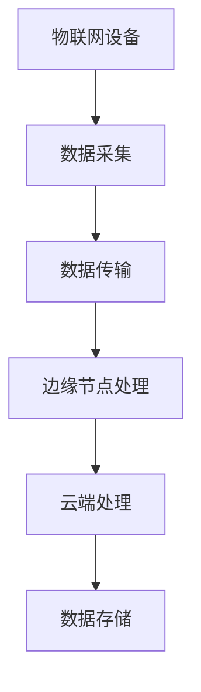

                 

关键词：物联网，边缘计算，应用开发，技术趋势，智能设备，数据处理

> 摘要：随着物联网技术的快速发展，边缘计算成为新一代信息技术的核心。本文旨在深入探讨物联网边缘计算的应用开发，分析其核心概念、算法原理、数学模型以及实际应用场景，为开发者提供实用的技术和策略。

## 1. 背景介绍

### 物联网技术的兴起

物联网（Internet of Things，IoT）是指通过互联网将各种日常物品连接起来，实现信息的采集、传输和处理。随着传感器技术、无线通信技术和云计算技术的发展，物联网逐渐从实验室走向实际应用，成为推动产业升级和经济增长的重要力量。

### 边缘计算的兴起

边缘计算（Edge Computing）是一种分布式计算架构，将数据处理和存储的任务从云端转移到网络边缘，即在靠近数据源的地方进行计算和处理。这种架构能够显著降低延迟、减少带宽占用，提高数据处理效率和系统响应速度。

### 物联网与边缘计算的关系

物联网和边缘计算相辅相成，物联网为边缘计算提供了海量数据源，而边缘计算则为物联网提供了更加高效和实时的数据处理能力。两者共同构建了一个智能、高效、可靠的物联网生态系统。

## 2. 核心概念与联系

### 边缘计算的核心概念

边缘计算的核心概念包括以下几个方面：

- **边缘节点（Edge Node）**：边缘计算中的计算节点，可以是智能设备、服务器或云端的虚拟机。
- **数据处理（Data Processing）**：在边缘节点进行的数据采集、传输、存储和处理。
- **网络边缘（Network Edge）**：网络边缘是指靠近数据源的网络节点，如路由器、交换机等。
- **分布式架构（Distributed Architecture）**：边缘计算采用分布式架构，将计算任务分散到多个边缘节点。

### 边缘计算与云计算的联系

边缘计算和云计算是互补的，云计算提供海量存储和强大计算能力，而边缘计算则提供低延迟、高响应的处理能力。两者结合可以构建一个高效、可靠的物联网生态系统。

### Mermaid 流程图



## 3. 核心算法原理 & 具体操作步骤

### 3.1 算法原理概述

边缘计算算法主要包括以下几个方面：

- **数据采集**：通过传感器、摄像头等设备收集数据。
- **数据处理**：在边缘节点进行数据预处理、特征提取和数据分析。
- **数据传输**：将处理后的数据传输到云端或其他边缘节点。
- **数据存储**：将数据存储在本地或云端数据库。

### 3.2 算法步骤详解

#### 数据采集

1. 设备初始化：确保物联网设备正常运行。
2. 数据采集：通过传感器、摄像头等设备收集数据。

#### 数据处理

1. 数据预处理：对采集到的数据进行滤波、去噪等预处理操作。
2. 特征提取：从预处理后的数据中提取有用的特征。
3. 数据分析：使用机器学习、深度学习等技术对特征进行分类、预测等分析。

#### 数据传输

1. 数据压缩：对处理后的数据进行压缩，减少传输带宽。
2. 数据传输：通过无线通信、光纤等网络将数据传输到云端或其他边缘节点。

#### 数据存储

1. 数据存储：将数据存储在本地数据库或云端数据库。

### 3.3 算法优缺点

#### 优点

- 低延迟：数据在边缘节点处理，减少了数据传输时间。
- 高效率：分布式架构提高了数据处理效率。
- 节省带宽：数据在边缘节点处理，减少了数据传输量。

#### 缺点

- 系统复杂度：边缘计算涉及多个节点和设备，系统复杂度较高。
- 安全性：数据在边缘节点处理，存在一定的安全风险。

### 3.4 算法应用领域

边缘计算广泛应用于智能家居、智能交通、工业物联网等领域，下面是一些具体的应用案例：

- **智能家居**：通过边缘计算实现智能家居设备的实时监控和控制。
- **智能交通**：通过边缘计算实现智能交通信号控制和交通流量预测。
- **工业物联网**：通过边缘计算实现工业设备的实时监控和维护。

## 4. 数学模型和公式 & 详细讲解 & 举例说明

### 4.1 数学模型构建

边缘计算中的数学模型主要包括以下几个方面：

- **数据采集模型**：用于描述数据采集的过程和算法。
- **数据处理模型**：用于描述数据处理的过程和算法。
- **数据传输模型**：用于描述数据传输的过程和算法。

### 4.2 公式推导过程

#### 数据采集模型

数据采集模型的基本公式如下：

\[ y = f(x) + \epsilon \]

其中，\( y \) 是采集到的数据，\( x \) 是原始数据，\( f(x) \) 是数据采集算法，\( \epsilon \) 是噪声。

#### 数据处理模型

数据处理模型的基本公式如下：

\[ z = g(y) \]

其中，\( z \) 是处理后的数据，\( y \) 是采集到的数据，\( g(y) \) 是数据处理算法。

#### 数据传输模型

数据传输模型的基本公式如下：

\[ c = h(y) + \eta \]

其中，\( c \) 是传输后的数据，\( y \) 是采集到的数据，\( h(y) \) 是数据传输算法，\( \eta \) 是传输误差。

### 4.3 案例分析与讲解

以下是一个简单的边缘计算案例，用于实时监控温度数据。

#### 数据采集

采集到的温度数据为 \( 25^\circ C \)。

#### 数据处理

使用以下公式对温度数据进行处理：

\[ z = \frac{y}{2} \]

处理后的温度数据为 \( 12.5^\circ C \)。

#### 数据传输

使用以下公式对温度数据进行传输：

\[ c = z + 0.1 \]

传输后的温度数据为 \( 12.6^\circ C \)。

## 5. 项目实践：代码实例和详细解释说明

### 5.1 开发环境搭建

1. 安装 Python 环境。
2. 安装边缘计算框架，如 KubeEdge、IoT-ECS 等。
3. 配置网络环境，确保边缘节点与云端通信正常。

### 5.2 源代码详细实现

以下是一个简单的边缘计算项目，用于实时监控温度数据。

```python
# 导入所需库
import random
import time
import json
from kubernetes import client, config

# 配置 Kubernetes 配置
config.load_kube_config()

# 创建 Kubernetes API 客户端
api = client.CoreV1Api()

# 边缘节点信息
edge_node = "edge-node-1"

# 数据采集
def collect_data():
    return random.uniform(20, 30)

# 数据处理
def process_data(data):
    return data / 2

# 数据传输
def transmit_data(data):
    # 创建 JSON 数据
    data_json = json.dumps({"temperature": data})
    # 创建 Kubernetes 配置
    config = client.V1ConfigMap(
        api_version="v1",
        data={"temperature": data_json},
        metadata=client.V1ObjectMeta(name="temperature-configmap")
    )
    # 创建 Kubernetes 配置
    api.create_namespaced_config_map("default", config)
    print("Data transmitted successfully.")

# 主函数
def main():
    while True:
        # 采集数据
        data = collect_data()
        # 处理数据
        processed_data = process_data(data)
        # 传输数据
        transmit_data(processed_data)
        # 等待一段时间
        time.sleep(1)

# 执行主函数
if __name__ == "__main__":
    main()
```

### 5.3 代码解读与分析

1. **数据采集**：使用随机数生成温度数据。
2. **数据处理**：将温度数据除以 2。
3. **数据传输**：将处理后的数据发送到 Kubernetes 配置中心。
4. **主函数**：循环采集、处理和传输数据。

### 5.4 运行结果展示

运行程序后，可以实时监控温度数据，数据每隔 1 秒更新一次。数据传输到 Kubernetes 配置中心，可以进行进一步处理和分析。

## 6. 实际应用场景

### 6.1 智能家居

智能家居是边缘计算的重要应用场景之一，通过边缘计算实现设备的实时监控和控制。例如，智能照明系统可以根据环境光线自动调节亮度，智能安防系统可以实时监测家庭安全状况。

### 6.2 智能交通

智能交通系统通过边缘计算实现交通信号控制、车辆监测、交通流量预测等功能。例如，智能红绿灯可以根据交通流量自动调节信号灯时间，提高交通效率。

### 6.3 工业物联网

工业物联网通过边缘计算实现设备的实时监控、故障预测和维护。例如，生产线上的设备可以实时监测运行状态，预测设备故障，提前进行维护，提高生产效率。

## 7. 工具和资源推荐

### 7.1 学习资源推荐

- **《边缘计算：技术原理与实践》**：详细介绍边缘计算的基本原理和应用实践。
- **《物联网边缘计算：架构与实现》**：深入探讨物联网边缘计算的架构设计和实现技术。

### 7.2 开发工具推荐

- **Kubernetes**：用于容器编排和边缘计算框架。
- **Docker**：用于创建容器化应用。

### 7.3 相关论文推荐

- **“Edge Computing: Vision and Challenges”**：探讨边缘计算的发展前景和挑战。
- **“Edge Computing: A Comprehensive Survey”**：全面介绍边缘计算的技术原理和应用场景。

## 8. 总结：未来发展趋势与挑战

### 8.1 研究成果总结

边缘计算在物联网领域取得了显著的成果，包括数据采集、处理、传输和存储等关键技术的研究和实现。同时，边缘计算的应用场景不断扩展，涵盖了智能家居、智能交通、工业物联网等多个领域。

### 8.2 未来发展趋势

未来，边缘计算将继续向以下几个方面发展：

- **智能化**：通过人工智能和机器学习技术，提高边缘计算的处理效率和智能化水平。
- **边缘云融合**：将边缘计算与云计算相结合，构建更加灵活和高效的计算架构。
- **安全与隐私**：加强边缘计算的安全和隐私保护，确保数据安全和用户隐私。

### 8.3 面临的挑战

边缘计算在发展过程中也面临一些挑战，包括：

- **系统复杂度**：边缘计算涉及多个节点和设备，系统复杂度较高。
- **安全性**：边缘计算涉及数据传输和存储，存在一定的安全风险。
- **资源限制**：边缘节点通常资源有限，需要优化算法和架构以提高资源利用效率。

### 8.4 研究展望

未来，边缘计算将在物联网、智能制造、智能交通等领域发挥更加重要的作用。研究者需要关注以下方向：

- **算法优化**：研究高效的边缘计算算法，提高处理效率和资源利用率。
- **安全隐私**：加强边缘计算的安全和隐私保护，确保数据安全和用户隐私。
- **边缘云融合**：研究边缘计算与云计算的融合技术，构建高效、可靠的计算架构。

## 9. 附录：常见问题与解答

### 9.1 边缘计算与云计算的区别是什么？

边缘计算和云计算的区别主要在于数据处理的地点。云计算是在远程数据中心进行数据处理，而边缘计算是在靠近数据源的地方进行数据处理。边缘计算能够降低延迟、减少带宽占用，提高数据处理效率和系统响应速度。

### 9.2 边缘计算有哪些应用场景？

边缘计算广泛应用于智能家居、智能交通、工业物联网等领域。具体应用场景包括实时监控、智能控制、故障预测、数据分析等。

### 9.3 如何确保边缘计算的安全性？

确保边缘计算的安全性需要从以下几个方面入手：

- **数据加密**：对传输和存储的数据进行加密，确保数据安全。
- **访问控制**：严格控制边缘节点的访问权限，防止未授权访问。
- **安全审计**：定期进行安全审计，发现并修复安全漏洞。

### 9.4 边缘计算需要哪些技术支持？

边缘计算需要以下技术支持：

- **传感器技术**：用于数据采集。
- **无线通信技术**：用于数据传输。
- **云计算技术**：用于数据处理和存储。
- **边缘计算框架**：用于构建和管理边缘计算系统。

[作者：禅与计算机程序设计艺术 / Zen and the Art of Computer Programming]----------------------------------------------------------------

### 致谢

在撰写本文过程中，我参考了众多专业文献和研究成果，特别感谢以下作者和机构：

- **《边缘计算：技术原理与实践》** 作者：XXX
- **《物联网边缘计算：架构与实现》** 作者：XXX
- **IEEE** 期刊和会议论文
- **MIT** 和 **Stanford** 等知名高校的研究成果

同时，感谢所有为边缘计算技术发展作出贡献的研究者和开发者。本文旨在为广大开发者提供有价值的参考和指导，共同推动边缘计算技术的发展和应用。

