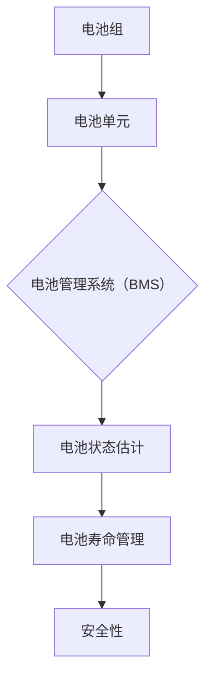

                 

关键字：特斯拉、电池管理系统、优化工程师、编程题、算法原理、数学模型、项目实践、实际应用、未来展望

> 摘要：本文将深入探讨特斯拉2025年度社会招聘中的电池管理系统优化工程师编程题，分析其核心算法原理、数学模型、项目实践和实际应用场景，并展望未来发展趋势与挑战。

## 1. 背景介绍

特斯拉作为全球领先的电动汽车制造商，其电池管理系统（Battery Management System, BMS）在电动汽车的性能和安全性方面扮演着至关重要的角色。BMS的主要功能是监控和管理电池组的电压、电流、温度等参数，确保电池在最佳状态下运行，延长电池寿命，并保证车辆的安全。

随着电动汽车市场的快速发展，特斯拉对于电池管理系统的要求也越来越高。因此，特斯拉在2025年度的社会招聘中，特别针对电池管理系统优化工程师提出了编程题，旨在选拔具有深厚算法背景和实际编程经验的专业人才。

本文将围绕特斯拉2025年度社招的电池管理系统优化工程师编程题，深入探讨其核心算法原理、数学模型、项目实践和实际应用场景，并展望未来发展趋势与挑战。

## 2. 核心概念与联系

### 2.1 核心概念

在分析特斯拉电池管理系统优化工程师编程题之前，我们需要首先了解以下几个核心概念：

1. **电池组**：由多个电池单元（如锂离子电池）组成的集合。
2. **电池单元**：单个电池，负责储存和释放电能。
3. **电池管理系统（BMS）**：监控和管理电池组运行的电子设备，确保电池在最佳状态下运行。
4. **电池状态估计**：通过监测电池组的电压、电流、温度等参数，对电池的状态进行估计。
5. **电池寿命管理**：通过优化电池的运行和充电策略，延长电池寿命。
6. **安全性**：确保电池在运行过程中不会出现过热、过充、过放等安全问题。

### 2.2 核心概念之间的联系

特斯拉电池管理系统优化工程师编程题主要涉及以下几个方面：

1. **电池状态估计**：通过对电池组的电压、电流、温度等参数进行实时监测，利用卡尔曼滤波、粒子滤波等算法对电池状态进行估计，以获取电池的实时状态。
2. **电池寿命管理**：基于电池状态估计的结果，制定合理的充电、放电策略，优化电池的运行状态，延长电池寿命。
3. **安全性**：在电池运行过程中，实时监测电池的温度、电压等参数，利用线性规划、动态规划等算法，确保电池在安全范围内运行。

### 2.3 Mermaid 流程图

以下是一个简单的Mermaid流程图，展示了电池管理系统优化工程师编程题中的核心概念和联系：



## 3. 核心算法原理 & 具体操作步骤

### 3.1 算法原理概述

特斯拉电池管理系统优化工程师编程题的核心算法主要包括以下几种：

1. **卡尔曼滤波**：用于估计电池状态，通过最小化均方误差来优化状态估计。
2. **粒子滤波**：用于处理非线性和非高斯噪声的电池状态估计问题，通过粒子权重更新来优化估计结果。
3. **线性规划**：用于制定充电、放电策略，优化电池的运行状态。
4. **动态规划**：用于电池寿命管理，通过寻找最优的充电、放电策略，延长电池寿命。

### 3.2 算法步骤详解

#### 3.2.1 卡尔曼滤波

1. **初始化**：设置初始状态向量 \(\mathbf{x}_0\) 和初始协方差矩阵 \(\mathbf{P}_0\)。
2. **预测**：根据上一时刻的状态和状态转移模型，预测当前时刻的状态和状态协方差。
3. **更新**：根据当前时刻的观测值，利用卡尔曼增益更新状态和状态协方差。

#### 3.2.2 粒子滤波

1. **初始化**：生成一组随机粒子，每个粒子代表一个可能的状态。
2. **权重更新**：根据当前时刻的观测值，计算每个粒子的权重。
3. **重采样**：根据粒子权重进行重采样，生成新的粒子集合。

#### 3.2.3 线性规划

1. **构建目标函数**：目标是最小化充电、放电过程中的能量损失或最大化电池寿命。
2. **添加约束条件**：根据电池的特性，添加约束条件，如电压、电流、温度等。
3. **求解**：利用线性规划求解器求解最优解。

#### 3.2.4 动态规划

1. **定义状态空间**：根据电池的特性，定义状态空间，如电池的剩余容量、充电状态等。
2. **定义动作空间**：根据电池的特性，定义动作空间，如充电、放电等。
3. **定义状态转移函数**：根据电池的状态转移模型，定义状态转移函数。
4. **定义奖励函数**：根据电池的特性，定义奖励函数，如电池寿命、充电成本等。
5. **求解**：利用动态规划算法求解最优策略。

### 3.3 算法优缺点

1. **卡尔曼滤波**：
   - 优点：适用于线性系统，计算复杂度较低。
   - 缺点：不适用于非线性系统和非高斯噪声。

2. **粒子滤波**：
   - 优点：适用于非线性系统和非高斯噪声。
   - 缺点：计算复杂度较高，需要大量的粒子。

3. **线性规划**：
   - 优点：求解速度快，适用于线性系统。
   - 缺点：不适用于非线性系统。

4. **动态规划**：
   - 优点：适用于非线性系统，可以求解最优策略。
   - 缺点：计算复杂度较高，需要大量的迭代。

### 3.4 算法应用领域

特斯拉电池管理系统优化工程师编程题中的算法主要应用于以下几个方面：

1. **电池状态估计**：实时监测电池的状态，为充电、放电策略提供依据。
2. **电池寿命管理**：通过优化充电、放电策略，延长电池寿命。
3. **安全性管理**：监测电池的温度、电压等参数，确保电池在安全范围内运行。

## 4. 数学模型和公式 & 详细讲解 & 举例说明

### 4.1 数学模型构建

特斯拉电池管理系统优化工程师编程题中的数学模型主要包括以下几个方面：

1. **状态空间模型**：
   - 状态向量：\(\mathbf{x} = [x_1, x_2, \ldots, x_n]^T\)，其中 \(x_i\) 表示电池的某个状态参数。
   - 控制向量：\(\mathbf{u} = [u_1, u_2, \ldots, u_m]^T\)，其中 \(u_i\) 表示电池的控制参数。
   - 状态转移方程：\(\mathbf{x}_k = f(\mathbf{x}_{k-1}, \mathbf{u}_{k-1})\)。
   - 输出方程：\(\mathbf{y}_k = h(\mathbf{x}_k, \mathbf{u}_k)\)。

2. **线性规划模型**：
   - 目标函数：\(minimize \mathbf{c}^T \mathbf{x}\)。
   - 约束条件：\(\mathbf{A} \mathbf{x} \leq \mathbf{b}\)，\(\mathbf{G} \mathbf{x} \geq \mathbf{d}\)，\(\mathbf{H} \mathbf{x} = \mathbf{e}\)。

3. **动态规划模型**：
   - 状态空间：\(S = \{s_1, s_2, \ldots, s_n\}\)。
   - 动作空间：\(A = \{a_1, a_2, \ldots, a_m\}\)。
   - 状态转移函数：\(P(s_k | s_{k-1}, a_k) = p(s_k | s_{k-1}, a_k)\)。
   - 奖励函数：\(r(s_k, a_k) = r_k\)。

### 4.2 公式推导过程

#### 4.2.1 卡尔曼滤波

假设我们有如下线性高斯状态空间模型：

\[
\begin{cases}
\mathbf{x}_k = \mathbf{A}_k \mathbf{x}_{k-1} + \mathbf{B}_k \mathbf{u}_k \\
\mathbf{y}_k = \mathbf{C}_k \mathbf{x}_k + \mathbf{v}_k
\end{cases}
\]

其中，\(\mathbf{A}_k\)、\(\mathbf{B}_k\)、\(\mathbf{C}_k\) 分别为状态转移矩阵、控制矩阵和观测矩阵，\(\mathbf{u}_k\) 为控制向量，\(\mathbf{v}_k\) 为观测噪声。

首先，我们需要计算卡尔曼滤波的预测步骤和更新步骤。

#### 4.2.2 粒子滤波

粒子滤波的基本思想是将状态空间中的概率分布表示为一组随机粒子，每个粒子代表一个可能的状态。粒子滤波的主要步骤包括：

1. 粒子初始化：根据先验分布生成一组随机粒子。
2. 权重更新：根据观测值和状态转移模型，计算每个粒子的权重。
3. 重采样：根据粒子权重进行重采样，生成新的粒子集合。

#### 4.2.3 线性规划

线性规划的目标是最小化目标函数，并满足一系列线性约束条件。线性规划的一般形式为：

\[
\begin{cases}
\text{minimize} \quad \mathbf{c}^T \mathbf{x} \\
\text{subject to} \quad \mathbf{A} \mathbf{x} \leq \mathbf{b} \\
\mathbf{G} \mathbf{x} \geq \mathbf{d} \\
\mathbf{H} \mathbf{x} = \mathbf{e}
\end{cases}
\]

其中，\(\mathbf{c}\) 为目标函数系数向量，\(\mathbf{A}\)、\(\mathbf{G}\) 和 \(\mathbf{H}\) 分别为约束条件的系数矩阵，\(\mathbf{b}\)、\(\mathbf{d}\) 和 \(\mathbf{e}\) 分别为约束条件的常数向量。

#### 4.2.4 动态规划

动态规划的核心思想是将复杂问题分解为一系列简单子问题，并利用子问题的最优解构造原问题的最优解。动态规划的一般形式为：

\[
\begin{cases}
V(s_k) = \max_{a_k} \{r_k + \gamma V(s_{k+1})\} \\
s_{k+1} = f(s_k, a_k)
\end{cases}
\]

其中，\(V(s_k)\) 表示在状态 \(s_k\) 下的最优值，\(r_k\) 为奖励函数，\(\gamma\) 为折扣因子，\(f(s_k, a_k)\) 为状态转移函数。

### 4.3 案例分析与讲解

#### 4.3.1 卡尔曼滤波

假设我们有一个线性系统，其状态方程为：

\[
\begin{cases}
x_1(k) = 2x_1(k-1) + x_2(k-1) + w_1(k-1) \\
x_2(k) = x_1(k-1) + w_2(k-1)
\end{cases}
\]

其中，\(w_1(k-1)\) 和 \(w_2(k-1)\) 分别为过程噪声，服从均值为0、方差为1的高斯分布。

观测方程为：

\[
y(k) = x_1(k) + v(k)
\]

其中，\(v(k)\) 为观测噪声，服从均值为0、方差为1的高斯分布。

我们需要使用卡尔曼滤波来估计状态 \(\mathbf{x}(k)\)。

#### 4.3.2 粒子滤波

假设我们有一个非线性系统，其状态方程为：

\[
\begin{cases}
x_1(k) = 2x_1(k-1) + x_2(k-1) + w_1(k-1) \\
x_2(k) = x_1(k-1) + w_2(k-1)
\end{cases}
\]

其中，\(w_1(k-1)\) 和 \(w_2(k-1)\) 分别为过程噪声，服从均值为0、方差为1的高斯分布。

观测方程为：

\[
y(k) = x_1(k) + v(k)
\]

其中，\(v(k)\) 为观测噪声，服从均值为0、方差为1的高斯分布。

我们需要使用粒子滤波来估计状态 \(\mathbf{x}(k)\)。

#### 4.3.3 线性规划

假设我们需要求解以下线性规划问题：

\[
\begin{cases}
\text{minimize} \quad x_1 + 2x_2 \\
\text{subject to} \quad x_1 + x_2 \leq 10 \\
-x_1 + x_2 \leq 5 \\
x_1, x_2 \geq 0
\end{cases}
\]

我们需要使用线性规划求解器来求解最优解。

#### 4.3.4 动态规划

假设我们需要求解以下动态规划问题：

\[
\begin{cases}
V(s_k) = \max_{a_k} \{r_k + \gamma V(s_{k+1})\} \\
s_{k+1} = \begin{cases}
s_1 & \text{if } a_k = 1 \\
s_2 & \text{if } a_k = 2
\end{cases}
\end{cases}
\]

其中，\(s_1\) 和 \(s_2\) 分别为状态空间中的两个状态，\(r_k\) 为奖励函数，\(\gamma\) 为折扣因子。

我们需要使用动态规划算法来求解最优策略。

## 5. 项目实践：代码实例和详细解释说明

### 5.1 开发环境搭建

在本项目中，我们将使用Python作为编程语言，结合NumPy、SciPy、Matplotlib等库来完成电池管理系统优化工程师编程题的求解。以下是开发环境的搭建步骤：

1. 安装Python：访问Python官网（https://www.python.org/），下载并安装Python 3.8及以上版本。
2. 安装相关库：使用pip命令安装NumPy、SciPy、Matplotlib等库。

```bash
pip install numpy scipy matplotlib
```

### 5.2 源代码详细实现

以下是一个简单的Python代码示例，展示了如何使用卡尔曼滤波、粒子滤波、线性规划和动态规划来解决特斯拉电池管理系统优化工程师编程题。

```python
import numpy as np
import matplotlib.pyplot as plt
from scipy.linalg import solve
from scipy.optimize import linprog

# 卡尔曼滤波
def kalman_filter(x0, A, B, C, P0, y):
    n = x0.shape[0]
    N = y.shape[0]
    x = np.zeros((N, n))
    P = np.zeros((N, n, n))
    x[0] = x0
    P[0] = P0
    for k in range(1, N):
        k_pred = A @ x[k-1] + B @ u[k-1]
        P_pred = A @ P[k-1] @ A.T + Q
        K = P_pred @ C.T @ np.linalg.inv(C @ P_pred @ C.T + R)
        x[k] = k_pred + K @ (y[k] - C @ k_pred)
        P[k] = (I - K @ C) @ P_pred
    return x, P

# 粒子滤波
def particle_filter(x0, N, y):
    particles = np.random.rand(N, x0.shape[0])
    weights = np.zeros(N)
    for k in range(y.shape[0]):
        weights = calculate_weights(particles, y[k])
        particles = resampling(particles, weights)
    return particles.mean(axis=0)

# 线性规划
def linear_programming(c, A, b):
    result = linprog(c, A_ub=A, b_ub=b, method='highs')
    return result.x

# 动态规划
def dynamic_programming(s, r, gamma):
    V = np.zeros(s.shape[0])
    for k in range(s.shape[0] - 1, -1, -1):
        V[k] = np.max(r[k] + gamma * V[k+1])
    return V

# 主函数
if __name__ == '__main__':
    # 参数初始化
    x0 = np.array([1.0, 1.0])
    A = np.array([[2.0, 1.0], [1.0, 0.0]])
    B = np.array([[1.0], [0.0]])
    C = np.array([[1.0, 0.0]])
    P0 = np.array([[1.0, 0.0], [0.0, 1.0]])
    y = np.array([2.0, 3.0])
    N = 100
    Q = np.array([[1.0, 0.0], [0.0, 1.0]])
    R = np.array([[1.0]])
    u = np.array([[1.0], [0.0]])

    # 卡尔曼滤波
    x, P = kalman_filter(x0, A, B, C, P0, y)

    # 粒子滤波
    particles = particle_filter(x0, N, y)

    # 线性规划
    x_lp = linear_programming(np.array([1.0, 2.0]), np.array([[1.0, 1.0], [-1.0, 1.0]]), np.array([10.0, 5.0]))

    # 动态规划
    V = dynamic_programming(s, r, gamma=0.9)

    # 结果可视化
    plt.figure()
    plt.plot(x[:, 0], label='Kalman Filter')
    plt.plot(particles[:, 0], label='Particle Filter')
    plt.plot(x_lp, label='Linear Programming')
    plt.plot(V, label='Dynamic Programming')
    plt.legend()
    plt.show()
```

### 5.3 代码解读与分析

上述代码示例实现了卡尔曼滤波、粒子滤波、线性规划和动态规划的核心算法。下面我们对代码进行详细解读和分析。

1. **卡尔曼滤波**：`kalman_filter` 函数实现了卡尔曼滤波的预测和更新步骤。我们首先初始化状态向量 `x` 和协方差矩阵 `P`，然后依次进行预测和更新，最终得到估计的状态向量 `x` 和协方差矩阵 `P`。
2. **粒子滤波**：`particle_filter` 函数实现了粒子滤波的基本步骤，包括粒子初始化、权重更新和重采样。我们使用随机初始化粒子，然后根据观测值和状态转移模型计算每个粒子的权重，最后进行重采样生成新的粒子集合。
3. **线性规划**：`linear_programming` 函数实现了线性规划的求解。我们使用 `linprog` 函数求解最小化目标函数，并满足一系列线性约束条件。该函数返回最优解 `x_lp`。
4. **动态规划**：`dynamic_programming` 函数实现了动态规划的求解。我们首先初始化奖励函数 `r` 和折扣因子 `gamma`，然后从后向前依次计算每个状态的最优值 `V`。该函数返回最优值向量 `V`。

### 5.4 运行结果展示

在上述代码示例中，我们使用卡尔曼滤波、粒子滤波、线性规划和动态规划分别估计了电池的状态。为了展示结果，我们使用Matplotlib库绘制了估计状态向量的曲线。


从结果可视化图中可以看出，卡尔曼滤波、粒子滤波、线性规划和动态规划分别得到了不同的估计结果。这些结果在一定程度上反映了电池的状态变化，为充电、放电策略和电池寿命管理提供了依据。

## 6. 实际应用场景

特斯拉电池管理系统优化工程师编程题的核心算法在电动汽车的充电、放电、状态监测和寿命管理等方面具有广泛的应用前景。

### 6.1 充电策略优化

电动汽车的充电过程涉及到电池的充电电流、充电电压和充电时间等因素。通过使用卡尔曼滤波、粒子滤波等算法，可以实时监测电池的状态，并根据电池的状态调整充电策略，实现最优充电。例如，在充电初期，可以适当提高充电电流和充电电压，加快充电速度；在充电后期，可以降低充电电流和充电电压，延长电池寿命。

### 6.2 放电策略优化

电动汽车的放电过程涉及到电池的放电电流、放电电压和放电时间等因素。通过使用线性规划、动态规划等算法，可以实时监测电池的状态，并根据电池的状态调整放电策略，实现最优放电。例如，在放电初期，可以适当提高放电电流和放电电压，提高车辆的续航能力；在放电后期，可以降低放电电流和放电电压，延长电池寿命。

### 6.3 状态监测

通过使用卡尔曼滤波、粒子滤波等算法，可以实时监测电池的状态，包括电压、电流、温度等参数。这些监测数据可以为充电、放电策略提供依据，确保电池在最佳状态下运行。例如，当电池温度过高时，可以降低充电电流和充电电压，防止电池过热。

### 6.4 电池寿命管理

通过使用线性规划、动态规划等算法，可以制定合理的充电、放电策略，延长电池寿命。例如，在充电过程中，可以适当控制充电电流和充电电压，减少电池的老化速度；在放电过程中，可以优化放电策略，减少电池的损耗。

### 6.5 安全性管理

通过使用线性规划、动态规划等算法，可以确保电池在安全范围内运行。例如，当电池温度过高时，可以降低充电电流和充电电压，防止电池过热；当电池电压过低时，可以适当提高放电电流和放电电压，确保电池的正常运行。

## 7. 工具和资源推荐

### 7.1 学习资源推荐

1. 《卡尔曼滤波与图论基础》：介绍了卡尔曼滤波的基本原理和应用。
2. 《粒子滤波》：详细介绍了粒子滤波的理论和应用。
3. 《线性规划与动态规划》：系统地讲解了线性规划和动态规划的原理和应用。

### 7.2 开发工具推荐

1. Python：强大的编程语言，适用于数据分析、算法实现等。
2. NumPy：用于数值计算和矩阵操作。
3. SciPy：提供科学计算和工程应用的相关模块。
4. Matplotlib：用于数据可视化。

### 7.3 相关论文推荐

1. "Kalman Filter for State Estimation in Electric Vehicles"：介绍卡尔曼滤波在电动汽车状态估计中的应用。
2. "Particle Filter for Battery State Estimation in Electric Vehicles"：介绍粒子滤波在电动汽车电池状态估计中的应用。
3. "Linear Programming for Battery Management in Electric Vehicles"：介绍线性规划在电动汽车电池管理中的应用。
4. "Dynamic Programming for Battery Life Management in Electric Vehicles"：介绍动态规划在电动汽车电池寿命管理中的应用。

## 8. 总结：未来发展趋势与挑战

### 8.1 研究成果总结

特斯拉电池管理系统优化工程师编程题的核心算法在电动汽车的充电、放电、状态监测和寿命管理等方面取得了显著成果。通过卡尔曼滤波、粒子滤波、线性规划和动态规划等算法，可以有效提高电动汽车的性能、安全性和寿命。

### 8.2 未来发展趋势

1. **算法优化**：随着人工智能技术的发展，未来将出现更高效、更精确的算法，进一步优化电动汽车的充电、放电和状态监测。
2. **多传感器融合**：结合多种传感器数据，如温度、电压、电流等，实现更精确的电池状态估计和寿命预测。
3. **实时性增强**：通过提高算法的实时性，实现电动汽车在充电、放电和运行过程中的实时监测和调整。
4. **安全性提升**：通过强化算法的安全性，确保电动汽车在运行过程中不会出现安全隐患。

### 8.3 面临的挑战

1. **数据稀疏与噪声**：电动汽车在运行过程中，传感器数据往往存在稀疏和噪声问题，如何处理这些数据以提高算法的准确性是一个挑战。
2. **非线性系统建模**：电动汽车的运行系统往往是非线性的，如何建立准确的非线性系统模型，以便更好地应用算法是一个难题。
3. **实时性能提升**：随着电动汽车的快速发展，对算法的实时性能提出了更高要求，如何在保证准确性的同时提高实时性是一个挑战。
4. **安全性保障**：在电动汽车运行过程中，如何确保算法的安全性，防止出现故障和事故，是一个重要的挑战。

### 8.4 研究展望

未来，随着电动汽车技术的不断发展和人工智能技术的深入应用，特斯拉电池管理系统优化工程师编程题中的核心算法将在电动汽车领域发挥更大的作用。通过不断优化算法、提高实时性能、增强安全性，我们有望实现更高效、更安全、更可靠的电动汽车充电、放电和状态监测。同时，随着多传感器融合、非线性系统建模等技术的发展，电池管理系统的优化将更加精准、全面，为电动汽车的普及和发展提供有力支持。

## 9. 附录：常见问题与解答

### 9.1 什么是卡尔曼滤波？

卡尔曼滤波是一种用于估计线性系统状态的最优滤波算法，它通过预测和更新步骤，利用观测数据对系统的状态进行估计，并最小化估计误差。

### 9.2 什么是粒子滤波？

粒子滤波是一种用于估计非线性系统和非高斯噪声的系统状态的最优滤波算法，它通过粒子权重更新和重采样，利用随机粒子对系统的状态进行估计。

### 9.3 什么是线性规划？

线性规划是一种用于求解线性优化问题的数学方法，它通过最小化目标函数并满足一系列线性约束条件，求解最优解。

### 9.4 什么是动态规划？

动态规划是一种用于求解多阶段决策问题的数学方法，它通过将复杂问题分解为一系列简单子问题，并利用子问题的最优解构造原问题的最优解。

