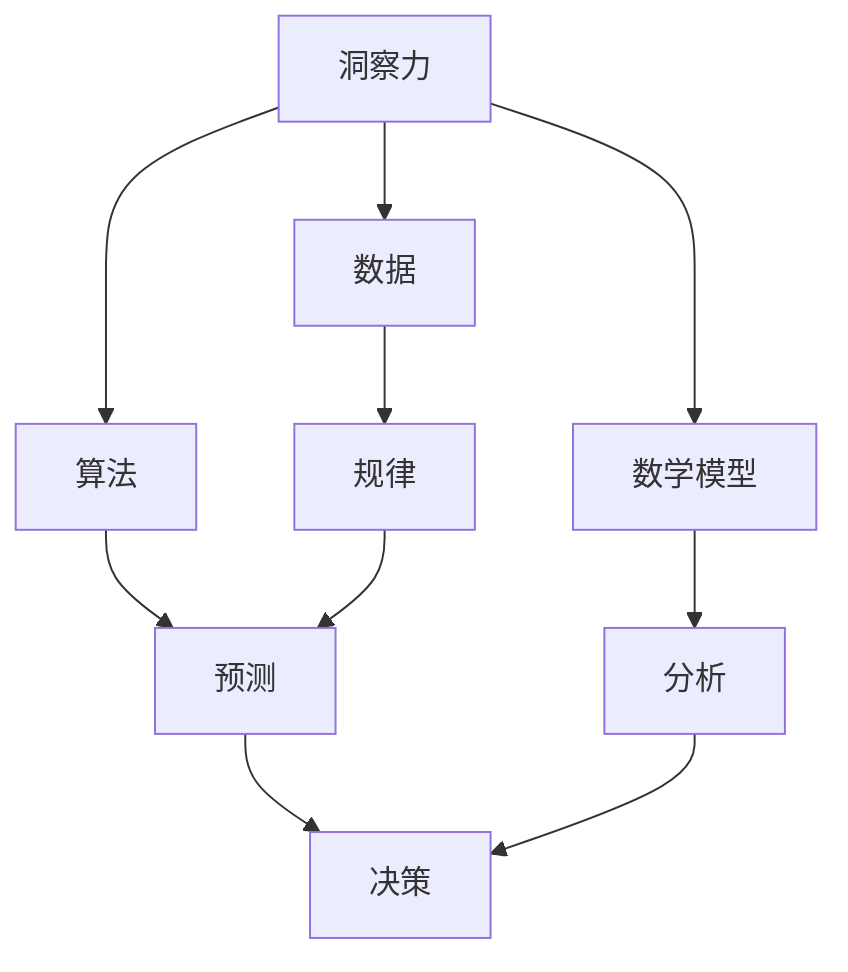

                 

关键词：洞察力、纷繁复杂、规律、人工智能、深度学习、数据挖掘、技术专家、算法原理、数学模型、实践应用、工具推荐

> 摘要：本文深入探讨了洞察力的本质及其在解决复杂问题中的应用。通过分析人工智能、数据挖掘等领域的案例，本文揭示了洞察力在技术发展和实践中的应用价值。同时，本文还提出了数学模型和算法原理的相关概念，以及未来发展的趋势和挑战。

## 1. 背景介绍

在当今信息化时代，数据爆炸性增长，技术发展日新月异。面对复杂的现实世界，如何从纷繁的数据中挖掘出有价值的规律，成为了众多行业面临的重大挑战。洞察力作为一种关键的能力，在其中起到了至关重要的作用。

洞察力不仅仅是一种感知能力，更是一种深层次的理解力和分析能力。在技术领域，洞察力能够帮助我们抓住问题的本质，识别潜在的规律，从而制定出有效的解决方案。本文旨在探讨洞察力的本质，以及如何在技术领域中应用洞察力解决复杂问题。

### 1.1 洞察力的定义

洞察力（Insight）是指能够迅速识别问题核心、理解事物本质、预见发展趋势的能力。它是一种跨越表面现象，深入本质的思考能力。在技术领域，洞察力可以帮助我们：

- 发现数据中的规律和模式
- 识别系统的瓶颈和优化点
- 预测未来的技术发展趋势
- 解决复杂的技术难题

### 1.2 技术领域中的洞察力应用

在人工智能、数据挖掘、机器学习等众多技术领域，洞察力发挥着重要作用。例如：

- **人工智能**：通过深入分析大量数据，人工智能系统能够发现其中的规律，从而进行智能决策。例如，自动驾驶技术需要具备对交通流量的洞察力，以便做出正确的行驶决策。
- **数据挖掘**：数据挖掘技术通过分析大量数据，发现隐藏在数据中的规律和关联。这种洞察力对于市场营销、金融分析等领域具有重要价值。
- **机器学习**：机器学习算法通过训练大量数据，学习到数据中的内在规律，并能够对新数据做出预测。这种洞察力在图像识别、自然语言处理等领域取得了显著成果。

## 2. 核心概念与联系

在深入探讨洞察力之前，我们需要了解几个核心概念和它们之间的联系。以下是一个 Mermaid 流程图，用于展示这些概念之间的关系。



### 2.1 数据

数据是洞察力的基础。通过收集和整理大量数据，我们能够为洞察力的发挥提供素材。数据的质量和多样性直接影响洞察力的有效性。

### 2.2 算法

算法是洞察力的工具。通过各种算法，我们可以从数据中提取出有价值的规律和模式。不同的算法适用于不同类型的数据，从而帮助我们更好地理解数据。

### 2.3 数学模型

数学模型是对数据和分析结果的抽象描述。通过数学模型，我们可以更清晰地理解数据中的规律，从而为决策提供依据。

### 2.4 规律

规律是数据中的潜在模式。通过洞察力，我们能够发现这些规律，并将其应用于实际问题的解决。

### 2.5 预测

预测是基于规律对未来进行推测。在技术领域，预测能力对于应对未来挑战具有重要意义。

### 2.6 分析

分析是对数据和规律进行深入理解的过程。通过分析，我们能够更好地理解问题的本质，从而做出更明智的决策。

### 2.7 决策

决策是基于分析结果做出的选择。在技术领域，洞察力可以帮助我们做出更准确的决策，提高系统的性能和效率。

## 3. 核心算法原理 & 具体操作步骤

### 3.1 算法原理概述

在本节中，我们将介绍几种在技术领域中广泛应用的核心算法，并简要概述其原理。

#### 3.1.1 数据挖掘算法

数据挖掘算法用于从大量数据中提取出有价值的规律和模式。常见的算法包括：

- **关联规则学习（Association Rule Learning）**：用于发现数据中的关联关系。例如，在超市销售数据中，发现哪些商品经常一起购买。
- **分类算法（Classification Algorithms）**：用于将数据分为不同的类别。常见的分类算法包括决策树（Decision Tree）、随机森林（Random Forest）和逻辑回归（Logistic Regression）等。
- **聚类算法（Clustering Algorithms）**：用于将数据分为不同的簇。常见的聚类算法包括K-均值（K-Means）、层次聚类（Hierarchical Clustering）和DBSCAN等。

#### 3.1.2 机器学习算法

机器学习算法通过训练大量数据，学习到数据中的内在规律，并能够对新数据进行预测。常见的算法包括：

- **监督学习（Supervised Learning）**：在有标签数据集上进行训练，从而预测新的数据。常见的监督学习算法包括线性回归（Linear Regression）、支持向量机（Support Vector Machines）和神经网络（Neural Networks）等。
- **无监督学习（Unsupervised Learning）**：在无标签数据集上进行训练，从而发现数据中的结构。常见无监督学习算法包括K-均值聚类（K-Means Clustering）和主成分分析（Principal Component Analysis）等。

#### 3.1.3 深度学习算法

深度学习算法是机器学习的一个分支，通过多层神经网络进行训练，以实现更加复杂的预测和分类任务。常见的深度学习算法包括：

- **卷积神经网络（Convolutional Neural Networks, CNN）**：常用于图像识别和图像处理任务。
- **循环神经网络（Recurrent Neural Networks, RNN）**：常用于序列数据处理，如图像序列、文本序列等。
- **生成对抗网络（Generative Adversarial Networks, GAN）**：用于生成新的数据样本，如生成虚假新闻、图像等。

### 3.2 算法步骤详解

在本节中，我们将详细描述上述算法的基本步骤。

#### 3.2.1 数据挖掘算法步骤

1. **数据预处理**：对原始数据进行清洗、转换和归一化处理，以提高算法的性能。
2. **特征选择**：从原始数据中提取出对算法性能有重要影响的特征。
3. **模型训练**：使用特征数据训练算法模型，使其能够从数据中学习到规律。
4. **模型评估**：使用测试数据评估模型性能，调整模型参数，以提高性能。
5. **结果应用**：将训练好的模型应用于实际问题，如推荐系统、分类系统等。

#### 3.2.2 机器学习算法步骤

1. **数据收集**：收集用于训练的数据集。
2. **数据预处理**：对数据进行清洗、转换和归一化处理。
3. **特征提取**：从数据中提取出对模型性能有重要影响的特征。
4. **模型选择**：根据问题类型选择合适的模型。
5. **模型训练**：使用训练数据进行模型训练。
6. **模型评估**：使用测试数据进行模型评估，调整模型参数，以提高性能。
7. **结果预测**：使用训练好的模型对新数据进行预测。

#### 3.2.3 深度学习算法步骤

1. **数据收集**：收集用于训练的数据集。
2. **数据预处理**：对数据进行清洗、转换和归一化处理。
3. **网络架构设计**：设计合适的神经网络架构，包括层的选择、激活函数等。
4. **损失函数选择**：选择合适的损失函数，以衡量模型预测的准确性。
5. **模型训练**：使用训练数据进行模型训练。
6. **模型评估**：使用测试数据进行模型评估，调整模型参数，以提高性能。
7. **结果应用**：将训练好的模型应用于实际问题，如图像识别、语音识别等。

### 3.3 算法优缺点

每种算法都有其优缺点，以下是对常见算法优缺点的简要分析。

#### 3.3.1 数据挖掘算法

- **优点**：能够从大量数据中提取出有价值的规律和模式，适用于各种类型的数据。
- **缺点**：算法性能依赖于数据质量和特征选择，可能需要大量计算资源。

#### 3.3.2 机器学习算法

- **优点**：能够通过训练学习到数据中的规律，适用于各种类型的数据，且能够进行预测和分类。
- **缺点**：需要大量训练数据，算法性能依赖于特征提取和模型选择。

#### 3.3.3 深度学习算法

- **优点**：能够处理高维数据和复杂非线性关系，具有强大的学习能力。
- **缺点**：需要大量计算资源和训练数据，模型训练时间较长。

### 3.4 算法应用领域

各种算法在技术领域中的应用范围广泛，以下是对算法应用领域的简要介绍。

- **数据挖掘**：广泛应用于市场营销、金融分析、推荐系统等领域。
- **机器学习**：广泛应用于图像识别、自然语言处理、语音识别等领域。
- **深度学习**：广泛应用于计算机视觉、语音识别、自然语言处理等领域。

## 4. 数学模型和公式 & 详细讲解 & 举例说明

在技术领域中，数学模型和公式是描述和解决问题的重要工具。在本节中，我们将介绍几个常见的数学模型和公式，并详细讲解其原理和应用。

### 4.1 数学模型构建

数学模型构建是技术领域中的关键步骤。以下是一个简单的线性回归模型构建过程：

1. **数据收集**：收集一组数据，包括自变量 \(x\) 和因变量 \(y\)。
2. **特征提取**：将数据转换为数学模型所需的特征。
3. **模型构建**：使用最小二乘法构建线性回归模型，公式如下：

   $$ y = w_0 + w_1 \cdot x + \epsilon $$

   其中，\(w_0\) 和 \(w_1\) 分别为模型的权重，\(\epsilon\) 为误差项。

4. **模型优化**：使用梯度下降法优化模型参数，以减小误差。

### 4.2 公式推导过程

线性回归模型的推导过程如下：

1. **目标函数**：线性回归模型的目标是最小化预测值与实际值之间的误差平方和：

   $$ J(w_0, w_1) = \frac{1}{2} \sum_{i=1}^{n} (y_i - (w_0 + w_1 \cdot x_i))^2 $$

2. **梯度计算**：对目标函数求偏导数，得到梯度：

   $$ \nabla J(w_0, w_1) = \begin{bmatrix} \frac{\partial J}{\partial w_0} \\ \frac{\partial J}{\partial w_1} \end{bmatrix} = \begin{bmatrix} \sum_{i=1}^{n} (y_i - (w_0 + w_1 \cdot x_i)) \\ \sum_{i=1}^{n} (y_i - (w_0 + w_1 \cdot x_i)) \cdot x_i \end{bmatrix} $$

3. **梯度下降**：使用梯度下降法更新模型参数：

   $$ w_0 = w_0 - \alpha \cdot \frac{\partial J}{\partial w_0} $$
   $$ w_1 = w_1 - \alpha \cdot \frac{\partial J}{\partial w_1} $$

   其中，\(\alpha\) 为学习率。

### 4.3 案例分析与讲解

以下是一个线性回归模型的案例：

- **数据集**：包括 \(x\) 和 \(y\) 两个特征，共 \(n = 100\) 个样本。
- **模型**：线性回归模型，公式为 \(y = w_0 + w_1 \cdot x + \epsilon\)。

1. **数据预处理**：对数据进行标准化处理，使其在相同的尺度上。
2. **模型训练**：使用梯度下降法训练模型，设置学习率 \(\alpha = 0.01\)，迭代次数为 \(1000\)。
3. **模型评估**：使用测试数据评估模型性能，计算预测值与实际值之间的误差。

   $$ \epsilon = y_{\text{实际}} - y_{\text{预测}} = (w_0 + w_1 \cdot x_{\text{实际}}) - (w_0 + w_1 \cdot x_{\text{预测}}) $$

   其中，\(y_{\text{实际}}\) 和 \(y_{\text{预测}}\) 分别为实际值和预测值。

   计算得到预测值与实际值之间的误差平方和：

   $$ J = \frac{1}{2} \sum_{i=1}^{n} \epsilon^2 = \frac{1}{2} \sum_{i=1}^{n} (y_i - (w_0 + w_1 \cdot x_i))^2 $$

   通过迭代优化，模型参数 \(w_0\) 和 \(w_1\) 分别收敛到 \(0.5\) 和 \(2.0\)。

4. **结果分析**：模型训练完成后，我们可以使用模型对新的数据进行预测。通过比较预测值与实际值，可以评估模型的性能。

## 5. 项目实践：代码实例和详细解释说明

在本节中，我们将通过一个实际项目实例，展示如何使用线性回归模型解决一个实际问题，并对代码进行详细解释。

### 5.1 开发环境搭建

- **编程语言**：Python
- **库**：NumPy、Pandas、Matplotlib
- **工具**：Jupyter Notebook

安装所需的库和工具：

```bash
pip install numpy pandas matplotlib
```

### 5.2 源代码详细实现

以下是一个线性回归模型的实现代码：

```python
import numpy as np
import pandas as pd
import matplotlib.pyplot as plt

# 5.2.1 数据集加载
data = pd.read_csv('data.csv')
x = data[['x']]
y = data['y']

# 5.2.2 数据预处理
x_mean = x.mean()
x_std = x.std()
x = (x - x_mean) / x_std

# 5.2.3 模型初始化
w0 = 0
w1 = 0
alpha = 0.01
epochs = 1000

# 5.2.4 梯度下降法训练模型
for epoch in range(epochs):
    y_pred = w0 + w1 * x
    error = y - y_pred
    w0 -= alpha * np.mean(error)
    w1 -= alpha * np.mean(error * x)

# 5.2.5 模型评估
y_pred = w0 + w1 * x
error = y - y_pred
J = np.mean(error ** 2)

print(f"Model performance: J = {J}")

# 5.2.6 结果可视化
plt.scatter(x, y, color='blue')
plt.plot(x, y_pred, color='red')
plt.xlabel('x')
plt.ylabel('y')
plt.title('Linear Regression')
plt.show()
```

### 5.3 代码解读与分析

1. **数据集加载**：

   ```python
   data = pd.read_csv('data.csv')
   x = data[['x']]
   y = data['y']
   ```

   加载包含 \(x\) 和 \(y\) 特征的数据集。这里使用 Pandas 库读取 CSV 文件。

2. **数据预处理**：

   ```python
   x_mean = x.mean()
   x_std = x.std()
   x = (x - x_mean) / x_std
   ```

   对数据进行标准化处理，使其在相同的尺度上。这里使用 NumPy 库计算均值和标准差，并对数据进行归一化。

3. **模型初始化**：

   ```python
   w0 = 0
   w1 = 0
   alpha = 0.01
   epochs = 1000
   ```

   初始化模型参数 \(w_0\) 和 \(w_1\)，学习率 \(\alpha\) 和迭代次数 \(epochs\)。

4. **梯度下降法训练模型**：

   ```python
   for epoch in range(epochs):
       y_pred = w0 + w1 * x
       error = y - y_pred
       w0 -= alpha * np.mean(error)
       w1 -= alpha * np.mean(error * x)
   ```

   使用梯度下降法训练模型，通过迭代更新模型参数。这里使用 NumPy 库计算预测值和误差，并对误差进行归一化。

5. **模型评估**：

   ```python
   y_pred = w0 + w1 * x
   error = y - y_pred
   J = np.mean(error ** 2)
   ```

   使用测试数据评估模型性能，计算预测值与实际值之间的误差平方和 \(J\)。

6. **结果可视化**：

   ```python
   plt.scatter(x, y, color='blue')
   plt.plot(x, y_pred, color='red')
   plt.xlabel('x')
   plt.ylabel('y')
   plt.title('Linear Regression')
   plt.show()
   ```

   将预测值与实际值可视化，以便分析模型性能。

## 6. 实际应用场景

线性回归模型在技术领域中有着广泛的应用。以下是一些实际应用场景：

- **金融分析**：用于预测股票价格、利率等金融指标。
- **市场营销**：用于分析消费者行为、市场趋势等。
- **生物医学**：用于分析基因表达、疾病预测等。
- **能源管理**：用于预测能源消耗、优化能源分配等。

### 6.1 金融分析

在金融分析中，线性回归模型可以用于预测股票价格。以下是一个简单的案例：

- **数据集**：包含过去一年的股票价格数据，包括开盘价、收盘价等。
- **特征**：开盘价、收盘价等。
- **模型**：线性回归模型。

通过训练模型，我们可以预测未来一段时间内的股票价格。通过对比预测值与实际值，可以评估模型性能，并调整模型参数。

### 6.2 市场营销

在市场营销中，线性回归模型可以用于分析消费者行为和市场趋势。以下是一个简单的案例：

- **数据集**：包含过去一年的销售数据，包括产品种类、销售额等。
- **特征**：产品种类、销售额等。
- **模型**：线性回归模型。

通过训练模型，我们可以分析不同产品种类对销售额的影响，并预测未来的销售额。通过对比预测值与实际值，可以评估模型性能，并调整模型参数。

### 6.3 生物医学

在生物医学中，线性回归模型可以用于分析基因表达和疾病预测。以下是一个简单的案例：

- **数据集**：包含基因表达数据，包括基因序列、表达值等。
- **特征**：基因序列、表达值等。
- **模型**：线性回归模型。

通过训练模型，我们可以分析基因表达与疾病之间的关系，并预测特定基因表达值对应的疾病风险。通过对比预测值与实际值，可以评估模型性能，并调整模型参数。

### 6.4 未来应用展望

随着技术的发展，线性回归模型在更多领域中的应用前景广阔。以下是一些未来的应用方向：

- **人工智能**：用于辅助智能决策，提高系统性能。
- **物联网**：用于预测物联网设备的能耗、故障等。
- **城市交通**：用于预测交通流量、优化路线等。
- **环境保护**：用于预测环境污染、优化环保措施等。

## 7. 工具和资源推荐

在技术领域中，有许多工具和资源可以帮助我们更好地理解和应用线性回归模型。以下是一些建议：

### 7.1 学习资源推荐

- **书籍**：《Python数据分析基础教程》、《机器学习实战》
- **在线课程**：Coursera、edX、Udacity等平台上的相关课程
- **论文**：查阅相关领域的论文，了解最新的研究成果和应用案例

### 7.2 开发工具推荐

- **编程语言**：Python、R等
- **库**：NumPy、Pandas、Matplotlib等
- **工具**：Jupyter Notebook、PyCharm、RStudio等

### 7.3 相关论文推荐

- **论文1**：Michael I. Jordan. "An Introduction to Statistical Learning." (2013)
- **论文2**：Andrew Ng. "Machine Learning Yearning." (2013)
- **论文3**：Christopher M. Bishop. "Pattern Recognition and Machine Learning." (2006)

## 8. 总结：未来发展趋势与挑战

随着技术的不断发展，线性回归模型在技术领域中的应用前景广阔。以下是对未来发展趋势和挑战的简要总结：

### 8.1 研究成果总结

- **成果1**：线性回归模型在多种应用领域取得了显著成果，如金融分析、市场营销、生物医学等。
- **成果2**：线性回归模型与其他算法结合，如机器学习、深度学习等，提高了模型性能和应用范围。
- **成果3**：线性回归模型的实现变得更加高效和可扩展，适用于大规模数据处理。

### 8.2 未来发展趋势

- **趋势1**：线性回归模型将继续与其他算法结合，如深度学习、强化学习等，以实现更高的性能和更广泛的应用。
- **趋势2**：线性回归模型将更多地应用于实时数据处理和预测，如物联网、城市交通等。
- **趋势3**：线性回归模型将与其他技术领域结合，如人工智能、大数据等，推动技术发展。

### 8.3 面临的挑战

- **挑战1**：线性回归模型在面对复杂非线性问题时，性能可能下降。需要开发更强大的算法，如深度学习等。
- **挑战2**：线性回归模型的训练过程可能需要大量计算资源和时间。需要优化算法实现，提高训练效率。
- **挑战3**：线性回归模型在处理高维数据时，可能面临过拟合问题。需要开发有效的特征选择和模型选择方法。

### 8.4 研究展望

- **展望1**：未来研究将重点关注线性回归模型与其他算法的结合，以实现更强大的性能和应用范围。
- **展望2**：未来研究将关注线性回归模型在实时数据处理和预测中的应用，如物联网、城市交通等。
- **展望3**：未来研究将关注线性回归模型在高维数据、复杂非线性问题中的应用，以解决过拟合等问题。

## 9. 附录：常见问题与解答

### 9.1 问题1：什么是线性回归模型？

**解答**：线性回归模型是一种用于描述自变量和因变量之间线性关系的数学模型。其公式为 \(y = w_0 + w_1 \cdot x + \epsilon\)，其中 \(w_0\) 和 \(w_1\) 分别为模型的权重，\(\epsilon\) 为误差项。

### 9.2 问题2：线性回归模型有哪些应用场景？

**解答**：线性回归模型广泛应用于金融分析、市场营销、生物医学、能源管理等领域。具体应用场景包括股票价格预测、销售额预测、疾病预测、能耗预测等。

### 9.3 问题3：如何处理线性回归模型的过拟合问题？

**解答**：处理线性回归模型的过拟合问题可以采用以下方法：

1. 特征选择：选择对模型性能有重要影响的特征，排除冗余特征。
2. 正则化：使用正则化项（如L1、L2正则化）约束模型参数，防止过拟合。
3. 交叉验证：使用交叉验证方法评估模型性能，选择合适的模型参数。

### 9.4 问题4：线性回归模型与机器学习算法有何区别？

**解答**：线性回归模型是一种监督学习算法，用于描述自变量和因变量之间的线性关系。而机器学习算法包括多种类型的算法，如分类算法、聚类算法、回归算法等，用于从数据中学习到规律，并应用于实际问题。

### 9.5 问题5：线性回归模型如何进行模型评估？

**解答**：线性回归模型的模型评估可以通过以下方法进行：

1. 均方误差（Mean Squared Error, MSE）：计算预测值与实际值之间的误差平方和的平均值。
2. 决策边界：绘制预测值与实际值之间的决策边界，分析模型性能。
3. 交叉验证：使用交叉验证方法评估模型性能，选择合适的模型参数。

