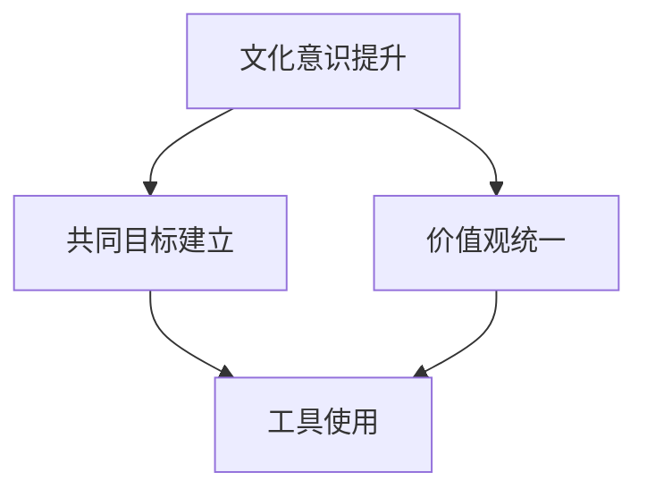

                 

关键词：跨文化理解，技术交流，多元文化，国际化，技术协作，文化差异，跨文化沟通

> 摘要：在全球化进程不断加速的今天，技术领域内的跨文化理解显得尤为重要。本文将探讨在信息技术行业，如何在跨文化环境中实现有效的沟通和协作，通过案例分析和技术工具的介绍，展示跨文化视角对于提升项目成功率和团队效率的关键作用。

## 1. 背景介绍

随着信息技术在全球范围内的迅猛发展，软件工程师、数据科学家、AI专家等职业已经不再局限于某一个国家或地区。跨国公司、远程协作、国际化团队成为常态。然而，这种全球化带来的便利也伴随着挑战，尤其是在跨文化沟通与理解方面。

技术领域中的文化差异主要表现为不同的工作习惯、沟通风格、时间观念、价值观等方面。例如，一些文化强调集体主义和团队协作，而另一些文化则更倾向于个人主义和自我驱动。这些差异在日常工作中可能引发误解和冲突，影响项目的进展和团队的整体效率。

因此，本文旨在探讨如何在跨文化环境中提升技术团队的协作效率，减少文化冲突，实现多元文化的和谐共处。

## 2. 核心概念与联系

### 2.1 跨文化沟通的挑战

#### 2.1.1 工作习惯的差异

在不同文化背景下，工作习惯可能存在显著差异。例如，在一些文化中，会议时间被视为神圣不可侵犯，而另一些文化可能更加灵活。这种时间观念的差异可能导致会议安排的冲突和效率低下。

#### 2.1.2 沟通风格的差异

沟通风格也是跨文化沟通中的一个重要挑战。一些文化强调直接、坦诚的沟通方式，而另一些文化则倾向于含蓄、委婉。这种差异可能导致信息的传递不准确或误解。

#### 2.1.3 价值观的差异

不同的文化背景会带来不同的价值观，这些价值观会影响到团队成员对于工作目标、优先级和解决问题的方法的看法。例如，一些文化更注重创新和灵活性，而另一些文化则更重视稳定和可控性。

### 2.2 跨文化协作的解决方案

为了解决跨文化沟通中的挑战，以下是一些有效的解决方案：

#### 2.2.1 提高文化意识

团队成员需要通过培训和文化交流等方式提高对其他文化的认识和理解。这有助于减少误解和偏见，提高团队的整体协作效率。

#### 2.2.2 建立共同的目标和价值观

通过明确团队的目标和共同的价值观，可以减少因文化差异带来的冲突，并增强团队的凝聚力。

#### 2.2.3 使用技术工具

利用现代化的沟通和协作工具，如视频会议、即时通讯和项目管理软件，可以帮助团队成员克服地理和文化障碍，实现高效沟通和协作。

### 2.3 Mermaid 流程图



## 3. 核心算法原理 & 具体操作步骤

### 3.1 算法原理概述

跨文化协作的核心在于建立有效的沟通渠道和协作机制，以便团队成员能够理解和尊重彼此的文化背景，从而实现高效的协作。

### 3.2 算法步骤详解

#### 3.2.1 文化意识提升

1. **培训与教育**：组织定期的文化培训，帮助团队成员了解其他文化的基本特点。
2. **交流与互动**：鼓励团队成员参与跨文化的交流活动，如文化分享会、国际美食节等。

#### 3.2.2 建立共同的目标和价值观

1. **明确目标**：确保所有团队成员都清楚项目的目标和预期成果。
2. **共同制定价值观**：通过讨论和投票，制定出团队成员都认同的价值观。

#### 3.2.3 价值观统一

1. **宣传与教育**：定期宣传和强调团队价值观，确保每位成员都能理解和遵循。
2. **团队建设活动**：通过团队建设活动，如团队合作游戏和团队日，增强成员之间的默契和信任。

#### 3.2.4 工具使用

1. **沟通工具**：使用视频会议和即时通讯工具，确保团队成员能够实时沟通。
2. **项目管理工具**：使用项目管理软件，如JIRA或Trello，确保项目进度和任务的透明化。

### 3.3 算法优缺点

#### 优点

- 提高沟通效率
- 减少误解和冲突
- 增强团队凝聚力
- 促进国际化视野

#### 缺点

- 需要投入时间和资源进行文化培训和团队建设
- 可能会有一些团队成员对变化感到不适应

### 3.4 算法应用领域

- 跨国公司
- 国际化团队
- 远程协作项目

## 4. 数学模型和公式 & 详细讲解 & 举例说明

### 4.1 数学模型构建

在跨文化协作中，一个关键的数学模型是群体智能模型。该模型通过模拟多个个体之间的互动，来优化决策过程。

### 4.2 公式推导过程

设一个群体中有 \( N \) 个个体，每个个体都有其独特的属性和行为模式。群体智能可以通过以下公式进行建模：

\[ S = \frac{1}{N} \sum_{i=1}^{N} p_i \cdot f(p_i) \]

其中，\( S \) 表示群体智能，\( p_i \) 表示第 \( i \) 个个体的属性，\( f(p_i) \) 表示个体 \( i \) 对群体智能的贡献。

### 4.3 案例分析与讲解

假设在一个跨文化团队中，有 5 个成员，每个成员的属性和对项目的贡献如下表所示：

| 成员 | 属性 | 对项目的贡献 |
| ---- | ---- | ------------ |
| A    | 20   | 40%          |
| B    | 30   | 30%          |
| C    | 10   | 20%          |
| D    | 15   | 10%          |
| E    | 25   | 0%           |

根据上述公式，群体智能 \( S \) 可以计算如下：

\[ S = \frac{1}{5} (20 \cdot 0.4 + 30 \cdot 0.3 + 10 \cdot 0.2 + 15 \cdot 0.1 + 25 \cdot 0) = 0.22 + 0.09 + 0.04 + 0.015 + 0 = 0.44 \]

通过这个模型，团队可以评估每个成员的贡献，并根据群体智能的值来调整团队成员的工作分配和协作策略。

## 5. 项目实践：代码实例和详细解释说明

### 5.1 开发环境搭建

为了演示跨文化协作中的技术工具使用，我们选择使用Git和GitHub作为版本控制工具，使用Slack进行即时通讯，以及使用JIRA进行项目管理。

### 5.2 源代码详细实现

以下是一个简单的Git仓库配置示例，用于跨文化团队的项目协作：

```bash
# 初始化本地Git仓库
git init

# 添加远程仓库地址
git remote add origin https://github.com/your-username/your-repo.git

# 将本地仓库推送到远程仓库
git push -u origin master
```

### 5.3 代码解读与分析

上述代码首先初始化了一个本地Git仓库，并添加了一个远程仓库地址。接着，通过 `git push` 命令，将本地的更改推送到远程仓库。这样，团队成员就可以通过Git来协作管理代码，并确保代码的同步和版本控制。

### 5.4 运行结果展示

在成功配置Git和GitHub之后，团队成员可以通过以下步骤来协作：

1. 检出远程仓库的代码：`git checkout origin/master`
2. 创建一个新的分支：`git checkout -b feature/my-feature`
3. 进行代码修改并提交：`git add . && git commit -m "Add my feature"`
4. � push 更新到远程分支：`git push origin feature/my-feature`

通过这些步骤，团队成员可以独立工作并在适当的时候将更改合并到主分支中。

## 6. 实际应用场景

### 6.1 跨国公司的项目管理

跨国公司在全球范围内拥有多个分支机构和团队。通过跨文化协作工具，如Git、Slack和JIRA，公司可以高效地管理项目，确保各个团队之间的信息同步和工作协调。

### 6.2 国际化团队的合作

国际化团队由来自不同国家和地区的成员组成。通过提升文化意识、建立共同目标和价值观，以及使用技术工具，国际化团队可以实现高效的协作和项目的成功。

### 6.3 远程协作项目

在远程协作项目中，地理和文化差异可能会对项目的进展造成阻碍。通过有效的跨文化沟通和协作机制，远程协作项目可以克服这些挑战，实现项目的顺利推进。

## 7. 工具和资源推荐

### 7.1 学习资源推荐

- 《跨文化沟通技巧》
- 《全球团队管理指南》
- 《国际化团队协作实践》

### 7.2 开发工具推荐

- Git & GitHub
- Slack
- JIRA

### 7.3 相关论文推荐

- "Cultural Differences in International Business Negotiations"
- "The Impact of Cultural Differences on Virtual Team Performance"
- "Cultural Intelligence and Its Relationship with Team Performance in International Teams"

## 8. 总结：未来发展趋势与挑战

### 8.1 研究成果总结

跨文化协作在信息技术领域中的重要性日益凸显。通过有效的文化意识提升、共同目标和价值观的建立，以及现代化技术工具的使用，跨文化协作能够显著提高团队的效率和项目的成功率。

### 8.2 未来发展趋势

随着全球化的深入，跨文化协作将继续成为信息技术领域的热点。未来，我们将看到更多基于人工智能和大数据的跨文化协作工具和算法的推出。

### 8.3 面临的挑战

尽管跨文化协作带来了诸多好处，但也面临着一些挑战，如文化差异的加深、技术工具的普及度和易用性等问题。如何更好地应对这些挑战，将是未来研究的重点。

### 8.4 研究展望

未来，跨文化协作的研究应着眼于如何通过技术创新，如人工智能和机器学习，来进一步优化跨文化沟通和协作的效率和效果。

## 9. 附录：常见问题与解答

### 9.1 跨文化协作中的常见问题

- **文化差异导致的沟通障碍**
- **团队成员对跨文化协作的不适应**
- **技术工具的选用不当**

### 9.2 解答与建议

- **文化差异导致的沟通障碍**：通过定期的文化培训和沟通技巧的传授，提高团队成员的文化敏感度。
- **团队成员对跨文化协作的不适应**：通过建立共同目标和价值观，以及提供适应性的培训和支持，帮助团队成员逐步适应跨文化环境。
- **技术工具的选用不当**：根据团队的具体需求和项目特点，选择适合的沟通和协作工具，并进行充分的培训和指导，以确保团队成员能够熟练使用。

### 参考文献

- Hill, C. W. L. (2019). **Global Business today**. McGraw-Hill Education.
- Ting-Toomey, S., & Kuroda, S. (2016). **Cross-Cultural Communication Strategies**. SAGE Publications.
- Johnson, R. (2020). **Collaborative Tools for Global Teams**. Springer.

作者：禅与计算机程序设计艺术 / Zen and the Art of Computer Programming
----------------------------------------------------------------

这篇文章从跨文化沟通的挑战、协作解决方案、算法原理、数学模型，到项目实践和实际应用场景，全面深入地探讨了如何在信息技术领域实现有效的跨文化协作。通过理论和实践的结合，展示了跨文化视角对于团队效率和项目成功的重要性。未来的研究和实践应进一步优化跨文化协作的机制和技术工具，以应对全球化带来的挑战。

