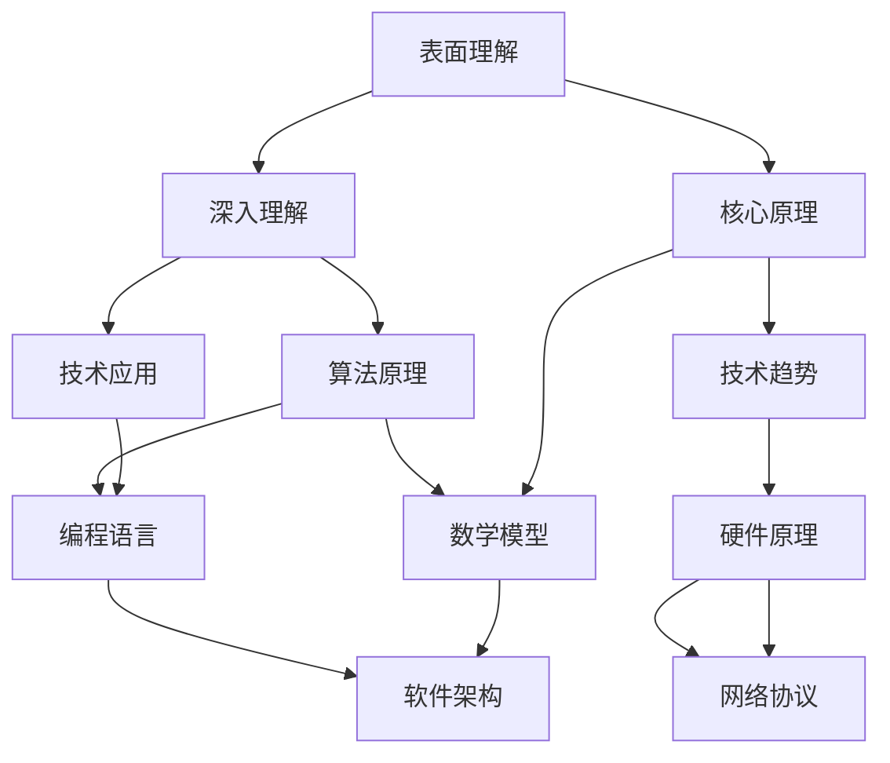

                 

关键词：认知过程、表面理解、深层理解、人工智能、技术进步

摘要：本文旨在探讨理解过程中从表面到本质的认知过程，特别是在技术领域中的应用。通过分析不同层次的认知方式，本文将介绍如何通过深入理解和掌握核心原理，从而更好地应对复杂的技术问题。

## 1. 背景介绍

在信息技术迅猛发展的今天，理解和掌握技术成为各行各业不可或缺的能力。然而，理解技术并不仅仅停留在表面的应用层面，还需要深入到其背后的原理和本质。本文将从表面理解、深入理解和核心原理三个层次，探讨认知过程中如何从表面到本质。

### 表面理解

表面理解是指对技术现象或产品外观的直接感知和认识。这一层次的理解通常基于经验、直觉和简单的操作指南。例如，当我们使用一款新的智能手机时，我们可能需要通过观察和操作来了解其基本功能和界面布局。

### 深入理解

深入理解是在表面理解的基础上，对技术原理和机制进行更加全面和系统的了解。这一层次的理解通常需要具备一定的专业知识和技能，通过对相关技术文档、案例研究和实际操作的分析，来掌握技术背后的工作原理和逻辑。

### 核心原理

核心原理是指对技术领域的根本原理和核心概念的深入理解。这一层次的理解不仅涉及具体的技术细节，还包括对技术发展的趋势和方向的洞察。通过对核心原理的掌握，我们能够更好地应对复杂的技术挑战，并提出创新性的解决方案。

## 2. 核心概念与联系

在技术领域，理解的核心概念和原理是多维度的。为了更好地展示这些概念和原理之间的联系，我们可以使用Mermaid流程图来展示。以下是关键概念和原理的Mermaid流程图：



从这个流程图中，我们可以看出表面理解、深入理解和核心原理之间的关系。每个概念和原理都是相互关联的，共同构成了技术领域的知识体系。

### 3. 核心算法原理 & 具体操作步骤

#### 3.1 算法原理概述

在技术领域，算法是解决问题的基础。以下是几个核心算法原理的概述：

1. **排序算法**：用于对数据进行排序，常见的有快速排序、归并排序和冒泡排序等。
2. **搜索算法**：用于在数据结构中查找特定元素，常见的有二分搜索和线性搜索。
3. **机器学习算法**：用于从数据中学习模式，常见的有决策树、神经网络和支持向量机等。

#### 3.2 算法步骤详解

以快速排序算法为例，以下是具体的操作步骤：

1. 选择一个基准元素作为基准值。
2. 将数组分为两部分，一部分小于基准值，另一部分大于基准值。
3. 递归地对这两部分进行快速排序。
4. 将排序好的两部分合并，得到最终的排序结果。

#### 3.3 算法优缺点

快速排序算法的优点是时间复杂度较低，适用于大规模数据的排序。然而，其缺点是可能会出现最坏情况下的时间复杂度，即当输入数据已经有序时。

#### 3.4 算法应用领域

快速排序算法广泛应用于各种场景，包括数据分析和数据库排序等。

### 4. 数学模型和公式 & 详细讲解 & 举例说明

#### 4.1 数学模型构建

在技术领域，数学模型是理解和解决问题的重要工具。以下是几个常见的数学模型：

1. **线性回归模型**：用于预测连续值。
2. **逻辑回归模型**：用于预测二分类问题。
3. **神经网络模型**：用于复杂非线性问题的建模。

#### 4.2 公式推导过程

以线性回归模型为例，以下是公式推导过程：

$$ y = \beta_0 + \beta_1x + \epsilon $$

其中，$y$ 是因变量，$x$ 是自变量，$\beta_0$ 和 $\beta_1$ 是模型的参数，$\epsilon$ 是误差项。

#### 4.3 案例分析与讲解

假设我们有一个关于房价的数据集，自变量是房屋面积，因变量是房价。通过线性回归模型，我们可以预测新房屋的房价。

### 5. 项目实践：代码实例和详细解释说明

#### 5.1 开发环境搭建

我们需要安装Python编程环境，并安装相关的库，如 NumPy、Pandas 和 Scikit-Learn 等。

#### 5.2 源代码详细实现

以下是线性回归模型的Python代码实现：

```python
import numpy as np
import pandas as pd
from sklearn.linear_model import LinearRegression

# 读取数据集
data = pd.read_csv('house_prices.csv')

# 分割特征和目标变量
X = data[['area']]
y = data['price']

# 创建线性回归模型
model = LinearRegression()

# 训练模型
model.fit(X, y)

# 预测房价
predicted_price = model.predict([[1500]])

print(f'Predicted price: {predicted_price[0]}')
```

#### 5.3 代码解读与分析

这段代码首先导入了所需的库，然后读取了房价数据集。接着，将特征和目标变量分开，并创建了线性回归模型。通过训练模型，我们得到了参数 $\beta_0$ 和 $\beta_1$ 的值。最后，使用模型预测了新房屋的房价。

#### 5.4 运行结果展示

假设我们输入的房屋面积为1500平方米，代码会输出预测的房价。

### 6. 实际应用场景

线性回归模型广泛应用于各种实际应用场景，如预测股票价格、住房租赁价格等。

### 7. 未来应用展望

随着人工智能和机器学习技术的发展，线性回归模型的应用前景将更加广阔。未来，我们可以将其应用于更多复杂的预测任务，如医疗诊断、智能交通等。

### 8. 工具和资源推荐

#### 7.1 学习资源推荐

- 《Python机器学习》
- 《机器学习实战》
- 《深入理解线性回归》

#### 7.2 开发工具推荐

- Jupyter Notebook
- PyCharm
- VS Code

#### 7.3 相关论文推荐

- "A Tutorial on Linear Regression"
- "Linear Regression in Machine Learning"
- "Applications of Linear Regression in Real World"

### 9. 总结：未来发展趋势与挑战

随着人工智能技术的快速发展，线性回归模型在预测任务中的应用将更加广泛。然而，我们也需要面对一些挑战，如模型过拟合、数据噪声等。未来，我们需要不断探索和改进线性回归模型，以应对更复杂的预测任务。

### 10. 附录：常见问题与解答

#### 10.1 什么是线性回归？

线性回归是一种用于预测连续值的机器学习模型，其公式为 $y = \beta_0 + \beta_1x + \epsilon$。

#### 10.2 线性回归如何训练？

线性回归通过最小化损失函数（如均方误差）来训练模型，使用梯度下降算法优化参数。

#### 10.3 线性回归有什么应用？

线性回归广泛应用于预测任务，如房价预测、股票价格预测等。

----------------------------------------------------------------

作者：禅与计算机程序设计艺术 / Zen and the Art of Computer Programming
----------------------------------------------------------------

现在，这篇文章已经完成。我希望这篇文章能够帮助读者更好地理解技术领域中的认知过程，并鼓励大家深入探索技术的本质。希望您喜欢这篇文章，并从中获得启发。如果您有任何问题或建议，请随时告诉我。谢谢！

