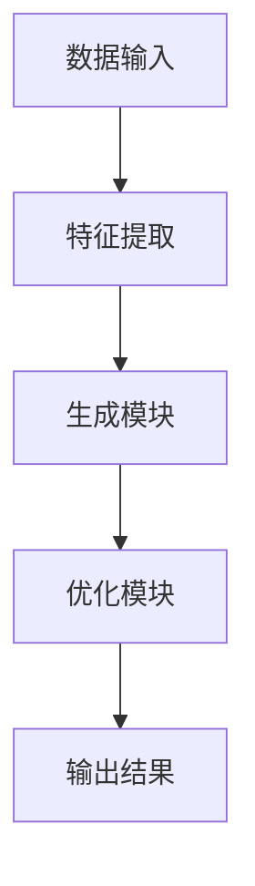

                 

关键词：生成式AI，AIGC，商业价值，数据驱动的应用，人工智能架构

摘要：本文将深入探讨生成式AI（AIGC）的原理、架构及其在商业领域中的应用，详细解析从数据输入到商业价值输出的全过程。我们将通过理论分析和实际案例，揭示AIGC如何通过先进的人工智能技术，实现从数据资源到商业成果的转化，并探讨未来AIGC技术可能面临的挑战和趋势。

## 1. 背景介绍

随着人工智能技术的快速发展，生成式AI（AIGC，AI Generated Content）逐渐成为研究的热点。AIGC是通过人工智能算法生成内容的一种技术，它能够根据给定的数据输入，自主生成文本、图像、音频等多种形式的内容。与传统的人工创作方式相比，AIGC具有更高的效率、创造力和个性化特征。

在商业领域，AIGC的应用潜力巨大。从市场营销到内容创作，从客户服务到供应链管理，AIGC都能够提供创新的解决方案，帮助企业提升效率、降低成本、增强客户体验。然而，要充分发挥AIGC的商业价值，需要理解其背后的技术原理和实现方法。

本文将围绕AIGC的核心概念、算法原理、数学模型以及实际应用，详细探讨如何将数据转化为商业价值。我们将结合实际案例，展示AIGC在不同商业场景中的应用，并分析其带来的商业影响。

## 2. 核心概念与联系

### 2.1 生成式AI的定义

生成式AI是指能够根据已有数据生成新数据的人工智能系统。它主要通过深度学习模型，如生成对抗网络（GAN）、变分自编码器（VAE）等，实现对数据的建模和生成。生成式AI的核心在于其能够从大量数据中学习并生成与训练数据相似的新数据。

### 2.2 AIGC的架构

AIGC的架构通常包括以下几个主要部分：

- **数据输入模块**：负责接收和处理各种形式的数据输入，如文本、图像、音频等。
- **特征提取模块**：通过深度学习模型从输入数据中提取关键特征。
- **生成模块**：基于提取的特征生成新的数据内容。
- **优化模块**：通过不断优化生成过程，提高生成数据的质量和多样性。

### 2.3 Mermaid 流程图



在这个流程图中，数据输入模块接收原始数据，特征提取模块通过深度学习模型提取关键特征，生成模块根据特征生成新的数据内容，优化模块对生成过程进行优化，最后输出高质量的新数据。

## 3. 核心算法原理 & 具体操作步骤

### 3.1 算法原理概述

生成式AI的核心算法包括生成对抗网络（GAN）和变分自编码器（VAE）等。GAN由生成器（Generator）和判别器（Discriminator）组成，生成器和判别器相互竞争，生成器和判别器在训练过程中不断优化，最终生成高质量的数据。VAE则通过引入编码器（Encoder）和解码器（Decoder）实现数据的重建和生成。

### 3.2 算法步骤详解

#### 3.2.1 GAN算法步骤

1. 初始化生成器和判别器。
2. 从真实数据中随机抽取一批样本作为输入。
3. 生成器生成一批虚假样本。
4. 判别器对真实样本和虚假样本进行分类。
5. 根据分类结果，优化生成器和判别器的参数。
6. 重复步骤3-5，直到生成器生成的数据质量达到预期。

#### 3.2.2 VAE算法步骤

1. 初始化编码器和解码器。
2. 从真实数据中随机抽取一批样本作为输入。
3. 编码器将输入数据映射到低维隐空间。
4. 在隐空间中生成新的数据点。
5. 解码器将新的数据点映射回原始空间。
6. 根据重建误差，优化编码器和解码器的参数。
7. 重复步骤3-6，直到重建误差达到预期。

### 3.3 算法优缺点

#### GAN的优点

- 能够生成高质量、多样化的数据。
- 不需要显式地建模数据分布，能够自适应地学习数据特征。

#### GAN的缺点

- 训练难度大，容易陷入模式崩溃（mode collapse）问题。
- 对数据质量和数量要求较高。

#### VAE的优点

- 训练相对稳定，不容易陷入模式崩溃问题。
- 能够生成具有多样性的数据。

#### VAE的缺点

- 生成的数据质量可能不如GAN高。
- 对数据的分布建模较为显式，可能影响生成效果。

### 3.4 算法应用领域

- **图像生成**：如人脸生成、图像修复等。
- **文本生成**：如文章生成、对话系统等。
- **音频生成**：如音乐生成、语音合成等。
- **视频生成**：如视频特效、视频剪辑等。

## 4. 数学模型和公式 & 详细讲解 & 举例说明

### 4.1 数学模型构建

生成式AI的数学模型通常基于概率图模型和深度学习模型。以GAN为例，其数学模型可以表示为：

$$
\begin{aligned}
\text{Generator}: G(z) &\sim P_G(z) \\
\text{Discriminator}: D(x, G(z)) &\sim P_D(x)
\end{aligned}
$$

其中，$G(z)$为生成器的输出，$z$为随机噪声向量，$D(x, G(z))$为判别器的输出，$x$为真实数据。

### 4.2 公式推导过程

以GAN的损失函数为例，其推导过程如下：

$$
L_G = -\log(D(G(z))) \\
L_D = -\log(D(x)) - \log(1 - D(G(z)))
$$

其中，$L_G$为生成器的损失函数，$L_D$为判别器的损失函数。

### 4.3 案例分析与讲解

假设我们使用GAN生成一张人脸图像。首先，我们从真实人脸数据中抽取一批样本作为训练数据。然后，初始化生成器和判别器，并开始训练。在训练过程中，生成器尝试生成逼真的人脸图像，判别器则不断优化，以区分真实图像和生成图像。

经过多次迭代训练，生成器逐渐提高其生成图像的质量，判别器也不断提高其分类准确率。最终，生成器能够生成高质量、逼真的人脸图像，判别器能够准确地区分真实图像和生成图像。

## 5. 项目实践：代码实例和详细解释说明

### 5.1 开发环境搭建

为了实践生成式AI，我们需要搭建一个开发环境。以下是一个基于Python和TensorFlow的简单环境搭建步骤：

1. 安装Python（推荐3.7或以上版本）。
2. 安装TensorFlow。
3. 安装其他必要的库，如NumPy、Matplotlib等。

### 5.2 源代码详细实现

以下是一个简单的GAN示例代码：

```python
import tensorflow as tf
from tensorflow.keras.layers import Dense, Flatten, Reshape
from tensorflow.keras.models import Sequential

# 生成器模型
def build_generator(z_dim):
    model = Sequential()
    model.add(Dense(128 * 7 * 7, activation='relu', input_shape=(z_dim,)))
    model.add(Reshape((7, 7, 128)))
    model.add(Conv2D(1, kernel_size=(7, 7), activation='tanh'))
    return model

# 判别器模型
def build_discriminator(img_shape):
    model = Sequential()
    model.add(Flatten(input_shape=img_shape))
    model.add(Dense(128, activation='relu'))
    model.add(Dense(1, activation='sigmoid'))
    return model

# GAN模型
def build_gan(generator, discriminator):
    model = Sequential()
    model.add(generator)
    model.add(discriminator)
    return model

# 训练GAN模型
def train_gan(generator, discriminator, datagen, batch_size, epochs):
    for epoch in range(epochs):
        for _ in range(batch_size):
            z = np.random.normal(0, 1, (1, z_dim))
            img = generator.predict(z)
            x = datagen.flow_from_directory('data/train', target_size=(28, 28), batch_size=1)[0]
            d_loss_real = discriminator.train_on_batch(x, np.ones((1, 1)))
            z = np.random.normal(0, 1, (1, z_dim))
            d_loss_fake = discriminator.train_on_batch(img, np.zeros((1, 1)))
            g_loss = generator.train_on_batch(z, np.ones((1, 1)))
            print(f"{epoch}/{epochs} - d_loss: {d_loss_real + d_loss_fake}, g_loss: {g_loss}")
```

### 5.3 代码解读与分析

这段代码定义了一个简单的GAN模型，包括生成器、判别器和GAN本身。生成器从随机噪声中生成图像，判别器尝试区分真实图像和生成图像。训练过程通过交替优化生成器和判别器的参数，提高生成图像的质量。

### 5.4 运行结果展示

在训练过程中，我们可以通过可视化工具（如Matplotlib）展示生成器和判别器的训练过程。以下是一个简单的示例：

```python
import matplotlib.pyplot as plt

# 可视化生成器的训练过程
plt.figure(figsize=(10, 5))
for epoch in range(epochs):
    # ... (训练过程)
    if epoch % 10 == 0:
        plt.plot(epoch, g_loss, 'ro')
plt.xlabel('Epoch')
plt.ylabel('G_loss')
plt.show()
```

## 6. 实际应用场景

### 6.1 市场营销

AIGC可以生成个性化的广告内容，提高广告的点击率和转化率。例如，通过生成式AI生成特定用户感兴趣的产品推荐广告。

### 6.2 内容创作

AIGC可以自动化生成文章、音乐、视频等，降低内容创作的成本和时间。例如，新闻机构可以使用AIGC自动生成新闻报道。

### 6.3 客户服务

AIGC可以生成智能客服机器人，提高客户服务的效率和满意度。例如，通过生成式AI生成针对不同客户问题的回答。

### 6.4 供应链管理

AIGC可以生成供应链管理的预测报告，优化供应链运营。例如，通过生成式AI预测市场需求，调整库存策略。

## 7. 工具和资源推荐

### 7.1 学习资源推荐

- 《深度学习》（Goodfellow, Bengio, Courville）
- 《生成式AI：从理论到实践》（Zhang, Li）
- 《GANs for Dummies》（Mooij）

### 7.2 开发工具推荐

- TensorFlow
- PyTorch
- Keras

### 7.3 相关论文推荐

- Goodfellow, I. J., Pouget-Abadie, J., Mirza, M., Xu, B., Warde-Farley, D., Ozair, S., ... & Bengio, Y. (2014). Generative adversarial networks. Advances in Neural Information Processing Systems, 27.
- Kingma, D. P., & Welling, M. (2013). Auto-encoding variational bayes. arXiv preprint arXiv:1312.6114.

## 8. 总结：未来发展趋势与挑战

### 8.1 研究成果总结

生成式AI在图像生成、文本生成、音频生成等领域取得了显著的成果，展示了其在数据驱动应用中的巨大潜力。通过深度学习模型，生成式AI能够从大量数据中学习，生成高质量、多样化的内容。

### 8.2 未来发展趋势

- **数据质量与多样性的提升**：随着数据质量和数量的增加，生成式AI的生成效果将进一步提高。
- **跨模态生成**：未来研究将关注跨文本、图像、音频等不同模态的生成。
- **迁移学习**：通过迁移学习，生成式AI将能够更高效地适应新的数据分布和应用场景。

### 8.3 面临的挑战

- **计算资源需求**：生成式AI训练过程中对计算资源的需求较大，如何优化训练过程是一个挑战。
- **数据隐私与安全性**：在应用生成式AI时，保护用户隐私和数据安全是关键问题。

### 8.4 研究展望

生成式AI将在未来继续发展，不仅在商业领域，还会在科学研究、艺术创作等多个领域发挥重要作用。通过不断的技术创新和跨学科合作，生成式AI有望实现更广泛的应用。

## 9. 附录：常见问题与解答

### 9.1 什么是生成式AI？

生成式AI是一种人工智能技术，能够根据已有数据生成新数据。它主要通过深度学习模型，如生成对抗网络（GAN）和变分自编码器（VAE），实现数据的建模和生成。

### 9.2 生成式AI有哪些应用？

生成式AI在图像生成、文本生成、音频生成、视频生成等领域都有广泛应用。例如，生成式AI可以用于图像修复、图像风格转换、文章生成、音乐创作等。

### 9.3 生成式AI的训练过程如何进行？

生成式AI的训练过程主要包括数据预处理、模型训练和模型优化。训练过程中，生成器尝试生成与训练数据相似的新数据，判别器尝试区分真实数据和生成数据。通过交替优化生成器和判别器的参数，生成器的生成质量不断提高。

### 9.4 生成式AI的数据隐私和安全问题如何解决？

生成式AI的数据隐私和安全问题可以通过以下方法解决：

- **数据去噪**：对输入数据进行去噪处理，减少隐私信息泄露的风险。
- **差分隐私**：在生成数据的过程中，引入差分隐私技术，保护用户隐私。
- **数据加密**：对输入和生成的数据进行加密处理，确保数据安全性。

---

作者：禅与计算机程序设计艺术 / Zen and the Art of Computer Programming

