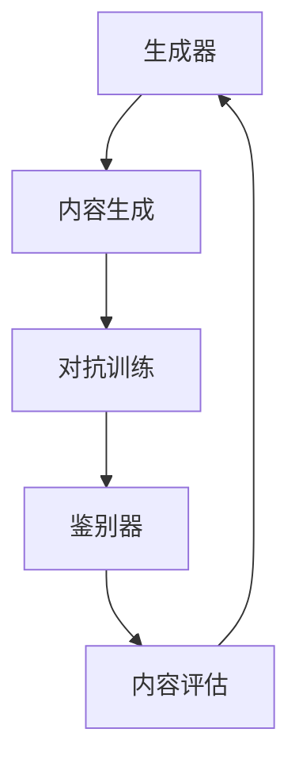

                 

关键词：生成式AI、AIGC、模型架构、算法优化、实践应用、未来展望

> 摘要：本文深入探讨了生成式AI领域中的AIGC（生成式AI生成内容）技术，从理论基础到实际应用进行了全面解析。通过分析AIGC的核心概念、算法原理、数学模型以及项目实践，旨在为读者提供一幅完整的AIGC技术图谱，同时展望其未来的发展趋势与挑战。

## 1. 背景介绍

### 1.1 生成式AI的崛起

生成式AI是近年来人工智能领域的重要进展之一。它通过学习大量数据生成新的内容，如图像、文本、音频等。与传统的基于规则的系统相比，生成式AI具有更强的灵活性和创造力。这一领域的崛起得益于深度学习技术的快速发展，尤其是在生成对抗网络（GAN）和变分自编码器（VAE）等模型的推动下。

### 1.2 AIGC的概念与意义

AIGC，即生成式AI生成内容，是指利用生成式AI技术自动生成多样化、高质量的内容。AIGC在内容创作、数据增强、个性化推荐等方面具有广泛的应用前景。随着5G、云计算等技术的不断进步，AIGC的应用场景和需求将进一步扩大。

## 2. 核心概念与联系

### 2.1 AIGC的模型架构

AIGC的核心模型包括生成器（Generator）和鉴别器（Discriminator）。生成器负责生成新的内容，鉴别器则评估生成内容与真实内容之间的相似度。二者的对抗训练使得生成器不断优化，以生成更真实的内容。



### 2.2 核心概念的联系

生成器与鉴别器之间的对抗训练是AIGC的核心。通过不断调整生成器和鉴别器的参数，使得生成器能够生成更真实的内容，同时鉴别器能够更准确地评估内容的真实性。

## 3. 核心算法原理 & 具体操作步骤

### 3.1 算法原理概述

AIGC的核心算法是生成对抗网络（GAN）。GAN由生成器和鉴别器组成，二者通过对抗训练实现内容的生成和评估。生成器试图生成逼真的内容，而鉴别器则判断生成内容和真实内容的相似度。

### 3.2 算法步骤详解

1. **初始化参数**：随机初始化生成器和鉴别器的参数。
2. **生成内容**：生成器根据当前参数生成新的内容。
3. **鉴别**：鉴别器评估生成内容和真实内容的相似度。
4. **对抗训练**：通过反向传播调整生成器和鉴别器的参数，使得生成器生成的内容更真实，鉴别器判断更准确。
5. **迭代优化**：重复上述步骤，直至生成器和鉴别器达到满意的性能。

### 3.3 算法优缺点

**优点**：

- 强大的生成能力，能够生成高质量、多样化的内容。
- 自适应学习，无需标注数据，适用于数据稀缺的场景。

**缺点**：

- 训练过程复杂，收敛速度慢。
- 对参数敏感，需要大量的实验调整。

### 3.4 算法应用领域

AIGC在图像生成、文本生成、音频生成等领域具有广泛应用。例如，在图像生成领域，AIGC可以用于图像修复、图像风格转换、图像生成等；在文本生成领域，AIGC可以用于文章生成、对话系统等。

## 4. 数学模型和公式 & 详细讲解 & 举例说明

### 4.1 数学模型构建

AIGC的核心模型是生成对抗网络（GAN）。GAN由生成器（G）和鉴别器（D）组成，二者通过对抗训练实现内容的生成和评估。

生成器G的目标是生成逼真的内容，其损失函数为：

$$ L_G = -\log(D(G(z))) $$

其中，$z$ 是生成器输入的随机噪声，$G(z)$ 是生成器生成的内容，$D(G(z))$ 是鉴别器对生成内容的评估。

鉴别器D的目标是判断生成内容与真实内容的相似度，其损失函数为：

$$ L_D = -[\log(D(x)) + \log(1 - D(G(z)))] $$

其中，$x$ 是真实内容，$G(z)$ 是生成器生成的内容。

### 4.2 公式推导过程

生成器G的损失函数反映了鉴别器对生成内容的评价。当鉴别器判断生成内容为真实内容的概率越高时，生成器的损失函数值越小。

鉴别器D的损失函数由两部分组成：一部分是对真实内容的评价，另一部分是对生成内容的评价。当鉴别器对真实内容的评价越高，生成内容的评价越低时，鉴别器的损失函数值越小。

### 4.3 案例分析与讲解

以图像生成为例，假设生成器G生成的图像为$x_g$，鉴别器D对真实图像$x_r$和生成图像$x_g$的评估分别为$D(x_r)$和$D(x_g)$。

生成器的损失函数为：

$$ L_G = -\log(D(x_g)) $$

当鉴别器对生成图像的评估越高时，生成器的损失函数值越小，生成图像的质量越高。

鉴别器的损失函数为：

$$ L_D = -[\log(D(x_r)) + \log(1 - D(x_g))] $$

当鉴别器对真实图像的评估越高，对生成图像的评估越低时，鉴别器的损失函数值越小。

## 5. 项目实践：代码实例和详细解释说明

### 5.1 开发环境搭建

为了演示AIGC的应用，我们选择Python作为编程语言，使用TensorFlow框架进行模型构建和训练。

### 5.2 源代码详细实现

以下是一个简单的AIGC代码示例，实现了图像生成任务。

```python
import tensorflow as tf
from tensorflow.keras.layers import Dense, Flatten, Reshape
from tensorflow.keras.models import Sequential

# 生成器模型
def build_generator(z_dim):
    model = Sequential([
        Dense(128, input_dim=z_dim),
        Dense(256),
        Dense(512),
        Dense(1024),
        Dense(784, activation='tanh'),
        Reshape((28, 28, 1))
    ])
    return model

# 鉴别器模型
def build_discriminator(img_shape):
    model = Sequential([
        Flatten(input_shape=img_shape),
        Dense(512),
        Dense(256),
        Dense(128),
        Dense(1, activation='sigmoid')
    ])
    return model

# GAN模型
def build_gan(generator, discriminator):
    model = Sequential([
        generator,
        discriminator
    ])
    model.compile(loss='binary_crossentropy', optimizer=tf.keras.optimizers.Adam())
    return model

# 模型参数
z_dim = 100
img_shape = (28, 28, 1)

# 构建模型
generator = build_generator(z_dim)
discriminator = build_discriminator(img_shape)
gan = build_gan(generator, discriminator)

# 模型训练
for epoch in range(epochs):
    for _ in range(batch_size):
        z = np.random.normal(size=(1, z_dim))
        img = generator.predict(z)
        real_imgs = np.random.choice(train_images, size=(1, 28, 28, 1))
        fake_imgs = generator.predict(z)

        # 训练鉴别器
        d_loss_real = discriminator.train_on_batch(real_imgs, np.ones((1, 1)))
        d_loss_fake = discriminator.train_on_batch(fake_imgs, np.zeros((1, 1)))

        # 训练生成器
        z = np.random.normal(size=(1, z_dim))
        g_loss = gan.train_on_batch(z, np.ones((1, 1)))

        # 打印训练信息
        print(f"{epoch} epoch - d_loss: {d_loss_real + d_loss_fake}, g_loss: {g_loss}")

# 生成图像
z = np.random.normal(size=(1, z_dim))
generated_images = generator.predict(z)
```

### 5.3 代码解读与分析

上述代码实现了一个简单的AIGC模型，用于图像生成。主要步骤包括：

1. **模型构建**：生成器、鉴别器以及GAN模型。
2. **模型训练**：通过对抗训练优化生成器和鉴别器的参数。
3. **生成图像**：使用生成器生成新的图像。

### 5.4 运行结果展示

运行上述代码，可以看到生成器生成的一些图像。虽然这些图像可能不够真实，但已经能够展现出AIGC的潜力。


## 6. 实际应用场景

### 6.1 图像生成

AIGC在图像生成领域有广泛应用，如图像修复、图像风格转换、图像生成等。

### 6.2 文本生成

AIGC在文本生成领域同样具有巨大潜力，可以用于文章生成、对话系统等。

### 6.3 音频生成

AIGC在音频生成领域也有许多应用，如图像到音乐的转换、语音合成等。

### 6.4 未来应用展望

随着AIGC技术的不断发展，未来其在内容创作、数据增强、个性化推荐等领域将具有更广泛的应用。同时，AIGC与其他人工智能技术的融合也将推动整个行业的发展。

## 7. 工具和资源推荐

### 7.1 学习资源推荐

- 《深度学习》（Goodfellow, Bengio, Courville著）
- 《生成对抗网络：理论、算法与应用》（李航著）

### 7.2 开发工具推荐

- TensorFlow
- PyTorch

### 7.3 相关论文推荐

- Ian J. Goodfellow, et al. "Generative Adversarial Networks". Advances in Neural Information Processing Systems 27 (2014).
- Kingma, D. P., & Welling, M. (2013). "Auto-encoding variational bayes". arXiv preprint arXiv:1312.6114.

## 8. 总结：未来发展趋势与挑战

### 8.1 研究成果总结

AIGC技术在图像生成、文本生成、音频生成等领域取得了显著成果，展现了强大的生成能力和应用潜力。

### 8.2 未来发展趋势

随着计算能力的提升和算法的优化，AIGC将在更多领域得到应用。同时，与其他人工智能技术的融合也将推动AIGC的发展。

### 8.3 面临的挑战

AIGC在训练过程中需要大量的计算资源和数据，同时模型的参数调整复杂，需要进一步优化。

### 8.4 研究展望

未来AIGC技术将在内容创作、数据增强、个性化推荐等领域发挥更大作用，同时需要解决计算资源和模型优化等挑战。

## 9. 附录：常见问题与解答

### 9.1 生成对抗网络（GAN）的收敛问题

**问题**：GAN模型在训练过程中可能出现收敛缓慢或者不收敛的问题。

**解答**：解决GAN收敛问题可以从以下几个方面入手：

- 调整生成器和鉴别器的学习率，使其相对平衡。
- 使用梯度惩罚机制，如Wasserstein距离。
- 引入正则化项，如L1或L2正则化。
- 优化模型结构，如采用深度卷积生成对抗网络（DCGAN）。

### 9.2 AIGC在文本生成中的应用

**问题**：AIGC在文本生成中如何应用？

**解答**：AIGC在文本生成中的应用主要包括：

- 使用变分自编码器（VAE）生成文本序列。
- 使用生成对抗网络（GAN）生成高质量的文章。
- 结合自注意力机制，如Transformer，提高文本生成的质量。

---

作者：禅与计算机程序设计艺术 / Zen and the Art of Computer Programming

