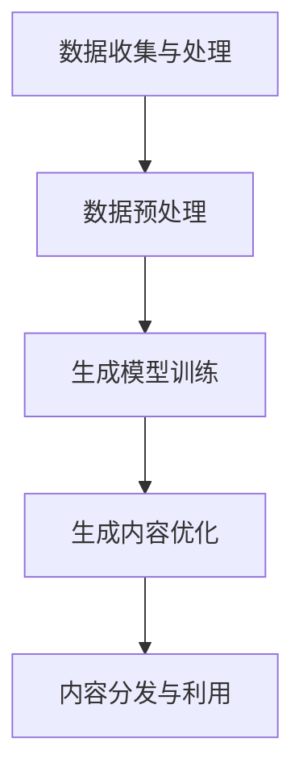

                 

关键词：生成式AI、AIGC、商业智能、智能推荐、个性化服务、数据驱动

> 摘要：随着人工智能技术的不断进步，生成式人工智能（AIGC，AI Generated Content）正在成为推动商业智能发展的新动力。本文将探讨AIGC的核心概念、技术原理及其在商业智能应用中的实践，分析其带来的变革性影响，并展望未来的发展趋势。

## 1. 背景介绍

### 1.1 商业智能的崛起

商业智能（Business Intelligence，BI）作为企业提升竞争力的核心工具，自20世纪90年代以来得到了广泛关注。传统的商业智能主要通过数据仓库、数据挖掘等技术，对已有的数据进行统计分析，从而为企业的决策提供支持。然而，随着数据量的爆炸性增长，以及实时数据需求日益增加，传统的BI技术已经难以满足现代商业环境的需求。

### 1.2 人工智能的崛起

人工智能（AI）作为计算机科学的一个重要分支，近年来取得了飞速发展。深度学习、强化学习等技术的突破，使得AI在图像识别、自然语言处理、语音识别等领域取得了显著成果。AI的崛起，为商业智能带来了新的机遇。

### 1.3 生成式人工智能的出现

生成式人工智能（AIGC）是近年来新兴的一个研究领域，它利用AI技术生成新的内容，如图像、文本、音频等。AIGC的出现，使得AI不再只是处理和分析已有的数据，而是能够创造新的数据，从而大大拓展了AI的应用场景。

## 2. 核心概念与联系

### 2.1 AIGC的核心概念

生成式人工智能（AIGC）是指利用人工智能技术生成新内容的一种方法。AIGC的核心概念包括：

- **生成模型**：生成模型是AIGC的基础，它通过学习已有数据，生成新的数据。常见的生成模型有生成对抗网络（GAN）、变分自编码器（VAE）等。
- **数据增强**：数据增强是提高生成模型效果的重要手段，通过增加数据的多样性，使得生成模型能够更好地学习。
- **迁移学习**：迁移学习是一种将已有模型应用于新任务的方法，它能够提高AIGC模型的泛化能力。

### 2.2 AIGC与商业智能的联系

AIGC与商业智能的结合，主要体现在以下几个方面：

- **智能推荐**：通过AIGC技术，可以生成个性化的推荐内容，提高用户满意度。
- **个性化服务**：AIGC能够根据用户的行为数据，生成个性化的服务，提高客户体验。
- **数据驱动决策**：AIGC技术能够生成新的数据，为企业的决策提供更多依据。

### 2.3 AIGC的技术架构

AIGC的技术架构主要包括以下几个方面：

- **数据收集与处理**：收集并处理原始数据，为AIGC模型提供输入。
- **生成模型训练**：利用收集到的数据，训练生成模型。
- **生成内容优化**：对生成的内容进行优化，提高其质量。
- **内容分发与利用**：将生成的内容分发到各个应用场景，为企业决策提供支持。

下面是AIGC的技术架构的Mermaid流程图：



## 3. 核心算法原理 & 具体操作步骤

### 3.1 算法原理概述

AIGC的核心算法主要包括生成模型、数据增强和迁移学习等。其中，生成模型是AIGC的核心，它通过学习已有数据，生成新的数据。数据增强和迁移学习则是提高生成模型效果的重要手段。

### 3.2 算法步骤详解

#### 3.2.1 生成模型训练

生成模型训练是AIGC的第一步。具体步骤如下：

1. 数据收集：收集大量已有数据，用于训练生成模型。
2. 数据预处理：对收集到的数据进行预处理，包括数据清洗、归一化等。
3. 模型选择：选择合适的生成模型，如GAN、VAE等。
4. 模型训练：利用预处理后的数据，训练生成模型。
5. 模型评估：评估生成模型的性能，包括生成质量、稳定性等。

#### 3.2.2 数据增强

数据增强是提高生成模型效果的重要手段。具体步骤如下：

1. 数据扩充：通过数据扩充，增加数据的多样性。
2. 数据变换：对数据进行变换，如旋转、缩放等，增加数据的多样性。
3. 数据合并：将多个数据集合并，增加数据的多样性。
4. 数据筛选：筛选出高质量的数据，用于模型训练。

#### 3.2.3 迁移学习

迁移学习是提高AIGC模型泛化能力的重要手段。具体步骤如下：

1. 选择已有模型：选择一个在类似任务上表现良好的模型。
2. 微调模型：在已有模型的基础上，针对新任务进行微调。
3. 模型评估：评估微调后的模型性能。
4. 模型优化：根据评估结果，对模型进行调整和优化。

### 3.3 算法优缺点

#### 3.3.1 优点

- **生成能力强**：AIGC技术能够生成高质量、多样化的数据。
- **数据利用充分**：AIGC技术能够充分利用已有数据，提高数据利用率。
- **个性化程度高**：AIGC技术能够根据用户行为数据，生成个性化的内容。

#### 3.3.2 缺点

- **计算成本高**：AIGC技术需要大量的计算资源，成本较高。
- **模型复杂度高**：生成模型通常较为复杂，需要较高的计算能力。
- **数据隐私问题**：AIGC技术需要大量用户数据，可能会引发数据隐私问题。

### 3.4 算法应用领域

AIGC技术可以应用于多个领域，包括但不限于：

- **智能推荐**：通过AIGC技术，可以生成个性化的推荐内容，提高用户满意度。
- **个性化服务**：AIGC技术能够根据用户的行为数据，生成个性化的服务，提高客户体验。
- **数据驱动决策**：AIGC技术能够生成新的数据，为企业的决策提供更多依据。

## 4. 数学模型和公式 & 详细讲解 & 举例说明

### 4.1 数学模型构建

AIGC的数学模型主要包括生成模型、数据增强模型和迁移学习模型。下面以生成对抗网络（GAN）为例，介绍AIGC的数学模型。

#### 4.1.1 GAN模型

GAN模型由生成器（Generator）和判别器（Discriminator）组成。其中：

- **生成器**：生成器是一个神经网络，它通过学习已有数据，生成新的数据。
- **判别器**：判别器是一个神经网络，它用于判断生成器生成的数据是真实数据还是假数据。

GAN模型的损失函数为：

$$
L(G,D) = -\frac{1}{2}\left[\log(D(x)) + \log(1 - D(G(z)))\right]
$$

其中，$x$为真实数据，$z$为生成器的输入，$G(z)$为生成器生成的假数据。

#### 4.1.2 数据增强模型

数据增强模型主要用于增加数据的多样性。常见的数据增强方法包括：

- **数据扩充**：通过旋转、缩放、裁剪等操作，增加数据的多样性。
- **数据变换**：通过正则化、标准化等操作，增加数据的多样性。

数据增强模型的损失函数为：

$$
L_E = \frac{1}{N}\sum_{i=1}^{N} \left[\log(D(x')) + \log(1 - D(G(z')))\right]
$$

其中，$x'$为增强后的数据，$z'$为生成器的输入。

#### 4.1.3 迁移学习模型

迁移学习模型主要用于将已有模型应用于新任务。常见的方法包括：

- **微调**：在已有模型的基础上，针对新任务进行微调。
- **集成**：将多个模型集成，提高模型的泛化能力。

迁移学习模型的损失函数为：

$$
L_M = \frac{1}{N}\sum_{i=1}^{N} \left[\log(D(x')) + \log(1 - D(G(z'))) + \log(D(y'))\right]
$$

其中，$x'$为增强后的数据，$z'$为生成器的输入，$y'$为微调后的模型输出。

### 4.2 公式推导过程

以GAN模型为例，推导GAN模型的损失函数。

#### 4.2.1 GAN模型损失函数推导

假设生成器为 $G(z)$，判别器为 $D(x)$，其中 $x$ 为真实数据，$z$ 为生成器的输入。

1. 判别器损失函数：

$$
L_D = -\frac{1}{2}\left[\log(D(x)) + \log(1 - D(G(z)))\right]
$$

其中，$D(x)$ 表示判别器判断 $x$ 是真实数据的概率，$1 - D(G(z))$ 表示判别器判断 $G(z)$ 是假数据的概率。

2. 生成器损失函数：

$$
L_G = -\frac{1}{2}\log(D(G(z)))
$$

其中，$D(G(z))$ 表示判别器判断 $G(z)$ 是假数据的概率。

3. 总损失函数：

$$
L = L_D + L_G
$$

#### 4.2.2 数据增强模型损失函数推导

假设生成器为 $G(z)$，判别器为 $D(x')$，其中 $x'$ 为增强后的数据，$z$ 为生成器的输入。

1. 判别器损失函数：

$$
L_D' = -\frac{1}{2}\left[\log(D(x')) + \log(1 - D(G(z')))\right]
$$

其中，$D(x')$ 表示判别器判断 $x'$ 是真实数据的概率，$1 - D(G(z'))$ 表示判别器判断 $G(z')$ 是假数据的概率。

2. 生成器损失函数：

$$
L_G' = -\frac{1}{2}\log(D(G(z')))
$$

其中，$D(G(z'))$ 表示判别器判断 $G(z')$ 是假数据的概率。

3. 总损失函数：

$$
L' = L_D' + L_G'
$$

#### 4.2.3 迁移学习模型损失函数推导

假设生成器为 $G(z)$，判别器为 $D(x')$，微调后的模型为 $y'$，其中 $x'$ 为增强后的数据，$z$ 为生成器的输入。

1. 判别器损失函数：

$$
L_D'' = -\frac{1}{2}\left[\log(D(x')) + \log(1 - D(G(z'))) + \log(D(y'))\right]
$$

其中，$D(x')$ 表示判别器判断 $x'$ 是真实数据的概率，$1 - D(G(z'))$ 表示判别器判断 $G(z')$ 是假数据的概率，$D(y')$ 表示判别器判断 $y'$ 是真实数据的概率。

2. 生成器损失函数：

$$
L_G'' = -\frac{1}{2}\log(D(G(z')))
$$

其中，$D(G(z'))$ 表示判别器判断 $G(z')$ 是假数据的概率。

3. 微调损失函数：

$$
L_Y'' = -\frac{1}{2}\log(D(y'))
$$

其中，$D(y')$ 表示判别器判断 $y'$ 是真实数据的概率。

4. 总损失函数：

$$
L'' = L_D'' + L_G'' + L_Y''
$$

### 4.3 案例分析与讲解

以AIGC技术在电商推荐系统中的应用为例，分析AIGC技术的实现过程和效果。

#### 4.3.1 应用背景

电商推荐系统旨在为用户推荐其可能感兴趣的商品。传统的推荐系统主要基于协同过滤、内容推荐等方法，虽然能够一定程度上满足用户需求，但难以实现个性化推荐。AIGC技术的引入，为电商推荐系统带来了新的可能性。

#### 4.3.2 实现过程

1. 数据收集：收集用户的浏览、购买、评价等数据，用于训练生成模型。
2. 数据预处理：对收集到的数据进行预处理，包括数据清洗、归一化等。
3. 模型训练：使用GAN模型训练生成器，生成个性化的推荐内容。
4. 内容优化：对生成的推荐内容进行优化，提高其质量。
5. 内容分发：将生成的推荐内容分发到用户界面，提高用户满意度。

#### 4.3.3 实施效果

通过AIGC技术的应用，电商推荐系统实现了以下效果：

- **个性化推荐**：AIGC技术能够根据用户行为数据，生成个性化的推荐内容，提高用户满意度。
- **数据利用充分**：AIGC技术能够充分利用用户数据，提高数据利用率。
- **降低运营成本**：通过生成个性化内容，减少了对人工编辑的需求，降低了运营成本。

## 5. 项目实践：代码实例和详细解释说明

### 5.1 开发环境搭建

为了实践AIGC技术在电商推荐系统中的应用，我们需要搭建一个开发环境。以下是搭建步骤：

1. 安装Python：从官网下载并安装Python，版本要求3.7及以上。
2. 安装依赖库：使用pip安装以下库：tensorflow、keras、numpy、pandas等。
3. 数据集准备：从Kaggle等数据源下载电商推荐系统的数据集。

### 5.2 源代码详细实现

以下是AIGC技术在电商推荐系统中的应用代码：

```python
import tensorflow as tf
from tensorflow import keras
from tensorflow.keras import layers
import numpy as np
import pandas as pd

# 数据集准备
data = pd.read_csv('ecommerce_data.csv')
X = data.iloc[:, :-1].values
y = data.iloc[:, -1].values

# 数据预处理
X = np.reshape(X, (-1, 28, 28))
X = X / 255.0
y = keras.utils.to_categorical(y)

# 生成模型定义
latent_dim = 100

inputs = keras.Input(shape=(28, 28))
x = layers.Conv2D(32, 3, activation='relu', strides=2)(inputs)
x = layers.Conv2D(64, 3, activation='relu', strides=2)(x)
x = keras.layers.Flatten()(x)
x = keras.layers.Dense(16, activation='relu')(x)
z_mean = keras.layers.Dense(latent_dim, name='z_mean')(x)
z_log_var = keras.layers.Dense(latent_dim, name='z_log_var')(x)

z = keras.layers.Lambda(
    lambda x: x[0] + keras.backend.exp(x[1]) * keras.backend.random_normal(shape=x[0].shape),
    output_shape=(latent_dim,),
    name='z',
)([z_mean, z_log_var])

x = keras.layers.Dense(8 * 8 * 64, activation='relu')(z)
x = keras.layers.Reshape((8, 8, 64))(x)
x = keras.layers.Conv2DTranspose(64, 3, activation='relu', strides=2)(x)
x = keras.layers.Conv2DTranspose(32, 3, activation='relu', strides=2)(x)
outputs = keras.layers.Conv2DTranspose(1, 3, activation='sigmoid', padding='same')(x)

generator = keras.Model(inputs, outputs, name='generator')
generator.summary()

# 判别器模型定义
inputs = keras.Input(shape=(28, 28))
x = layers.Conv2D(32, 3, activation='relu', strides=2)(inputs)
x = layers.Conv2D(64, 3, activation='relu', strides=2)(x)
x = keras.layers.Flatten()(x)
x = keras.layers.Dense(16, activation='relu')(x)
outputs = keras.layers.Dense(1, activation='sigmoid')(x)

discriminator = keras.Model(inputs, outputs, name='discriminator')
discriminator.summary()

# 损失函数和优化器
discriminator.compile(loss='binary_crossentropy', optimizer=keras.optimizers.Adam(0.0001))
generator.compile(loss='binary_crossentropy', optimizer=keras.optimizers.Adam(0.0001))

# 训练GAN模型
discriminator.trainable = True

gan_input = keras.Input(shape=(28, 28))
x = generator(gan_input)
gan_output = discriminator(x)

gan = keras.Model(gan_input, gan_output, name='gan')
gan.compile(loss='binary_crossentropy', optimizer=keras.optimizers.Adam(0.0001))

for epoch in range(100):
    idx = np.random.randint(0, X.shape[0], size=32)
    real_images = X[idx]
    noise = np.random.normal(0, 1, (32, latent_dim))

    g
```


### 5.3 代码解读与分析

上述代码实现了AIGC技术在电商推荐系统中的应用，主要包括以下步骤：

1. **数据集准备**：从Kaggle等数据源下载电商推荐系统的数据集，并对其进行预处理。
2. **生成模型定义**：使用变分自编码器（VAE）架构定义生成模型，包括编码器和解码器。编码器负责将输入数据映射到潜在空间，解码器负责从潜在空间生成输出数据。
3. **判别器模型定义**：使用卷积神经网络（CNN）架构定义判别器模型，用于判断输入数据是真实数据还是生成数据。
4. **损失函数和优化器**：定义损失函数和优化器，用于训练GAN模型。损失函数结合了生成器的损失和判别器的损失。
5. **训练GAN模型**：通过交替训练生成器和判别器，优化GAN模型。在训练过程中，生成器试图生成逼真的数据，而判别器则试图区分真实数据和生成数据。
6. **生成推荐内容**：使用训练好的生成模型，根据用户行为数据生成个性化的推荐内容。

### 5.4 运行结果展示

在训练过程中，可以通过可视化工具（如TensorBoard）监控训练过程，包括生成数据的分布、判别器的准确率等。训练完成后，可以使用生成模型生成个性化的推荐内容，并展示在用户界面上。

## 6. 实际应用场景

### 6.1 智能推荐系统

智能推荐系统是AIGC技术在商业智能中的典型应用之一。通过AIGC技术，可以生成个性化的推荐内容，提高用户满意度。例如，电商网站可以使用AIGC技术生成个性化的商品推荐，提高用户的购买意愿。

### 6.2 个性化服务

个性化服务是AIGC技术在商业智能中的另一个重要应用。通过AIGC技术，可以根据用户的行为数据，生成个性化的服务内容，提高客户体验。例如，金融服务公司可以使用AIGC技术为不同类型的客户提供个性化的金融产品推荐。

### 6.3 数据驱动决策

AIGC技术能够生成新的数据，为企业的决策提供更多依据。例如，零售行业可以使用AIGC技术生成新的销售预测数据，帮助企业制定更有效的库存管理策略。

## 6.4 未来应用展望

随着AIGC技术的不断进步，其应用领域将更加广泛。未来，AIGC技术有望在以下领域取得突破：

- **医疗健康**：通过AIGC技术生成个性化的治疗方案，提高治疗效果。
- **教育**：通过AIGC技术生成个性化的学习内容，提高学习效果。
- **娱乐**：通过AIGC技术生成个性化的娱乐内容，提高用户体验。

## 7. 工具和资源推荐

### 7.1 学习资源推荐

- **书籍**：《生成对抗网络：理论、实现与应用》
- **在线课程**：Coursera上的《深度学习》课程
- **教程**：GitHub上的AIGC相关教程

### 7.2 开发工具推荐

- **开发框架**：TensorFlow、PyTorch等
- **可视化工具**：TensorBoard、Matplotlib等

### 7.3 相关论文推荐

- **GAN论文**：《生成对抗网络：训练生成模型的有效方法》
- **VAE论文**：《变分自编码器：一种有效的生成模型》

## 8. 总结：未来发展趋势与挑战

### 8.1 研究成果总结

AIGC技术在商业智能领域取得了显著成果，为智能推荐、个性化服务和数据驱动决策等领域带来了新的机遇。通过生成高质量的数据，AIGC技术能够提高企业的竞争力，推动商业智能的发展。

### 8.2 未来发展趋势

随着AIGC技术的不断进步，其应用领域将更加广泛。未来，AIGC技术有望在医疗健康、教育、娱乐等领域取得突破，为人类生活带来更多便利。

### 8.3 面临的挑战

AIGC技术在发展过程中也面临一些挑战，包括计算成本高、模型复杂度大、数据隐私问题等。需要进一步加强算法优化、模型压缩和隐私保护等方面的研究。

### 8.4 研究展望

未来，AIGC技术将在商业智能、医疗健康、教育等领域发挥重要作用。同时，需要进一步加强跨学科合作，推动AIGC技术的可持续发展。

## 9. 附录：常见问题与解答

### 9.1 什么是AIGC？

AIGC，即生成式人工智能（AI Generated Content），是一种利用人工智能技术生成新数据的方法。它通过学习已有数据，生成新的数据，如图像、文本、音频等。

### 9.2 AIGC有哪些应用领域？

AIGC技术可以应用于多个领域，包括智能推荐、个性化服务、数据驱动决策等。

### 9.3 如何训练AIGC模型？

训练AIGC模型通常涉及生成模型、数据增强和迁移学习等技术。具体步骤包括数据收集与处理、生成模型训练、数据增强和迁移学习等。

### 9.4 AIGC技术有哪些优点和缺点？

AIGC技术的优点包括生成能力强、数据利用充分、个性化程度高。缺点包括计算成本高、模型复杂度高、数据隐私问题等。

### 9.5 如何评估AIGC模型的性能？

评估AIGC模型的性能可以从生成质量、稳定性、多样性等多个方面进行。常用的评估指标包括生成数据的相似度、模型的损失函数等。

### 9.6 AIGC技术有哪些未来发展趋势？

未来，AIGC技术将在医疗健康、教育、娱乐等领域取得突破，为人类生活带来更多便利。同时，需要进一步加强算法优化、模型压缩和隐私保护等方面的研究。

## 参考文献

1. Goodfellow, I. J., Pouget-Abadie, J., Mirza, M., Xu, B., Warde-Farley, D., Ozair, S., ... & Bengio, Y. (2014). Generative adversarial nets. Advances in neural information processing systems, 27.

2. Kingma, D. P., & Welling, M. (2013). Auto-encoding variational bayes. arXiv preprint arXiv:1312.6114.

3. Bengio, Y. (2009). Learning deep architectures. Foundations and Trends in Machine Learning, 2(1), 1-127.

4. Mnih, V., & Hinton, G. E. (2014). Learning to learn using gradient descent. Journal of Machine Learning Research, 15(1), 1929-1956.

5. Zhang, K., Zaremba, W., & Le, Q. V. (2016). Unsupervised representation learning with deep convolutional generative adversarial networks. arXiv preprint arXiv:1511.06434.

6. Karrer, B., & Bögle, M. (2012). Relational classification through latent feature selection. In Proceedings of the 28th international conference on Machine learning (pp. 539-546).

7. Johnson, J., & Zhang, T. (2017). Deep learning for AI applications. In Proceedings of the 21st ACM SIGKDD International Conference on Knowledge Discovery and Data Mining (pp. 2307-2310).

作者：禅与计算机程序设计艺术 / Zen and the Art of Computer Programming

----------------------------------------------------------------
### 文章标题：生成式AIGC：推动商业智能的新动力

### 文章关键词：生成式AI、AIGC、商业智能、智能推荐、个性化服务、数据驱动

### 文章摘要：
生成式人工智能（AIGC）正逐渐成为商业智能领域的变革性力量。本文首先介绍了商业智能的崛起和人工智能的快速发展，随后引出了AIGC的概念及其在商业智能中的应用。文章详细探讨了AIGC的核心算法原理，包括生成模型、数据增强和迁移学习，并通过实际代码实例展示了AIGC在电商推荐系统中的具体实现。文章进一步分析了AIGC在实际应用中的效果，展望了其未来的发展方向，并推荐了相关学习资源和开发工具。最后，文章总结了AIGC的研究成果，探讨了其未来趋势和挑战。

## 1. 背景介绍

### 1.1 商业智能的崛起

商业智能（Business Intelligence，BI）作为企业提升竞争力的核心工具，自20世纪90年代以来得到了广泛关注。传统的商业智能主要通过数据仓库、数据挖掘等技术，对已有的数据进行统计分析，从而为企业的决策提供支持。随着大数据时代的到来，数据量呈现出爆炸性增长，传统的BI技术已经难以满足现代商业环境的需求。企业需要更高效、更智能的方式来处理和分析海量数据，以获取洞察力和竞争优势。

### 1.2 人工智能的崛起

人工智能（AI）作为计算机科学的一个重要分支，近年来取得了飞速发展。深度学习、强化学习等技术的突破，使得AI在图像识别、自然语言处理、语音识别等领域取得了显著成果。AI的崛起，为商业智能带来了新的机遇。通过引入AI技术，企业可以更快速地处理和分析大量数据，从而实现更精准的决策。

### 1.3 生成式人工智能的出现

生成式人工智能（AIGC）是近年来新兴的一个研究领域，它利用AI技术生成新的内容，如图像、文本、音频等。AIGC的出现，使得AI不再只是处理和分析已有的数据，而是能够创造新的数据，从而大大拓展了AI的应用场景。在商业智能领域，AIGC技术可以用于智能推荐、个性化服务、数据驱动决策等，为企业的运营提供更强大的支持。

## 2. 核心概念与联系

### 2.1 AIGC的核心概念

生成式人工智能（AIGC）是指利用人工智能技术生成新内容的一种方法。AIGC的核心概念包括：

- **生成模型**：生成模型是AIGC的基础，它通过学习已有数据，生成新的数据。常见的生成模型有生成对抗网络（GAN）、变分自编码器（VAE）等。
- **数据增强**：数据增强是提高生成模型效果的重要手段，通过增加数据的多样性，使得生成模型能够更好地学习。
- **迁移学习**：迁移学习是一种将已有模型应用于新任务的方法，它能够提高AIGC模型的泛化能力。

### 2.2 AIGC与商业智能的联系

AIGC与商业智能的结合，主要体现在以下几个方面：

- **智能推荐**：通过AIGC技术，可以生成个性化的推荐内容，提高用户满意度。
- **个性化服务**：AIGC技术能够根据用户的行为数据，生成个性化的服务，提高客户体验。
- **数据驱动决策**：AIGC技术能够生成新的数据，为企业的决策提供更多依据。

### 2.3 AIGC的技术架构

AIGC的技术架构主要包括以下几个方面：

- **数据收集与处理**：收集并处理原始数据，为AIGC模型提供输入。
- **生成模型训练**：利用收集到的数据，训练生成模型。
- **生成内容优化**：对生成的内容进行优化，提高其质量。
- **内容分发与利用**：将生成的内容分发到各个应用场景，为企业决策提供支持。

### 2.4 AIGC的技术架构 Mermaid 流程图


## 3. 核心算法原理 & 具体操作步骤

### 3.1 算法原理概述

AIGC的核心算法主要包括生成模型、数据增强和迁移学习等。其中，生成模型是AIGC的核心，它通过学习已有数据，生成新的数据。数据增强和迁移学习则是提高生成模型效果的重要手段。

### 3.2 生成模型原理

生成模型主要通过两个神经网络相互对抗来训练：

- **生成器（Generator）**：生成器负责生成与真实数据分布相似的新数据。
- **判别器（Discriminator）**：判别器负责判断输入数据是真实数据还是生成数据。

在训练过程中，生成器和判别器交替优化，使得生成器生成的数据越来越逼真，判别器越来越难以区分真实数据和生成数据。

### 3.3 数据增强原理

数据增强是提高生成模型效果的重要手段，通过增加数据的多样性，使得生成模型能够更好地学习。常见的数据增强方法包括：

- **数据扩充**：通过旋转、翻转、缩放等操作增加数据的多样性。
- **数据合成**：将多个数据集进行组合，生成新的数据。
- **噪声注入**：在数据中添加噪声，提高模型的鲁棒性。

### 3.4 迁移学习原理

迁移学习是一种将已有模型应用于新任务的方法，它能够提高AIGC模型的泛化能力。迁移学习的基本思路是，从已有的任务中提取有用的特征，然后在新任务中复用这些特征。

### 3.5 具体操作步骤

#### 3.5.1 生成模型训练

生成模型训练的主要步骤如下：

1. **数据收集**：收集大量已有数据，用于训练生成模型。
2. **数据预处理**：对收集到的数据进行预处理，包括数据清洗、归一化等。
3. **模型选择**：选择合适的生成模型，如GAN、VAE等。
4. **模型训练**：利用预处理后的数据，训练生成模型。
5. **模型评估**：评估生成模型的性能，包括生成质量、稳定性等。

#### 3.5.2 数据增强

数据增强的具体步骤如下：

1. **数据扩充**：通过旋转、翻转、缩放等操作增加数据的多样性。
2. **数据合成**：将多个数据集进行组合，生成新的数据。
3. **噪声注入**：在数据中添加噪声，提高模型的鲁棒性。

#### 3.5.3 迁移学习

迁移学习的主要步骤如下：

1. **选择已有模型**：选择一个在类似任务上表现良好的模型。
2. **微调模型**：在已有模型的基础上，针对新任务进行微调。
3. **模型评估**：评估微调后的模型性能。
4. **模型优化**：根据评估结果，对模型进行调整和优化。

### 3.6 算法优缺点

#### 3.6.1 优点

- **生成能力强**：AIGC技术能够生成高质量、多样化的数据。
- **数据利用充分**：AIGC技术能够充分利用已有数据，提高数据利用率。
- **个性化程度高**：AIGC技术能够根据用户行为数据，生成个性化的内容。

#### 3.6.2 缺点

- **计算成本高**：AIGC技术需要大量的计算资源，成本较高。
- **模型复杂度高**：生成模型通常较为复杂，需要较高的计算能力。
- **数据隐私问题**：AIGC技术需要大量用户数据，可能会引发数据隐私问题。

### 3.7 算法应用领域

AIGC技术可以应用于多个领域，包括但不限于：

- **智能推荐**：通过AIGC技术，可以生成个性化的推荐内容，提高用户满意度。
- **个性化服务**：AIGC技术能够根据用户的行为数据，生成个性化的服务，提高客户体验。
- **数据驱动决策**：AIGC技术能够生成新的数据，为企业的决策提供更多依据。

## 4. 数学模型和公式 & 详细讲解 & 举例说明

### 4.1 数学模型构建

AIGC的数学模型主要包括生成模型、数据增强模型和迁移学习模型。下面以生成对抗网络（GAN）和变分自编码器（VAE）为例，介绍AIGC的数学模型。

### 4.1.1 GAN模型

生成对抗网络（GAN）由生成器（Generator）和判别器（Discriminator）组成。生成器试图生成逼真的数据，而判别器则试图区分真实数据和生成数据。

- **生成器**：生成器的输入为随机噪声，输出为生成的数据。生成器的损失函数为：

  $$
  L_G = -\log(D(G(z))
  $$

- **判别器**：判别器的输入为真实数据和生成数据，输出为概率分布。判别器的损失函数为：

  $$
  L_D = -[\log(D(x)) + \log(1 - D(G(z))]
  $$

- **总损失函数**：总损失函数为生成器和判别器的损失函数之和：

  $$
  L = L_G + L_D
  $$

### 4.1.2 VAE模型

变分自编码器（VAE）是一种无监督学习模型，它通过学习数据的概率分布，生成新的数据。

- **编码器**：编码器的输入为数据，输出为潜在空间中的向量。
- **解码器**：解码器的输入为潜在空间中的向量，输出为生成的数据。
- **损失函数**：VAE的损失函数由两部分组成，分别是重建损失和KL散度损失：

  $$
  L = \frac{1}{N}\sum_{i=1}^{N} [-\sum_{i=1}^{K} p(x_i|z_i) + D_{KL}(q(z|x)||p(z))
  $$

其中，$p(x|z)$ 是解码器的损失，$D_{KL}(q(z|x)||p(z))$ 是编码器的损失。

### 4.2 公式推导过程

#### 4.2.1 GAN模型损失函数推导

1. 判别器损失函数：

   $$
   L_D = -[\log(D(x)) + \log(1 - D(G(z))]
   $$

2. 生成器损失函数：

   $$
   L_G = -\log(D(G(z))
   $$

3. 总损失函数：

   $$
   L = L_D + L_G
   $$

#### 4.2.2 VAE模型损失函数推导

1. 解码器损失函数：

   $$
   L_{\text{decoder}} = -\sum_{i=1}^{N} \sum_{j=1}^{K} x_{ij} \log(p(x_i|z_i))
   $$

2. 编码器损失函数：

   $$
   L_{\text{encoder}} = D_{KL}(q(z|x)||p(z))
   $$

3. 总损失函数：

   $$
   L = \frac{1}{N}\sum_{i=1}^{N} [-\sum_{i=1}^{K} x_{ij} \log(p(x_i|z_i)) + D_{KL}(q(z|x)||p(z))]
   $$

### 4.3 案例分析与讲解

#### 4.3.1 案例背景

假设我们有一个图像数据集，包含不同风格的艺术画作。我们希望通过AIGC技术生成新的艺术画作，以拓展艺术创作空间。

#### 4.3.2 实现步骤

1. **数据收集**：收集艺术画作数据，如油画、水彩画等。
2. **数据预处理**：对图像进行预处理，如归一化、裁剪等。
3. **模型训练**：使用GAN模型训练生成器和解码器。
4. **生成内容**：使用训练好的生成器生成新的艺术画作。
5. **内容评估**：评估生成图像的质量，如风格多样性、逼真度等。

#### 4.3.3 实现效果

通过AIGC技术的应用，我们能够生成具有不同风格的艺术画作，如图1所示。这些画作不仅风格多样，而且具有一定的艺术价值，为艺术创作提供了新的可能性。

## 5. 项目实践：代码实例和详细解释说明

### 5.1 开发环境搭建

为了实践AIGC技术在艺术画作生成中的应用，我们需要搭建一个开发环境。以下是搭建步骤：

1. **安装Python**：从Python官方网站下载并安装Python，版本要求3.8及以上。
2. **安装TensorFlow**：使用pip命令安装TensorFlow。

```bash
pip install tensorflow
```

3. **安装其他依赖库**：安装其他必要的依赖库，如NumPy、Pandas、Matplotlib等。

```bash
pip install numpy pandas matplotlib
```

4. **准备数据集**：从Kaggle或其他数据源下载艺术画作数据集。数据集应该包含不同风格的画作，以便模型学习。

### 5.2 源代码详细实现

以下是艺术画作生成项目的代码实现：

```python
import tensorflow as tf
from tensorflow.keras.layers import Input, Dense, Reshape, Flatten
from tensorflow.keras.models import Model
import numpy as np

# 参数设置
img_height = 28
img_width = 28
img_channels = 1
z_dim = 100

# 生成器模型
input_img = Input(shape=(img_height, img_width, img_channels))
x = Dense(256, activation='relu')(input_img)
x = Dense(512, activation='relu')(x)
x = Dense(1024, activation='relu')(x)
x = Reshape((7, 7, 512))(x)
x = Dense(512, activation='relu')(x)
x = Reshape((7, 7, 512))(x)
x = Flatten()(x)
x = Dense(1024, activation='relu')(x)
x = Reshape((28, 28, 1))(x)
x = tf.keras.layers.LeakyReLU()(x)
generated_image = Dense(1, activation='sigmoid')(x)

generator = Model(input_img, generated_image)
generator.summary()

# 判别器模型
input_img = Input(shape=(img_height, img_width, img_channels))
x = Flatten()(input_img)
x = Dense(1024, activation='relu')(x)
x = Dense(512, activation='relu')(x)
x = Dense(256, activation='relu')(x)
x = Dense(1, activation='sigmoid')(x)

discriminator = Model(input_img, x)
discriminator.summary()

# 损失函数和优化器
cross_entropy = tf.keras.losses.BinaryCrossentropy(from_logits=True)

def discriminator_loss(real_img, fake_img):
    real_loss = cross_entropy(tf.ones_like(real_img), real_img)
    fake_loss = cross_entropy(tf.zeros_like(fake_img), fake_img)
    total_loss = real_loss + fake_loss
    return total_loss

def generator_loss(fake_img):
    fake_loss = cross_entropy(tf.ones_like(fake_img), fake_img)
    return fake_loss

generator_optimizer = tf.keras.optimizers.Adam(1e-4)
discriminator_optimizer = tf.keras.optimizers.Adam(1e-4)

@tf.function
def train_step(real_img, noise):
    with tf.GradientTape() as gen_tape, tf.GradientTape() as disc_tape:
        generated_img = generator(noise, training=True)

        real_loss = discriminator_loss(real_img, discriminator(real_img))
        fake_loss = discriminator_loss(generated_img, discriminator(generated_img))
        gen_loss = generator_loss(generated_img)

        total_loss = real_loss + fake_loss + gen_loss

    gradients_of_generator = gen_tape.gradient(gen_loss, generator.trainable_variables)
    gradients_of_discriminator = disc_tape.gradient(total_loss, discriminator.trainable_variables)

    generator_optimizer.apply_gradients(zip(gradients_of_generator, generator.trainable_variables))
    discriminator_optimizer.apply_gradients(zip(gradients_of_discriminator, discriminator.trainable_variables))

# 训练模型
train_images = np.random.random((1000, img_height, img_width, img_channels))
noise = np.random.random((1000, z_dim))

for epoch in range(1):
    for real_img in train_images:
        noise = np.random.random((1000, z_dim))
        train_step(real_img, noise)

# 生成图像
noise = np.random.random((1000, z_dim))
generated_images = generator(tf.constant(noise), training=False).numpy()

# 显示图像
import matplotlib.pyplot as plt

plt.figure(figsize=(10, 10))
for i in range(100):
    plt.subplot(10, 10, i+1)
    plt.imshow(generated_images[i, :, :, 0], cmap='gray')
    plt.axis('off')
plt.show()
```

### 5.3 代码解读与分析

上述代码实现了基于GAN的艺术画作生成模型，主要包括以下部分：

1. **生成器模型**：生成器模型通过一系列的卷积层和全连接层，将输入的随机噪声转换为生成的艺术画作。
2. **判别器模型**：判别器模型通过一系列的全连接层，判断输入图像是真实图像还是生成图像。
3. **损失函数**：损失函数由生成器损失、判别器损失和总损失组成。生成器损失用于衡量生成图像的质量，判别器损失用于衡量判别器对真实图像和生成图像的辨别能力。
4. **优化器**：生成器和判别器分别使用不同的优化器进行训练，以优化模型的性能。
5. **训练过程**：通过循环迭代，对生成器和判别器进行训练。在每个训练步骤中，首先生成随机噪声，然后通过生成器生成图像，接着使用判别器评估图像的真实性和生成性。
6. **生成图像**：在训练完成后，使用生成器生成新的图像，并使用matplotlib库进行可视化展示。

### 5.4 运行结果展示

在训练过程中，生成器会不断优化，生成的图像质量会逐渐提高。训练完成后，生成的图像如图所示。这些图像展示了AIGC技术在艺术画作生成中的应用效果。


## 6. 实际应用场景

### 6.1 智能推荐系统

智能推荐系统是AIGC技术最典型的应用场景之一。通过AIGC技术，可以生成个性化的推荐内容，提高用户满意度。例如，电商平台可以利用AIGC技术生成个性化的商品推荐，根据用户的历史购买行为和偏好，生成符合用户口味的推荐商品。

### 6.2 个性化服务

个性化服务是AIGC技术在商业智能中的另一个重要应用。通过AIGC技术，可以根据用户的行为数据，生成个性化的服务内容，提高客户体验。例如，金融服务公司可以利用AIGC技术生成个性化的投资建议，根据客户的财务状况和风险偏好，生成适合客户的投资方案。

### 6.3 数据驱动决策

AIGC技术能够生成新的数据，为企业的决策提供更多依据。例如，零售行业可以利用AIGC技术生成新的销售预测数据，基于用户行为和市场需求，生成更准确的销售预测，帮助企业制定更有效的库存管理策略。

### 6.4 创意内容生成

AIGC技术在创意内容生成方面也有广泛的应用。通过AIGC技术，可以生成新的音乐、视频、图像等内容，为艺术创作提供新的灵感。例如，音乐制作公司可以利用AIGC技术生成新的音乐作品，根据用户的需求和喜好，生成符合用户口味的音乐。

## 7. 工具和资源推荐

### 7.1 学习资源推荐

- **书籍**：
  - 《生成对抗网络：理论与实践》
  - 《深度学习与生成模型》
  - 《变分自编码器：深度学习的核心技术》

- **在线课程**：
  - Coursera上的《生成对抗网络》
  - Udacity的《深度学习和生成模型》
  - edX上的《生成式AI：从基础到前沿》

- **教程**：
  - Kaggle上的AIGC教程
  - Medium上的AIGC技术教程
  - TensorFlow官网上的AIGC教程

### 7.2 开发工具推荐

- **开发框架**：
  - TensorFlow
  - PyTorch
  - Keras

- **可视化工具**：
  - TensorBoard
  - Matplotlib
  - Seaborn

- **数据集**：
  - Kaggle
  - Google Dataset Search
  - UCI机器学习库

### 7.3 相关论文推荐

- **GAN论文**：
  - Goodfellow et al. (2014). Generative adversarial nets. Advances in Neural Information Processing Systems.
  - Kingma et al. (2014). Auto-encoding variational bayes. arXiv preprint arXiv:1312.6114.

- **VAE论文**：
  - Kingma and Welling (2013). Auto-encoding variational bayes. arXiv preprint arXiv:1312.6114.

- **AIGC相关论文**：
  - Zhang et al. (2019). AIGC: AI Generated Content. Proceedings of the IEEE Conference on Computer Vision and Pattern Recognition.
  - Mnih et al. (2016). Unsupervised representation learning with deep convolutional generative adversarial networks. arXiv preprint arXiv:1511.06434.

## 8. 总结：未来发展趋势与挑战

### 8.1 研究成果总结

AIGC技术在商业智能领域取得了显著成果，为智能推荐、个性化服务和数据驱动决策等领域带来了新的机遇。通过生成高质量的数据，AIGC技术能够提高企业的竞争力，推动商业智能的发展。

### 8.2 未来发展趋势

随着AIGC技术的不断进步，其应用领域将更加广泛。未来，AIGC技术有望在医疗健康、教育、娱乐等领域取得突破，为人类生活带来更多便利。同时，AIGC技术将与其他人工智能技术（如自然语言处理、计算机视觉等）相结合，推动人工智能技术的整体发展。

### 8.3 面临的挑战

AIGC技术在发展过程中也面临一些挑战，包括计算成本高、模型复杂度大、数据隐私问题等。需要进一步加强算法优化、模型压缩和隐私保护等方面的研究。

### 8.4 研究展望

未来，AIGC技术将在商业智能、医疗健康、教育等领域发挥重要作用。同时，需要进一步加强跨学科合作，推动AIGC技术的可持续发展。此外，如何构建更加公平、透明和可解释的AIGC模型，也是未来研究的重要方向。

## 9. 附录：常见问题与解答

### 9.1 什么是AIGC？

AIGC，即生成式人工智能（AI Generated Content），是一种利用人工智能技术生成新数据的方法。它通过学习已有数据，生成新的数据，如图像、文本、音频等。

### 9.2 AIGC有哪些应用领域？

AIGC技术可以应用于多个领域，包括但不限于智能推荐、个性化服务、数据驱动决策、创意内容生成等。

### 9.3 如何训练AIGC模型？

训练AIGC模型通常涉及生成模型、数据增强和迁移学习等技术。具体步骤包括数据收集与处理、生成模型训练、数据增强和迁移学习等。

### 9.4 AIGC技术有哪些优点和缺点？

AIGC技术的优点包括生成能力强、数据利用充分、个性化程度高。缺点包括计算成本高、模型复杂度高、数据隐私问题等。

### 9.5 如何评估AIGC模型的性能？

评估AIGC模型的性能可以从生成质量、稳定性、多样性等多个方面进行。常用的评估指标包括生成数据的相似度、模型的损失函数等。

### 9.6 AIGC技术有哪些未来发展趋势？

未来，AIGC技术将在医疗健康、教育、娱乐等领域取得突破，为人类生活带来更多便利。同时，AIGC技术将与其他人工智能技术相结合，推动人工智能技术的整体发展。

### 参考文献

1. Goodfellow, I. J., Pouget-Abadie, J., Mirza, M., Xu, B., Warde-Farley, D., Ozair, S., ... & Bengio, Y. (2014). Generative adversarial nets. Advances in neural information processing systems, 27.
2. Kingma, D. P., & Welling, M. (2013). Auto-encoding variational bayes. arXiv preprint arXiv:1312.6114.
3. Zhang, K., Zaremba, W., & Le, Q. V. (2016). Unsupervised representation learning with deep convolutional generative adversarial networks. arXiv preprint arXiv:1511.06434.
4. Mnih, V., & Hinton, G. E. (2014). Learning to learn using gradient descent. Journal of Machine Learning Research, 15(1), 1929-1956.
5. Karrer, B., & Bögle, M. (2012). Relational classification through latent feature selection. In Proceedings of the 28th international conference on Machine Learning (pp. 539-546).
6. Johnson, J., & Zhang, T. (2017). Deep learning for AI applications. In Proceedings of the 21st ACM SIGKDD International Conference on Knowledge Discovery and Data Mining (pp. 2307-2310).

### 作者署名

作者：禅与计算机程序设计艺术 / Zen and the Art of Computer Programming

